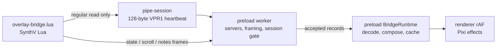
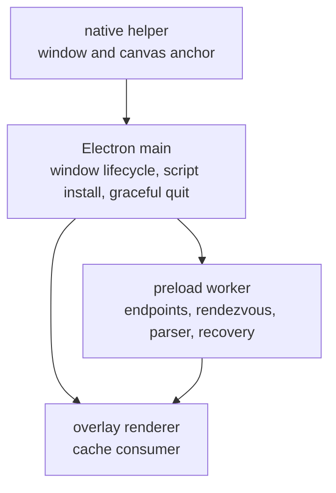
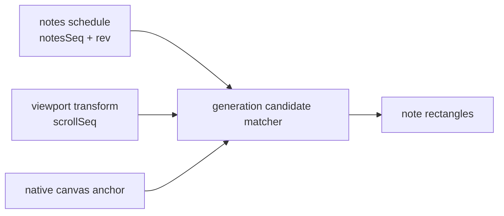

# Architecture

> 원문: [architecture.md](architecture.md). English가 source of truth다.

voxpane은 Synthesizer V Studio 2 위의 투명한 Electron overlay에 effect를 그린다. 앱은 project를
바꾸지 않는다. SynthV는 재생 정보와 view transform을 제공하고, native helper는 SynthV script가
알 수 없는 화면 anchor를 제공한다.

## The path

앱은 bridge directory를 만들고 세 endpoint를 소유하며, 하나의 새 app session을 `pipe-session`으로
advertise한다. Lua는 그 작은 regular file을 읽고, 유도된 `state`, `scroll`, `notes` write endpoint를
연다. worker는 framed byte를 event-by-event로 받고 session gate를 적용한 뒤 accepted record를 preload
`BridgeRuntime`으로 post한다. `BridgeRuntime`은 matching generation을 decode/compose하여 in-memory
cache에 넣고 renderer는 그 cache만 읽는다. render path에는 per-frame IPC나 endpoint I/O가 없다.

stream의 change rate는 다르다. `state`는 playhead와 현재 `rev`/`scrollSeq`/`notesSeq`를, `scroll`은
viewport transform을, `notes`는 전체 schedule을 싣는다. 셋은 independent stream이므로 channel 사이의
arrival order는 ordering guarantee가 아니다.

## Main ownership

Main은 permissions, tray, preferences, `overlay-bridge.lua` 설치와 rescan, window following, graceful
shutdown처럼 수명이 긴 Electron 작업을 소유한다. preload worker는 pipe server, framed parser, session gate,
reconnect/recovery lifecycle을 소유한다. worker는 accepted frame record를 preload로 post하고, preload의
`BridgeRuntime`이 그 record를 decode하여 matching generation을 snapshot으로 compose한다. renderer
`requestAnimationFrame`은 main이나 pipe를 기다리지 않는다.

정상 shutdown에서는 main이 먼저 receiver stop을 요청하고, 그 다음 자기 `pipe-session`과 FIFO endpoint를
withdraw한다. Darwin server는 bounded reader teardown 전에 300 ms drain grace를 둔다. force-kill은 이
순서를 atomic하게 만들 수 없으므로 late Lua open은 피할 수 없는 race이며 reconnect로 처리한다.

## Geometry path

runtime은 최신 `scroll` record의 `scrollSeq`가 state와 같고, `notesSeq`가 0이 아닐 때 schedule의
`notesSeq`와 `rev`도 모두 같을 때만 snapshot을 compose한다. 더 새 candidate가 incomplete 또는
mismatch여도 마지막 valid snapshot을 유지한다. candidate matcher는 일치한 schedule과 transform에
native canvas anchor를 결합한다. 따라서 세 pipe stream이 clock을 공유한다고 가정하지 않고도 scroll을
빠르게 따른다.

## The frame loop

각 animation frame은 최신 accepted cache entry를 읽고, playhead를 interpolate하고, sounding note를
찾고, canvas-local rect에 현재 viewport와 native anchor를 결합하고, pitch를 sample한 뒤 그린다.
Native canvas discovery는 별도로 돌아가므로 조금 낡은 anchor가 현재 scroll transform을 막지 못한다.

중요한 clock은 서로 독립이다: Lua의 4 ms tick, 앱의 500 ms rendezvous heartbeat, event-driven pipe
receipt, native canvas refresh, `requestAnimationFrame`. 이들은 의도적으로 synchronize하지 않는다.
script 부재, pipe disconnect, malformed frame, native anchor 부재는 frame loop throw가 아니라 아무것도
그리지 않는 상태다.

## Where things live

| Path | Responsibility |
| --- | --- |
| `apps/voxpane/src/main` | Electron lifecycle, windows, graceful bridge shutdown |
| `apps/voxpane/src/preload` | worker-owned endpoints, framing, session gate; `BridgeRuntime` decode, composition, cache |
| `apps/voxpane/src/shared` | rendezvous, frame, diagnostic, geometry contracts |
| `apps/voxpane/src/renderer/src/playback` | cache consumption, transport, matching, pitch |
| `packages/synthv-script` | TypeScript로 작성한 Lua publisher |
| `packages/macos-helper` | Accessibility anchor와 window sticking |
| `packages/windows-helper` | UI Automation anchor와 window sticking |
