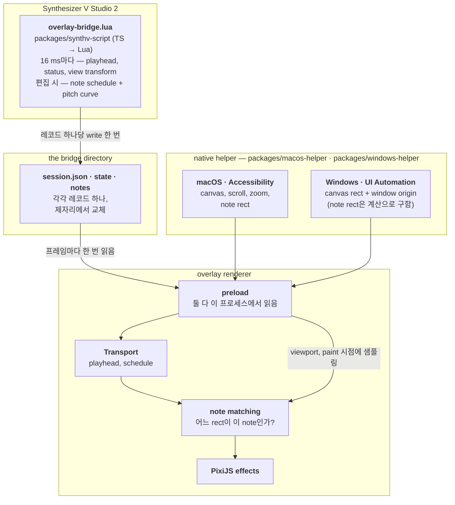

# Architecture (한국어)

> 원문: **[architecture.md](architecture.md)**. 영어판이 원본이다.

voxpane은 Synthesizer V Studio 2의 piano roll 위에 effect를 그린다. 프로젝트를 수정하지
않고, plugin도 아니다: SynthV의 창 위에 투명한 창을 얹고 재생에 맞춰 그리는 별도의 데스크톱
앱이다.

이 전제가 아래 모든 설계 결정의 출처다. 앱은 자기가 통제하지 못하는 프로그램에 대해 초당
60번 두 가지를 답해야 한다:

- **지금 무엇이 울리고 있는가?** SynthV만 안다. 그 안에서 도는 Lua script가 답을 publish
  한다.
- **그 note가 화면 어디에 있는가?** script는 알 수 없다 — 좌표가 canvas-local이고, 자기
  창이 어디 있는지도 모른다. OS의 accessibility 계층이 바깥에서 답한다.

어느 쪽도 상대의 질문에 답할 수 없고, 둘은 서로 다른 clock으로 읽힌다. 이 둘을 화해시키는
것이 renderer가 하는 일의 대부분이다.

## The path

두 경로가, 서로의 질문에 답할 수 없는 두 출처에서 출발해, renderer에서 합류한다:

bridge directory는 macOS에서 `~/Library/Application Support/voxpane/bridge`,
Windows에서 `%LOCALAPPDATA%\voxpane\bridge`다 — 왜 거기이고 누가 만드는지는
[bridge.ko.md](bridge.ko.md#where).

main process는 이 둘을 둘러싸고 있으면서 프레임 단위로는 어느 쪽도 건드리지 않는다.
SynthV의 창 frame을 따라가며 overlay를 옮기고 toolbar를 도킹하고, `overlay-bridge.lua`를
SynthV의 scripts 디렉터리에 설치하고, preferences를 소유하며 변경을 모든 창에 broadcast
하고, tray·permissions gate·창 lifecycle을 돌린다.

세 개의 진실 출처가 그림을 만들고, 셋은 정말로 독립적이다:

| 출처 | 답하는 것 | 읽는 쪽 |
| --- | --- | --- |
| bridge script | 무엇이 언제 어떤 pitch로 울리는가 | renderer, 프레임마다 한 번 |
| native helper | SynthV의 창과 note가 어디 있는가 | renderer(geometry)와 main(frame) |
| preferences | effect가 어떻게 보이는가 | 모든 창, main이 push |

## Processes and windows

**Main** (`src/main`)은 프레임보다 긴 수명을 가진 것 전부를 소유하고, 프레임 단위로 일어나는
것은 아무것도 소유하지 않는다.

- `index.ts` — follow loop. 하나의 native stick observer가 SynthV의 창 frame을 보고하고,
  overlay는 거기에 맞춰 크기가 잡히며 toolbar는 옆에 도킹된다. single-instance lock,
  permissions gate, 그리고 나머지가 초기화되는 **순서**도 여기 있다(그 순서는 하중을
  받는다 — 파일의 주석을 볼 것).
- `bridgeScript.ts` — 번들된 `overlay-bridge.lua`를 SynthV의 scripts 디렉터리에 설치한다.
  버전이 아니라 **내용 해시**를 비교하고, 그다음 macOS에 rescan을 요청한다.
- `preferences.ts` — `userData` 아래 `preferences.json`의 유일한 writer. 모든 변경이 전
  창에 broadcast되므로, 어떤 renderer도 진실의 사본을 따로 들고 있지 않다.
- `overlay.ts`, `toolbar.ts`, `settings.ts`, `permissions.ts`, `tray.ts` — 창 하나씩,
  각자 자기 창의 생성과 배치를 소유한다. overlay 자신의 동작 — SynthV 위에 머무르기,
  따라가기, 같이 숨기 — 은 [overlay.ko.md](overlay.ko.md).
- `dip.ts` — [geometry](geometry.ko.md#physical-pixels-points-and-dips) 참조.

**Preload** (`src/preload`)에 hot path가 있다. 이례적이고, 의도적이다. `sandbox: false`로
돌기 때문에 native addon을 `require`하고 파일을 열 수 있다 — 즉 renderer가 bridge channel과
piano roll geometry를 **프레임 경로에 IPC 없이** 읽는다. 프레임마다 main으로 왕복하는 것,
그게 이 배치가 없애려고 존재하는 바로 그것이다.

**Renderer** (`src/renderer`)는 하나의 번들이 네 개의 view를 담당하고, `App.tsx`에서
`window.location.hash`로 고른다: hash 없음이 overlay, `#toolbar`·`#settings`·`#permissions`
가 나머지다. frame loop를 가진 것은 overlay뿐이다.

**Native helper** (`packages/macos-helper`, `packages/windows-helper`)는 Rust + napi-rs다.
둘 다 창 추종을 하고, note rect을 읽는 것은 macOS뿐이다. `shared/native.ts`가 둘 위의
단일 표면인데, geometry 차이는 **의도적으로 감추지 않는다** — [geometry](geometry.ko.md)
참조.

## The frame loop

`App.tsx`의 `draw()`가 `requestAnimationFrame`으로 돌고, 그게 overlay의 전부다. 순서대로:

1. **bridge를 poll한다.** `transport.poll()`이 `state` channel을 읽는다 — 한 번만 할당한
   버퍼로 `pread`하므로, 읽을지 말지 판단하는 비용보다 싸다. schedule은 state record가
   generation이 바뀌었다고 말할 때만 다시 읽는다.
2. **viewport를 읽는다.** paint 시점에, 그릴 것이 있을 때만. scroll 위치와 zoom을 최대한
   늦게 샘플링하는 것인데, 아래 모든 것이 *지금*과 *note rect을 읽은 시점*의 차이이기
   때문이다.
3. **무엇이 울리는지 묻는다.** playhead는 두 state record 사이를 local clock으로 보간하고,
   schedule은 그 아래의 note를 이진 탐색으로 찾는다.
4. **그 note의 rect을 찾는다.** 어려운 부분 — [geometry](geometry.ko.md).
5. **이 순간의 sung pitch를 샘플링한다**(`playback/pitch.ts`). 발사점을 note 자신의 lane
   밖으로 옮기고, effect 강도를 몰 수도 있다.
6. **그린다.** Pixi scene에 transform 한 번. note geometry는 새 read가 set을 교체할 때만
   다시 만든다.

옆에서 두 번째 loop가 돈다: **note pump**. 비동기 `while` loop가 전체 piano roll read를
요청하고(macOS에서 ~50 ms), set을 통째로 교체하고, 30 ms 잔다. roll이 움직이는 동안 찍힌
read는 버린다 — 좌표들이 서로 어긋나 있기 때문이다. 그동안 낡은 set이 여전히 맞는 이유는,
4단계가 그것을 살아 있는 viewport 데이터로 매핑하기 때문이다.

그래서 **clock이 셋**이고, 이걸 혼동하는 것이 타이밍 버그 대부분의 출처다:

| Clock | 주기 | 나르는 것 |
| --- | --- | --- |
| script의 tick | 16 ms | playhead, transport status, view transform |
| note pump | ~30 ms + ~50 ms의 walk | note rect |
| frame loop | 디스플레이 주사율 | 그리기, 그리고 보간된 playhead |

셋은 동기화되어 있지 않고, 그럴 의도도 없다. 낡은 값은 전부 자기가 읽힌 frame과 짝지어져
있어서, 소비자가 신선함을 기다리는 대신 자기 나이를 스스로 보정한다.

## Why the transport is so small

`playback/transport.ts`는 200줄이고 event 감지를 전혀 하지 않는다 — seek tolerance도,
"방금 그거 loop wrap이었나?"도, anchor도 없다. transport가 파일이라서 생긴 결과다.

예전 bridge는 clipboard로 데이터를 옮겼다. clipboard는 사용자 것이라 transport *event*에
150 ms만 잠깐 빌릴 수 있었고, 그래서 script가 무엇이 event인지 판단해야 했다. 파일은
publish 하나에 ~4 µs이므로, state는 그냥 매 tick 나가고 — 이미 그리려고 프레임마다 읽고
있는 — 앱이 불연속을 직접 본다. 인색한 transport를 보상하려고 존재하던 기계장치가 그것과
함께 사라졌다.

옛 이슈(#61, #75)를 읽을 때 알아둘 것: clipboard blip이나 Windows memory scan 얘기는 이제
존재하지 않는 transport를 묘사한 것이다.

## Failure is the normal state

SynthV가 안 떠 있을 수 있다. script가 설치되지 않았을 수 있다. 사용자가 Accessibility를
허용하지 않았을 수 있다. record가 읽히는 순간 절반만 써져 있을 수 있다. 이 중 어느 것도
에러가 아니고, 전부 그릴 것이 없는 frame일 뿐이다.

그 결과가, 코드베이스 전반에 꽤 일관되게 강제된다: **decoder는 throw하지 않고 `null`을
반환하고**, frame loop는 `null`을 "건너뛰기"로 다룬다. `draw()` 안에서 throw하는 경로를
추가했다면, SynthV가 없는 상태를 **깨진 overlay**로 바꿔 놓은 것이다.

## Where things live

| 경로 | 내용 |
| --- | --- |
| `apps/voxpane/src/main` | Electron main: 창, tracking, preferences, tray |
| `apps/voxpane/src/preload` | hot path — channel 읽기, geometry, `contextBridge` API |
| `apps/voxpane/src/renderer/src/playback` | transport clock, note location, pitch, frame 수학 |
| `apps/voxpane/src/renderer/src/render` | PixiJS scene: glow, particles, trail — [effects.ko.md](effects.ko.md) |
| `apps/voxpane/src/shared` | 양쪽이 필요로 하는 타입과 순수 로직 — 그리고 테스트 |
| `packages/synthv-script` | Lua bridge script (TypeScript로 작성) |
| `packages/macos-helper` | Rust: Accessibility 읽기, 창 추종, script rescan |
| `packages/windows-helper` | Rust: UI Automation canvas 탐색, 창 추종 |

테스트는 Vitest이고, 대상 파일 옆에 두며, **순수 로직만** 다룬다 — bridge decoding,
preferences, transport clock, note location, frame 수학, DIP transform. Electron이나 native
addon이나 진짜 piano roll이 필요한 것은 설계상 범위 밖이다. 까다로운 산술이 `shared/`와
`playback/`에 자유 함수로 많이 나와 있는 이유가 그것이다.
