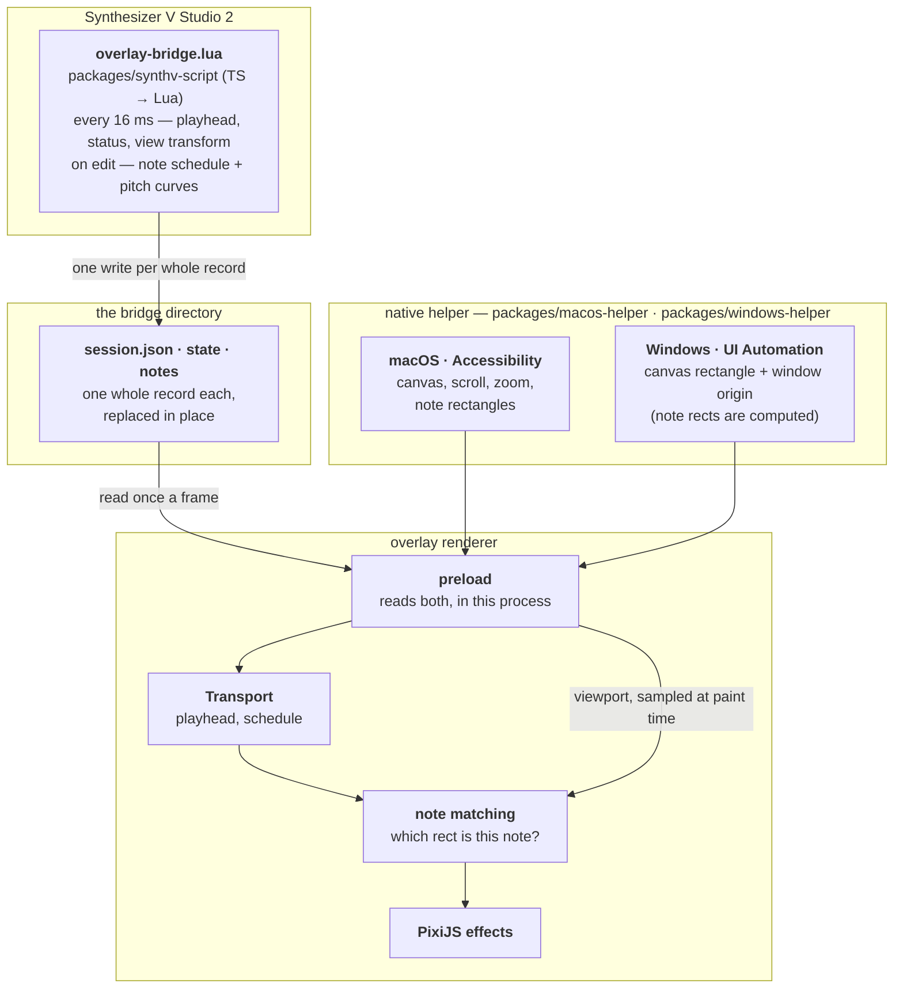

# Architecture

voxpane draws effects on top of Synthesizer V Studio 2's piano roll. It never modifies the
project and it is not a plugin: it is a separate desktop app that puts a transparent
window over SynthV's and paints on it in time with playback.

That framing is the source of every design decision below. The app has to answer two
questions sixty times a second about a program it does not control:

- **What is sounding right now?** Only SynthV knows. A Lua script running inside it
  publishes the answer.
- **Where is that note on screen?** The script cannot know — its coordinates are
  canvas-local and it has no idea where its own window is. The OS accessibility layer
  answers this, from outside.

Neither source can answer the other's question, and the two are read on different clocks.
Reconciling them is what most of the renderer does.

## The path

Two paths, from two sources that cannot answer each other's question, converging in the
renderer:

The bridge directory is `~/Library/Application Support/voxpane/bridge` on macOS and
`%LOCALAPPDATA%\voxpane\bridge` on Windows — [bridge.md](bridge.md#where) for why it is
there and who creates it.

The main process sits around both and touches neither per frame. It follows SynthV's window
frame — moving the overlay and docking the toolbar — installs `overlay-bridge.lua` into
SynthV's scripts directory, owns preferences and broadcasts every change to all windows, and
runs the tray, the permissions gate and window lifecycle.

Three sources of truth feed the picture, and they are genuinely independent:

| Source | Answers | Read by |
| --- | --- | --- |
| the bridge script | what is sounding, when, at what pitch | the renderer, once a frame |
| the native helper | where SynthV's window and notes are | the renderer (geometry) and main (the frame) |
| preferences | what the effects look like | every window, pushed from main |

## Processes and windows

**Main** (`src/main`) owns everything with a lifetime longer than a frame and nothing that
happens per frame.

- `index.ts` — the follow loop. One native stick observer reports SynthV's window frame;
  the overlay is resized onto it and the toolbar docked beside it. Also the single-instance
  lock, the permissions gate, and the order in which the rest is initialised (that order is
  load-bearing — see the comments in the file).
- `bridgeScript.ts` — installs the bundled `overlay-bridge.lua` into SynthV's scripts
  directory, comparing **content hashes** rather than versions, then asks macOS to rescan.
- `preferences.ts` — the single writer of `preferences.json` under `userData`. Every update
  is broadcast to all windows, so no renderer holds its own copy of the truth.
- `overlay.ts`, `toolbar.ts`, `settings.ts`, `permissions.ts`, `tray.ts` — one window each,
  each owning its own creation and placement. The overlay's own behaviour — staying above
  SynthV, following it, hiding with it — is [overlay.md](overlay.md).
- `dip.ts` — see [geometry](geometry.md#physical-pixels-points-and-dips).

**Preload** (`src/preload`) is where the hot path lives, which is unusual and deliberate.
It runs with `sandbox: false`, so it can `require` the native addons and open files —
meaning the renderer reads bridge channels and piano-roll geometry **without an IPC hop**.
A per-frame round trip to main was the thing this arrangement exists to avoid.

**Renderer** (`src/renderer`) is one bundle serving four views, selected by
`window.location.hash` in `App.tsx`: no hash is the overlay, `#toolbar`, `#settings`,
`#permissions` are the others. The overlay is the only one with a frame loop.

**Native helpers** (`packages/macos-helper`, `packages/windows-helper`) are Rust + napi-rs.
Both do window following; only macOS reads note rectangles. `shared/native.ts` is the one
surface over both, and it deliberately does *not* hide the geometry difference —
see [geometry](geometry.md).

## The frame loop

`App.tsx`'s `draw()` runs on `requestAnimationFrame` and is the whole of the overlay. In
order:

1. **Poll the bridge.** `transport.poll()` reads the `state` channel — a `pread` into a
   buffer allocated once, so it costs less than deciding whether to do it. The schedule is
   re-read only when the state record says its generation changed.
2. **Read the viewport**, at paint time, only if there is something to draw. This is scroll
   position and zoom sampled as late as possible, because everything downstream is the
   difference between *now* and *when the note rectangles were read*.
3. **Ask what is sounding.** The playhead is interpolated on the local clock between two
   state records; the schedule is binary-searched for the note under it.
4. **Find that note's rectangle.** The hard part — [geometry](geometry.md).
5. **Sample the sung pitch** at this instant (`playback/pitch.ts`), which moves the
   emission point off the note's own lane and can drive effect intensity.
6. **Draw.** One transform update on the Pixi scene; note geometry is only rebuilt when a
   new read replaces the set.

A second loop runs beside it: the **note pump**, an async `while` loop that asks for a full
piano-roll read (~50 ms on macOS), replaces the set wholesale, and sleeps 30 ms. Reads taken
while the roll was moving are discarded — their coordinates are mutually skewed. The stale
set stays correct meanwhile, because step 4 maps it through live viewport data.

So there are **three clocks**, and confusing them is the source of most timing bugs:

| Clock | Rate | Carries |
| --- | --- | --- |
| the script's tick | 16 ms | playhead, transport status, view transform |
| the note pump | ~30 ms + ~50 ms of walking | the note rectangles |
| the frame loop | display refresh | the drawing, and the interpolated playhead |

They are not synchronised and are not meant to be. Every stale value is paired with the
frame it was read in, so the consumer can correct for its own age rather than waiting for
freshness.

## Why the transport is so small

`playback/transport.ts` is 200 lines and does no event detection at all — no seek
tolerance, no "was that a loop wrap?", no anchors. That is a consequence of the transport
being a file.

The bridge used to move data through the clipboard, which belongs to the user, so it could
only be taken for ~150 ms **on an event**. The script therefore had to decide what an event
was. A file costs ~4 µs per publish, so state simply goes out on every tick and the app —
already reading once a frame in order to draw — sees discontinuities itself. All the
machinery that existed to compensate for a stingy transport left with it.

Worth knowing when reading old issues (#61, #75): anything about clipboard blips or a
Windows memory scan describes a transport that no longer exists.

## Failure is the normal state

SynthV may not be running. The script may not be installed. The user may not have granted
Accessibility. A record may be half-written at the moment it is read. None of these are
errors; all of them are frames with nothing to draw.

The consequence, which is enforced fairly consistently across the codebase: **decoders
return `null` rather than throwing**, and the frame loop treats `null` as "skip". If you
add a code path that throws inside `draw()`, you have made a missing SynthV into a broken
overlay.

## Where things live

| Path | What |
| --- | --- |
| `apps/voxpane/src/main` | Electron main: windows, tracking, preferences, tray |
| `apps/voxpane/src/preload` | the hot path — channel reads, geometry, `contextBridge` API |
| `apps/voxpane/src/renderer/src/playback` | transport clock, note location, pitch, frame math |
| `apps/voxpane/src/renderer/src/render` | the PixiJS scene: glow, particles, trail — [effects.md](effects.md) |
| `apps/voxpane/src/shared` | types and pure logic both sides need — and the tests |
| `packages/synthv-script` | the Lua bridge script (authored in TypeScript) |
| `packages/macos-helper` | Rust: Accessibility reads, window sticking, script rescan |
| `packages/windows-helper` | Rust: UI Automation canvas lookup, window sticking |

Tests are Vitest, colocated, and cover the pure logic only — bridge decoding, preferences,
the transport clock, note location, frame math, the DIP transforms. Anything needing
Electron, a native addon or a real piano roll is out of scope by design; that is why so
much of the tricky arithmetic lives in `shared/` and `playback/` as free functions.
