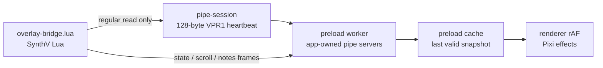
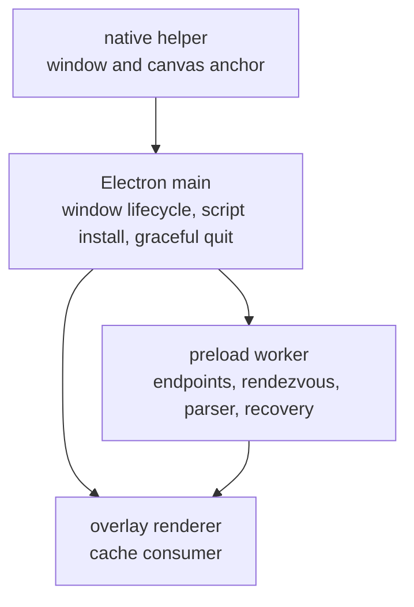
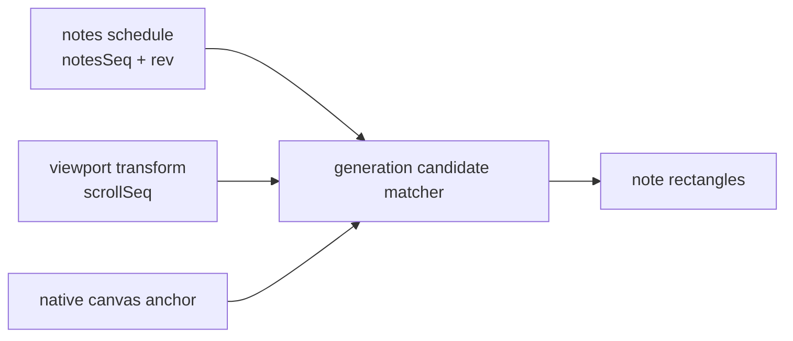

# Architecture

> Korean: [architecture.ko.md](architecture.ko.md). English is the source of truth.

voxpane draws effects in a transparent Electron overlay above Synthesizer V Studio 2. The
app never changes the project. SynthV supplies what is playing and its view transform; the
native helper supplies the screen anchor that SynthV's script cannot see.

## The path

The app creates the bridge directory, owns the three endpoints, and advertises one fresh
app session through `pipe-session`. Lua reads that small regular file and opens the derived
`state`, `scroll`, and `notes` write endpoints. The worker receives framed bytes
event-by-event; the renderer reads only the in-memory cache. No per-frame IPC or endpoint
I/O is in the render path.

The streams have different change rates: `state` carries the playhead and the current
`rev`/`scrollSeq`/`notesSeq`; `scroll` carries the viewport transform; `notes` carries a
whole schedule. They are independent streams, so arrival order across channels is not an
ordering guarantee.

## Main ownership

Main owns long-lived Electron work: permissions, the tray, preferences, installing and
rescanning `overlay-bridge.lua`, window following, and graceful shutdown. The preload
worker owns all pipe servers, their reconnect/recovery lifecycle, and the decoded snapshot.
It transfers valid state to preload memory; renderer `requestAnimationFrame` never waits
for main or a pipe.

On a clean shutdown, main asks the receiver to stop before it withdraws its owned
`pipe-session` and FIFO endpoints. The Darwin servers allow a 300 ms drain grace before
their bounded reader teardown. A force-kill cannot make that ordering atomic, so a late
Lua open remains an unavoidable race and is handled as a reconnect.

## Geometry path

The runtime composes a snapshot only when the latest `scroll` record has the state's
`scrollSeq` and, when `notesSeq` is nonzero, the schedule has both the matching `notesSeq`
and `rev`. It retains the last valid snapshot while a newer candidate is incomplete or
mismatched. The candidate matcher then combines the matched schedule and transform with
the native canvas anchor. This keeps scroll following responsive without pretending that
the three pipe streams share a clock.

## The frame loop

Each animation frame reads the latest accepted cache entry, interpolates the playhead,
finds the sounding note, combines its canvas-local rectangle with the current viewport and
native anchor, samples pitch, and draws. Native canvas discovery runs separately, so an
older anchor can never block a current scroll transform.

The relevant clocks are independent: Lua's 4 ms tick, the app's 500 ms rendezvous
heartbeat, event-driven pipe receipt, native canvas refresh, and `requestAnimationFrame`.
They are intentionally not synchronized. A missing script, disconnected pipe, malformed
frame, or absent native anchor means nothing is drawn, not that the frame loop throws.

## Where things live

| Path | Responsibility |
| --- | --- |
| `apps/voxpane/src/main` | Electron lifecycle, windows, graceful bridge shutdown |
| `apps/voxpane/src/preload` | worker-owned endpoints, framed parsing, runtime cache |
| `apps/voxpane/src/shared` | rendezvous, frame, diagnostic, and geometry contracts |
| `apps/voxpane/src/renderer/src/playback` | cache consumption, transport, matching, pitch |
| `packages/synthv-script` | TypeScript authored Lua publisher |
| `packages/macos-helper` | Accessibility anchor and window sticking |
| `packages/windows-helper` | UI Automation anchor and window sticking |
