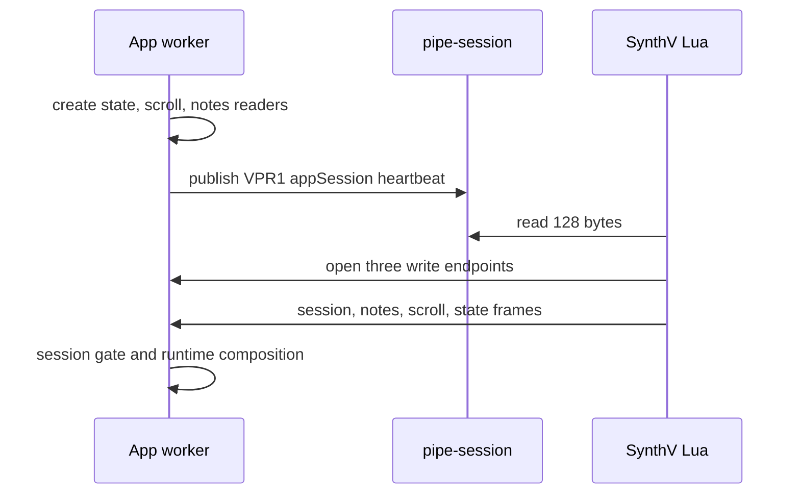

# Bridge

> 원문: [bridge.md](bridge.md). English가 source of truth다.

앱이 transport를 소유하고 SynthV Lua script가 publication을 소유한다. 둘은 bridge directory에서 만난다.
macOS에서는 `~/Library/Application Support/voxpane/bridge`, Windows에서는
`%LOCALAPPDATA%\\voxpane\\bridge`다. Lua는 directory를 만들 수 없으므로 앱이 rendezvous record를
publish하기 전에 만든다.

## Where

steady-state protocol에서 `pipe-session`만 regular file이다. 이는 app-owned 128-byte VPR1 rendezvous
record이자 heartbeat다. `state`, `scroll`, `notes`는 data file이 아니라 세 개의 app-owned pipe endpoint다.

## The paths



앱은 rendezvous heartbeat를 500 ms마다 refresh한다. `state` endpoint는 session frame 뒤에 state frame을
싣고, `scroll`, `notes`는 각각 자기 framed record를 싣는다. channel마다 active connection은 하나다.
새 connection은 그 channel의 이전 connection을 교체한다.

## Rendezvous record

VPR1 record는 정확히 128 byte다.

```text
VPR1\n<heartbeat seconds>\n<32 lowercase hexadecimal appSession>\n<8 lowercase hexadecimal FNV-1a checksum>\n<spaces to 128 bytes>
```

checksum은 `VPR1\n<heartbeat>\n<appSession>\n`의 FNV-1a 32-bit이며, eight lowercase hexadecimal
character로 표시한다. Lua에서 heartbeat가 두 초 이하로 오래되었으면 current다. 앱은 모든 endpoint
reader가 ready인 뒤에만 advertise한다. inspection command는 checksum-valid 오래된 record를 stale로
classify할 수 있는데, 이는 malformed record가 아니라 app stopped/crashed를 뜻한다.

endpoint name은 `appSession`에서 deterministic하게 유도된다.

| Platform | `state` | `scroll` | `notes` |
| --- | --- | --- | --- |
| macOS | `<directory>/pipe-<appSession>-state` | `<directory>/pipe-<appSession>-scroll` | `<directory>/pipe-<appSession>-notes` |
| Windows | `\\\\.\\pipe\\voxpane-<appSession>-state` | `\\\\.\\pipe\\voxpane-<appSession>-scroll` | `\\\\.\\pipe\\voxpane-<appSession>-notes` |

## Endpoint ownership

macOS에서 앱은 각 endpoint를 `mkfifo`로 만들고, rendezvous를 advertise하기 전에 reader를 열어 그
reader로 receive한다. Lua는 존재하는 FIFO를 write-only로 연다. disconnect 뒤 앱은 reconnect를 위한
짧은 reader lifecycle을 유지한다. withdrawal 뒤에는 300 ms drain grace를 두고 exceptional reader
teardown을 bound한다. Lua는 `EPIPE` 또는 open/write failure를 보면 모든 endpoint handle을 닫고
rendezvous retry loop로 돌아간다. 앱은 endpoint teardown 전에 `pipe-session`을 withdraw하고, 여전히
자기가 소유한 FIFO node만 지운다.

Windows에서 앱은 Node `net` Named Pipe server를 쓴다. channel별 active socket은 하나이며 새
connection이 이를 교체한다. PowerShell helper도 two-second launch path도 없다.

Lua endpoint handle은 `io.open(path, "wb")`로 열고 `write`, `close`, `setvbuf("no")`만 호출한다.
platform의 `wb` open에는 `O_CREAT` tradeoff가 있다. ordered rendezvous withdrawal과 240 ms
connected-session validation이 normal late open을 bound하지만, stale regular entry 또는 symlink는
편의상 prune하지 않는다. validation과 open 사이의 force-kill race는 피할 수 없다. Lua는 channel
pipe를 읽지 않으며 `pipe-session`만 regular read한다.

## Session gate and recovery

Lua connection의 첫 state frame은 `appSession`, `scriptSession`을 담은 session frame이다. receiver는
frame의 `appSession`이 advertised session과 같은지 확인하고 session gate를 연다. valid session frame
전의 indexed frame은 latest 하나만 보관했다가 적용한다. disconnect, invalid session, parser failure,
endpoint failure는 gate를 닫고 partial candidate를 버리며 fresh endpoint와 fresh app session으로
recover한다.

성공적인 reconnect마다 Lua는 sequence를 reset하고 full `notes`, 현재 `scroll`, `state`의 exact snapshot을
publish한다. 세 stream은 cross-channel order를 보장하지 않으므로 runtime은 `scrollSeq`, `notesSeq`, `rev`
일치를 기다리고 candidate가 다르면 마지막 valid snapshot을 유지한다.

`appSession`은 하나의 app endpoint generation을 식별한다. `scriptSession`은 그 app session 안의 하나의
Lua publication generation을 식별한다. 둘은 바꿔 쓸 수 없다.

## Frame boundaries

pipe payload는 bridge header, layout, channel, payload length로 frame된다. receiver parser는 endpoint에
배정된 channel만 받고 allocation 전에 payload cap을 적용한다. state/session은 작고 scroll도 작으며,
notes의 deliberate maximum은 64 MiB다. malformed stream은 partial record를 decode하는 대신 recovery
event가 된다.

## Shutdown and failure

graceful app quit은 receiver owner를 stop하고 work를 join한 뒤 rendezvous를 withdraw하고 owned endpoint를
drain/remove한다. 이 순서가 normal case를 deterministic하게 만든다. 임의 instruction에서 killed process는
막을 수 없으므로 stale rendezvous 또는 endpoint entry는 cleanup authority가 아니라 diagnose할 observation이다.

## Diagnostics

diagnostics는 connection state와 app session, state/scroll/notes의 receipt/applied clock, pipe recovery,
malformed frame, endpoint failure, disconnect, accepted in-memory frame의 invalid 또는 generation-mismatch
observation을 보인다.

## Versioning

VPR1 rendezvous grammar, endpoint derivation, frame header, payload codec에는 app shared code, Lua TypeScript
source, focused fixture/test라는 세 implementation이 있다. 함께 바꿔야 한다. endpoint protocol은
compatibility를 위해 unknown layout이나 unbounded payload를 받지 않는다.
