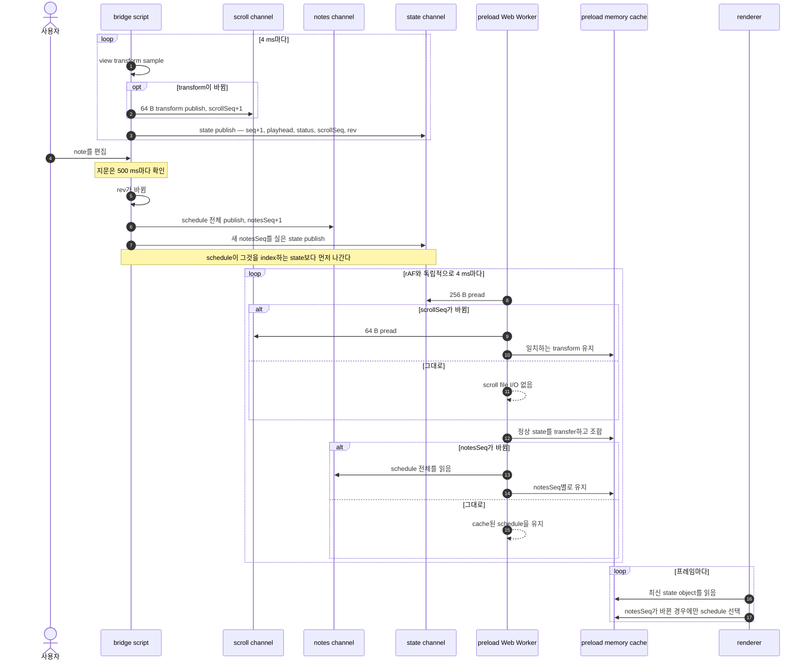

# The bridge (한국어)

> 원문: **[bridge.md](bridge.md)**. 영어판이 원본이다.

SynthV 안의 script가 앱으로 데이터를 보내는 방법.

Writer: `packages/synthv-script/src/lua/bridge/`.
Reader: `apps/voxpane/src/shared/bridgeChannels.ts`와 `src/preload/bridgeReader.ts`.
사람이 읽는 참조 decoder: `packages/synthv-script/scripts/dump.mjs`.

script 패키지에는 자체 [README](../packages/synthv-script/README.md)가 있고 Lua 쪽 toolchain을
다룬다 — `typescript-to-lua`, 1-based index 타이핑, host callback이 `self` 없이 도착한다는 것,
그리고 왜 JSON encoder를 손으로 썼는지. `packages/synthv-script` 아래를 편집하기 전에 읽을 것.

## Where

디렉터리 하나. 양쪽이 아무 설정 없이 닿을 수 있어야 한다:

| OS | 경로 |
| --- | --- |
| macOS | `~/Library/Application Support/voxpane/bridge` |
| Windows | `%LOCALAPPDATA%\voxpane\bridge` |

Lua에 `mkdir`이 없으므로 **디렉터리는 앱이 만든다**. 거기에 아무것도 없으면 script는 그냥
계속 열기에 실패하고 다음 tick에 재시도한다 — voxpane이 한 번도 돌지 않은 상태가 그것이다.

## The channels

| 파일 | 종류 | 주기 | 내용 |
| --- | --- | --- | --- |
| `session.json` | hot, 1 KB, JSON | 시작 시 1회 | protocol과 layout 버전, host 정보, 다른 channel이 무엇인지 |
| `state` | hot, 256 B, binary | 4 ms마다 | playhead, transport 상태, loop 힌트, `rev`, channel generation |
| `scroll` | hot, 64 B, binary | 바뀔 때 | 완전한 view transform과 그 generation |
| `notes` | cold, 가변 | 편집 시 / 재생 시작 시 | pitch curve를 포함한 note schedule 전체 |

**얼마나 자주 바뀌는가로** 나눈 것이다. transport는 매 tick sample되고, view transform은
사용자가 scroll하거나 zoom할 때 움직이며, schedule은 사용자가 타이핑할 때 움직인다. 바뀌지
않은 view는 `scroll` write를 만들지 않는다.

`session.json`이 JSON으로, 그리고 framing 대신 padding으로 남은 것은 의도적이다: binary
channel이 무엇인지 알려주는 문서이므로 `cat`으로 읽혀서 살아남아야 한다.

### Nothing is streamed and nothing is queued

각 channel은 **레코드 하나 전체**를 담고, 제자리에서 교체된다. generation을 놓친 reader는
필요한 것을 아무것도 놓치지 않은 것이다 — 다음 읽기에 더 새로운 값이 있다. 알림 메커니즘도
없다: 앱은 어차피 그리려고 프레임마다 보고 있고, watcher는 그것을 이길 수 없다(측정 결과 tail
latency가 훨씬 나쁘다).

## Pairing the channels

channel을 나눴다는 것은 다른 record가 교체되는 동안 reader가 state를 볼 수 있다는 뜻이다.
세 필드가 그것을 다룬다:

- **`notesSeq`.** state record가 `notes` channel의 generation을 나르므로, 프레임마다 state만
  poll하는 reader가 다른 파일을 열지 않고도 schedule이 움직였음을 안다. hot channel이 곧
  index다.
- **`scrollSeq`.** state는 `scroll` channel의 generation을 나른다. script는 완전한 transform을
  먼저 쓰고 그 write가 성공한 뒤에만 `scrollSeq`를 올린다. worker는 광고된 generation이
  바뀔 때만 `scroll`을 열고 record 자신의 sequence가 일치할 때만 받아들인다.
- **`rev`.** 현재 group의 note 지문(onset·end·pitch·lyric에 대한 FNV-1a, 여기에 group의 time
  offset과 note 수)이고 **state와 notes**가 나른다. `rev`가 바뀌었다는 것은 들고 있던 schedule이
  낡았다는 뜻이다. **notes record 자신의 `rev`가 우선한다** — state가 읽힐 때 나르고 있던 것보다.

script는 바뀐 scroll과 schedule record를 그것을 index하는 state record보다 *먼저* publish한다.
indexed-channel write 실패는 state가 광고하는 generation을 전진시키지 않는다.

`rev`는 tick마다가 아니라 자기 주기(500 ms)로 다시 계산한다: 지문 계산은 모든 note를 훑고
note마다 host를 호출하므로, 여기서 프로젝트 크기에 비례해 커지는 유일한 것이다.



## Atomicity

**레코드 하나는 항상 정확히 `write` 호출 하나다.** 그것이 안전성의 전부다 — `os.rename`도
임시 파일도 seqlock도 없다.

성립하는 이유는 커널이 정규 파일에 대한 읽기와 쓰기를 직렬화하기 때문이다. reader가 같은
바이트를 최대한 빠르게 `pread`하면서 측정한 결과: 128 B 레코드에 360만 회, 306 KB에 27만 회,
찢어짐 없음.

여기서 따라오는 두 가지는 선택 사항이 아니다:

- **레코드는 자기 길이를 싣는다**(헤더에). 직전보다 짧은 제자리 쓰기는 옛 꼬리를 남기고,
  원자성은 그것에 대해 아무것도 해주지 않는다.
- **stdio 버퍼는 꺼져 있다**(`setvbuf("no")`). 버퍼된 쓰기는 syscall 하나가 아니고, 버퍼된
  reader는 낡은 사본을 태연히 내준다 — 측정 결과 460만 회의 읽기가 단 하나의 generation만
  관측했다.

파일은 `r+b`로 열고 실패하면 `w+b`로 떨어진다. `w`가 아닌 이유: truncate하면 truncate와 write
사이에 reader에게 빈 파일이 노출된다.

## The record layout

전체가 little-endian이다. 모든 binary 레코드에 붙는 12바이트 헤더:

| 필드 | 타입 | 값 |
| --- | --- | --- |
| magic | 4 bytes | `VPB1` |
| layout | u16 | `5` |
| channel | u16 | 0 = session, 1 = state, 2 = notes, 3 = scroll |
| length | u32 | 뒤따르는 payload 바이트 수 |

**`session`** payload — UTF-8 JSON이다. `v: 1`, `layout: 5`, 문자열인 `appSession`을
반드시 가져야 하며, app은 이 shape이 아닌 record를 거부한다.

**`state`** payload — 고정 크기, 그다음 256바이트까지 공백으로 padding:

| 필드 | 타입 | 비고 |
| --- | --- | --- |
| `seq` | u32 | 매 tick 증가. 멈춘 `seq`는 script가 사라졌다는 뜻 |
| `notesSeq` | u32 | `notes` channel의 generation |
| `scrollSeq` | u32 | `scroll` channel의 generation |
| `status` | u8 | 0 stopped, 1 playing, 2 looping |
| flags | u8 | bit 0: loop 경계가 있음 |
| `at` | f64 | playhead, 초 |
| loop start, loop end | f64 × 2 | flag가 없으면 무의미 |
| `rev` | u16 길이 + UTF-8 | Lua의 `s2` |

**`scroll`** payload — header를 포함해 정확히 64바이트:

| 필드 | 타입 | 비고 |
| --- | --- | --- |
| `scrollSeq` | u32 | 검증을 위해 반복되는 generation |
| `perBlick`, `perSemitone` | f64 × 2 | view 스케일 |
| `viewLeft`, `viewRight` | f64 × 2 | 보이는 blick 범위 |
| `viewTop`, `viewBottom` | f64 × 2 | 보이는 value 범위 |

**`notes`** payload: `notesSeq`(u32), `rev`(`s2`), note 수(u32), 그다음 note마다:

| 필드 | 타입 |
| --- | --- |
| `onB`, `offB`, `onS`, `offS` | f64 × 4 |
| `pitch` | i16 (MIDI) |
| `lyric` | u16 길이 + UTF-8 |
| bend 개수 | u16 |
| bend 샘플 | i16 × 개수, `pitch`로부터의 cent |

blick은 i64가 아니라 **f64**로 이동한다: 어떤 프로젝트 길이보다도 한참 위까지 정확하고
(2⁵³ blick은 수백만 분), reader가 필드마다 BigInt를 할당하는 `getBigInt64`를 쓰지 않아도 된다.

### Why binary

encoder가 SynthV의 UI thread에서 돈다. pitch curve를 포함한 2000-note schedule을 만드는 데
JSON은 **18.8 ms**, `string.pack`은 **2.0 ms** — editor가 편집할 때마다 프레임을 떨구느냐 마느냐의
차이다. 레코드 크기도 절반이 된다(420 KB → 195 KB).

binary가 치르는 대가는 관용성이고, 그게 다음 절의 주제다.

## Versioning

JSON은 필드가 생기거나 타입이 바뀌는 것을 견딘다. 고정 layout을 틀린 버전으로 읽으면 **조용히**
틀린다. 그래서:

> magic과 layout 버전 **둘 다** 알아보지 못하는 reader는 레코드를 해석하지 말고 **거부해야
> 한다.**

layout 5는 framing된 `session` channel을 추가하고 모든 notes record 안에 `notesSeq`를 넣는다.
layout 4는 완전한 view transform을 generation-indexed `scroll` channel로 옮겼다. layout 3이
존재한 이유는 bend가 note 양쪽에 고정 padding을 갖게 되었기 때문이다. padding된
배열은 padding 없는 것과 정확히 같아 보인다 — 같은 타입, 그럴듯한 값 — 그래서 padding을 가정한
reader는 curve의 엉뚱한 부분을 index하며 미묘하게 틀린 것을 그렸을 것이다. 버전 번호가 막으려는
실패 방식이 바로 그것이다.

**포맷을 바꾼다는 것은 세 곳을 동시에 바꾼다는 뜻이다:**

1. `packages/synthv-script/src/lua/bridge/codec.ts` — `LAYOUT`을 올리고 writer를 바꾼다.
2. `apps/voxpane/src/shared/bridgeChannels.ts` — `LAYOUT`을 올리고 reader를 바꾼다.
3. `packages/synthv-script/scripts/dump.mjs` — `LAYOUT`을 올리고 참조 decoder를 바꾼다.

그다음 script를 다시 빌드하고 배포한다. 안 그러면 앱이 낡은 사본이 발행하는 모든 레코드를
(정확하게) 거부하고 overlay는 조용해진다.

## Reading, in the app

`preload/bridgeReader.ts`는 channel마다 fd를 하나씩 열어 두고 offset 0에서 읽는다.

- 전용 Node-enabled Web Worker가 약 4 ms마다 reader를 호출한다. 따라서 file acquisition은
  rAF와 독립적이고, renderer frame이 밀려도 계속된다.
- state는 고정된 exported width에 의존하지 않고 현재 record 크기로 buffer를 잡아 읽는다.
  검증이 끝나면 worker가 record 사본을 preload로 transfer하고, preload는 한 번 decode해 최신 state object를 교체한다. renderer의
  프레임별 호출은 그 object만 반환하며 file I/O도 Electron IPC도 하지 않는다.
- worker는 sampled state의 `scrollSeq`가 받아들인 generation과 다를 때만 `scroll`을 읽는다.
  record 자신의 sequence를 검증하고 state보다 먼저 scroll을
  transfer하며, preload runtime은 여섯 값을 renderer가 보는 `state.px`로 다시 조합한다.
  viewport가 그대로면 양쪽 모두 scroll-channel file I/O를 하지 않는다.
- worker는 sampled state의 `notesSeq`가 전진할 때만 `notes`를 열고 검증한다. 그 record는
  preload cache로 한 번 transfer되고, cache가 정확한 generation을 decode해 유지한다. renderer의
  `readSchedule(notesSeq)`는 그다음부터 in-memory lookup이다.
- worker는 schedule 자체의 `rev`가 그것을 요청한 state와 같은지 검증한다. 어긋나거나 완성되지
  않은 pair는 노출하지 않고 나중 sample에서 다시 시도한다.
- preload runtime은 `scrollSeq` key transform cache이자 `notesSeq` key schedule cache다.
  renderer transport는 받아들인 record를 재사용하면서 state와 최신 canvas snapshot으로 note
  geometry를 다시 계산한다.
- **아무것도 throw하지 않는다.** 짧은 읽기, 찢어진 레코드, 모르는 layout, 없는 파일 — 전부
  `null`, 즉 "마지막 정상 cache entry를 유지"다. writer는 언제든 재시작할 수 있는 별개
  프로세스이고, SynthV가 없는 것이 overlay를 깨뜨릴 수는 없다.
- 실패한 읽기는 **fd를 닫는다.** 다음 display frame이 아니라 다음 worker sample이 다시 연다.
  살아 있는 handle 아래에서 script가 재설치되거나 디렉터리가 비워질 수 있다.

소비자 쪽(`playback/transport.ts`)에서는 state snapshot이 실은 정확한 `notesSeq`에 대해서만
schedule을 받는다. 아직 없는 generation은 transport의 `notesSeq`를 전진시키지 않으므로 나중
frame이 cache lookup을 다시 시도한다. 잘못된 state sample은 memory를 교체하지 않으므로,
transport는 마지막 정상 record에서 계속 외삽한다. `seq`가 500 ms 동안 움직이지 않은 state
channel만 script가 사라졌다는 뜻이다: 외삽을 멈춘다.

## Seeing it

```sh
pnpm --filter @voxpane/synthv-script dump
```

`session.json`, decode된 state와 scroll record, 그리고 처음 8개 note를 bend 범위와 함께 출력한다.
선택 인자로 디렉터리를 줄 수 있다.

아무것도 안 돌고 있으면 `ENOENT`가 넷 나오는데, 그 자체가 "여기에 script가 한 번이라도
publish한 적이 있는가"에 대한 답이다. 정상적인 dump가 어떻게 생겼고 어떻게 읽는지는
[debugging](debugging.ko.md#3-read-the-live-state).
