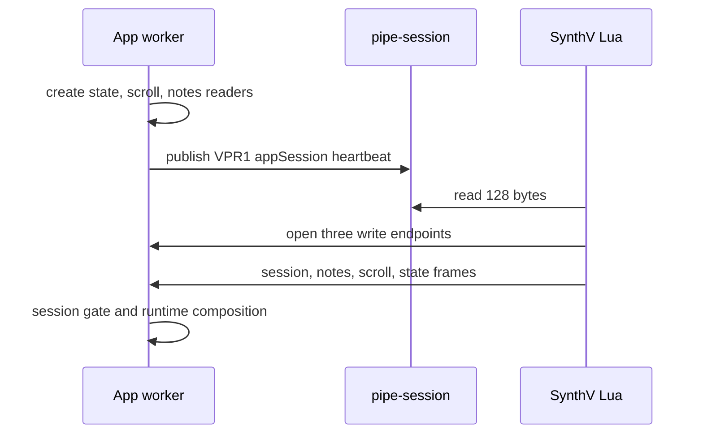

# Bridge

> Korean: [bridge.ko.md](bridge.ko.md). English is the source of truth.

The app owns the transport. SynthV's Lua script owns publication. They meet in the bridge
directory, which is `~/Library/Application Support/voxpane/bridge` on macOS and
`%LOCALAPPDATA%\\voxpane\\bridge` on Windows. Lua cannot create directories, so the app
creates this directory before publishing a rendezvous record.

## Where

`pipe-session` is the only regular file in the steady-state protocol. It is an app-owned,
128-byte VPR1 rendezvous record and heartbeat. `state`, `scroll`, and `notes` are not data
files: they are three app-owned pipe endpoints.

## The paths



The app refreshes the rendezvous heartbeat every 500 ms. The `state` endpoint carries a
session frame followed by state frames; `scroll` and `notes` carry their respective framed
records. Each channel has one active connection. A replacement connection supersedes the
old connection for that channel.

## Rendezvous record

The VPR1 record is exactly 128 bytes:

```text
VPR1\n<heartbeat seconds>\n<32 lowercase hexadecimal appSession>\n<8 lowercase hexadecimal FNV-1a checksum>\n<spaces to 128 bytes>
```

The checksum is FNV-1a 32-bit over `VPR1\n<heartbeat>\n<appSession>\n`, rendered as eight
lowercase hexadecimal characters. A heartbeat up to two seconds old is current to Lua.
The app only advertises after every endpoint reader is ready. The inspection command may
classify a checksum-valid older record as stale; that indicates an app that stopped or
crashed, not a malformed record.

Endpoint names are deterministic from `appSession`:

| Platform | `state` | `scroll` | `notes` |
| --- | --- | --- | --- |
| macOS | `<directory>/pipe-<appSession>-state` | `<directory>/pipe-<appSession>-scroll` | `<directory>/pipe-<appSession>-notes` |
| Windows | `\\\\.\\pipe\\voxpane-<appSession>-state` | `\\\\.\\pipe\\voxpane-<appSession>-scroll` | `\\\\.\\pipe\\voxpane-<appSession>-notes` |

## Endpoint ownership

On macOS the app creates each endpoint with `mkfifo`, opens its reader before advertising
the rendezvous, and receives from that reader. Lua opens the existing FIFO write-only.
On disconnect the app keeps a short reader lifecycle for reconnection; after withdrawal it
allows a 300 ms drain grace and bounds exceptional reader teardown. Lua sees `EPIPE` or an
open/write failure, closes all endpoint handles, and returns to the rendezvous retry loop.
The app withdraws `pipe-session` before it tears down endpoints, then removes only FIFO
nodes it still owns.

On Windows the app uses a Node `net` Named Pipe server. It permits one active socket per
channel and replaces it on a new connection. There is no PowerShell helper and no
two-second launch path.

Lua uses `io.open(path, "wb")` for endpoint handles and only calls `write`, `close`, and
`setvbuf("no")` on them. The platform's `wb` open includes the `O_CREAT` tradeoff: the
ordered rendezvous withdrawal and 240 ms connected-session validation bound normal late
opens, but a stale regular entry or symlink is never pruned as a convenience. A force-kill
between validation and open remains unavoidable. Lua never reads a channel pipe;
`pipe-session` is its only regular read.

## Session gate and recovery

The first state frame of a Lua connection is a session frame containing `appSession` and
`scriptSession`. The receiver checks that the frame's `appSession` equals the advertised
session before it opens the session gate. It holds only the latest pre-session indexed
frames, then applies them after a valid session frame. Any disconnect, invalid session,
parser failure, or endpoint failure closes the gate, discards partial candidates, and
recovers with fresh endpoints and a fresh app session.

On every successful reconnect Lua resets its sequences and publishes an exact snapshot:
full `notes`, current `scroll`, then `state`. The three streams are not cross-channel
ordered, so runtime composition waits for matching `scrollSeq`, `notesSeq`, and `rev`; it
keeps the last valid snapshot while candidates disagree.

`appSession` identifies one app endpoint generation. `scriptSession` identifies one Lua
publication generation within that app session. They are not interchangeable.

## Frame boundaries

Pipe payloads are framed with the bridge header, layout, channel, and payload length. The
receiver parser accepts only the channels assigned to an endpoint and enforces payload caps
before allocation: state/session are small, scroll is small, and notes has a deliberate
64 MiB maximum. A malformed stream is a recovery event, not a partial record to decode.

## Shutdown and failure

Graceful app quit stops the receiver owner, joins its work, withdraws the rendezvous, and
then drains/removes owned endpoints. This ordering makes the normal case deterministic.
It cannot cover a process killed at an arbitrary instruction, therefore stale rendezvous
or endpoint entries are observations to diagnose rather than a cleanup authority.

## Diagnostics

Diagnostics expose connection state and app session; receipt and applied clocks for state,
scroll, and notes; pipe recoveries; malformed frames; endpoint failures; disconnects; and
invalid or generation-mismatch observations from accepted in-memory frames.

## Versioning

The VPR1 rendezvous grammar, endpoint derivation, frame header, and payload codecs have
three implementations: app shared code, Lua TypeScript source, and focused fixtures/tests.
Change all of them together. The endpoint protocol does not accept an unknown layout or an
unbounded payload merely to preserve compatibility.
