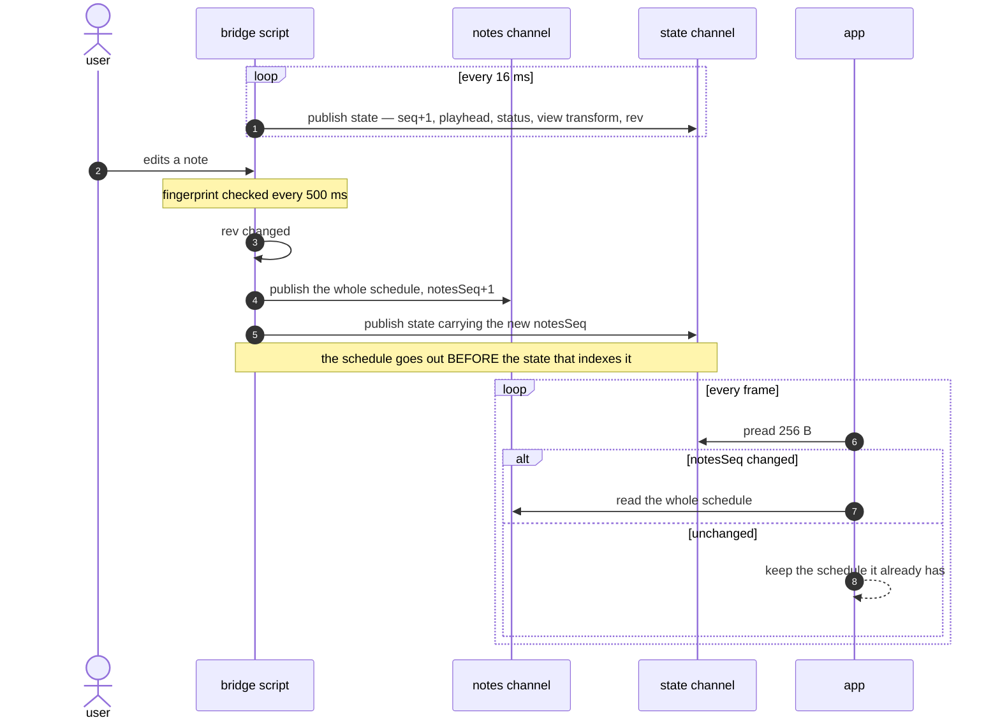

# The bridge

How the script inside SynthV gets data to the app.

Writer: `packages/synthv-script/src/lua/bridge/`.
Reader: `apps/voxpane/src/shared/bridgeChannels.ts` and `src/preload/bridgeReader.ts`.
Reference decoder for humans: `packages/synthv-script/scripts/dump.mjs`.

The script package has its own [README](../packages/synthv-script/README.md) covering the
Lua-side toolchain — `typescript-to-lua`, the 1-based index typing, host callbacks arriving
without `self`, and why there is a hand-written JSON encoder. Read it before editing
anything under `packages/synthv-script`.

## Where

One directory, reachable from both sides with no configuration:

| OS | Path |
| --- | --- |
| macOS | `~/Library/Application Support/voxpane/bridge` |
| Windows | `%LOCALAPPDATA%\voxpane\bridge` |

**The app creates it**, because Lua has no `mkdir`. A script that finds nothing there
simply keeps failing to open and retries on the next tick; that is the state before voxpane
has ever run.

## The channels

| File | Kind | Rate | Contents |
| --- | --- | --- | --- |
| `session.json` | hot, 1 KB, JSON | once at startup | protocol and layout version, host info, what the other channels are |
| `state` | hot, 256 B, binary | every 16 ms | playhead, transport status, loop hint, view transform, `rev`, sequence numbers |
| `notes` | cold, grows, binary | on edit / on play | the whole note schedule with pitch curves |

They are split **by how often they change**. The view transform moves 60 times a second
while the schedule moves when the user types; publishing them together meant re-serialising
every note in order to move a scroll position.

`session.json` stays JSON, and padded rather than framed, on purpose: it is the document
that tells a reader what the binary channels are, so it has to survive being read with
`cat`.

### Nothing is streamed and nothing is queued

Each channel holds **one whole record**, replaced in place. A reader that misses a
generation has missed nothing it needed — the next read has the newer value. There is no
notification of any kind, either: the app already looks every frame to draw, and a watcher
cannot beat that (measured: its tail latency is far worse).

## Pairing the channels

Split channels mean a reader can see a schedule from one generation and a view transform
from the next. Two mechanisms handle that:

- **`notesSeq`.** The state record carries the `notes` channel's generation, so a reader
  polling state once a frame learns the schedule moved without opening anything else. The
  hot channel is the index.
- **`rev`.** A fingerprint of the current group's notes (FNV-1a over onsets, ends, pitches
  and lyrics, plus the group's time offset and note count), carried by **both** channels. A
  changed `rev` means any held schedule is stale. **The record's own `rev` wins** over the
  one the state channel was carrying when it was read.

The script publishes the schedule *before* the state record that indexes it, so `rev` and
`notesSeq` describe the tick they are read in rather than the previous one.

`rev` is recomputed on its own cadence (every 500 ms), not per tick: fingerprinting walks
every note and calls into the host per note, and it is the only thing here that scales with
project size.



## Atomicity

**A record is always exactly one `write` call.** That is the whole safety story — no
`os.rename`, no temp file, no seqlock.

It holds because the kernel serialises reads and writes to a regular file. Measured with a
reader `pread`ing the same bytes as fast as it could: 3.6M reads against a 128 B record and
271k against a 306 KB one, no tear.

Two consequences are not optional:

- **Records carry their own length**, in the header. An in-place write shorter than the
  last one leaves the old tail behind, and atomicity does nothing about that.
- **The stdio buffer is off** (`setvbuf("no")`). A buffered write is not one syscall, and a
  buffered reader will happily serve a stale copy — measured, 4.6M reads that observed a
  single generation.

Files are opened `r+b`, falling back to `w+b`. Not `w`: truncating would expose an empty
file to a reader between the truncate and the write.

## The record layout

Little-endian throughout. Header, 12 bytes, on every binary record:

| Field | Type | Value |
| --- | --- | --- |
| magic | 4 bytes | `VPB1` |
| layout | u16 | `3` |
| channel | u16 | 1 = state, 2 = notes |
| length | u32 | payload bytes that follow |

**`state`** payload — fixed size, then space-padded to 256 bytes:

| Field | Type | Notes |
| --- | --- | --- |
| `seq` | u32 | advances every tick; a still `seq` means the script is gone |
| `notesSeq` | u32 | generation of the `notes` channel |
| `status` | u8 | 0 stopped, 1 playing, 2 looping |
| flags | u8 | bit 0: loop bounds are present |
| `at` | f64 | playhead, seconds |
| loop start, loop end | f64 × 2 | meaningless unless the flag is set |
| `perBlick`, `perSemitone` | f64 × 2 | the view scale |
| `viewLeft`, `viewRight` | f64 × 2 | visible blick range |
| `viewTop`, `viewBottom` | f64 × 2 | visible value range |
| `rev` | u16 length + UTF-8 | Lua's `s2` |

**`notes`** payload: `rev` (`s2`), note count (u32), then per note:

| Field | Type |
| --- | --- |
| `onB`, `offB`, `onS`, `offS` | f64 × 4 |
| `pitch` | i16 (MIDI) |
| `lyric` | u16 length + UTF-8 |
| bend count | u16 |
| bend samples | i16 × count, cents from `pitch` |

Blicks travel as **f64, not i64**: they are exact well past any project length (2⁵³ blicks
is millions of minutes) and it keeps the reader off `getBigInt64`, which allocates a BigInt
per field.

### Why binary

The encoder runs on SynthV's UI thread. A 2000-note schedule with pitch curves takes
**18.8 ms** to build as JSON and **2.0 ms** with `string.pack` — the difference between the
editor dropping a frame on every edit and not. The record also halves, 420 KB → 195 KB.

What binary costs is forgiveness, which is what the next section is about.

## Versioning

JSON tolerates a field appearing or changing type. A fixed layout read at the wrong version
is wrong **silently**. So:

> A reader that does not recognise both the magic and the layout version must **refuse** the
> record, never interpret it.

Layout 3 exists because bends gained the fixed padding on each side of their note. A padded
array looks exactly like an unpadded one — same type, plausible values — so a reader that
assumed padding would have indexed into the wrong part of the curve and drawn something
subtly wrong. That is the failure mode the version number is for.

**Changing the format means changing three places at once:**

1. `packages/synthv-script/src/lua/bridge/codec.ts` — bump `LAYOUT`, change the writer.
2. `apps/voxpane/src/shared/bridgeChannels.ts` — bump `LAYOUT`, change the reader.
3. `packages/synthv-script/scripts/dump.mjs` — bump `LAYOUT`, change the reference decoder.

Then rebuild and redeploy the script, or the app will (correctly) refuse every record a
stale copy publishes and the overlay will go quiet.

## Reading, in the app

`preload/bridgeReader.ts` holds one open fd per channel and reads from offset 0.

- `readState()` is a `pread` into a buffer allocated once — ~0.6 µs, no garbage, which is
  what a 60 Hz loop wants from its input. It runs **every frame**.
- `readSchedule()` allocates, so it runs only when `notesSeq` changed — a handful of times
  per session rather than per frame.
- **Nothing throws.** A short read, a torn record, an unknown layout, a missing file: every
  one of them is `null`, meaning "no data this frame". The writer is a different process
  that can restart at any moment, and a missing SynthV must not be able to break the
  overlay.
- A failed read **closes the fd**, so the next frame reopens. The script can be reinstalled
  or the directory cleared underneath a live handle.

On the consumer side (`playback/transport.ts`), a torn schedule leaves `notesSeq`
un-advanced, so the next frame retries rather than holding a schedule that never arrived.
And a state channel whose `seq` has not moved for 500 ms means the script is gone: stop
extrapolating.

## Seeing it

```sh
pnpm --filter @voxpane/synthv-script dump
```

Prints `session.json`, the decoded state record, and the first 8 notes with their bend
ranges. Optional argument: a directory, if you are looking at channels from somewhere else.

With nothing running you get three `ENOENT`s, which is itself the answer to "has the script
ever published here?". See [debugging](debugging.md#3-read-the-live-state) for what a
healthy dump looks like and how to read it.
