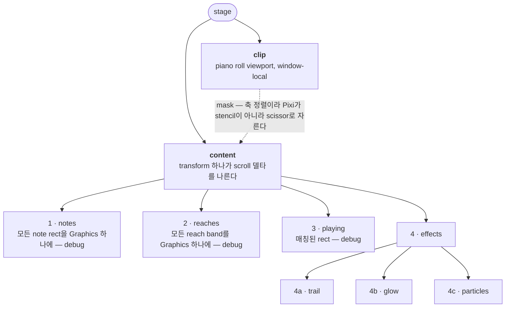

# Note effects (한국어)

> 원문: **[effects.md](effects.md)**. 영어판이 원본이다.

[geometry](geometry.ko.md)가 *어느 rect인가*에 답한 뒤 실제로 그려지는 것. effect 셋, scene
하나, 공유되는 좌표 공간 하나.

코드: `apps/voxpane/src/renderer/src/render/`(effect들과 Pixi scene)와
`playback/pitch.ts`(note 안에서 목소리가 어디 있는가).

## The three effects

**Glow** (`glow.ts`) — playhead가 note를 가로지르는 지점에 앉는 bloom sprite. sprite 하나를
envelope 둘이 몰고 random walk 셋이 흔든다. 내장 shape 넷(`bloom`, `cross`, `x`, `star`),
또는 사용자가 import한 이미지.

**Particles** (`particles.ts`) — 같은 지점에서 튀어나오는 spark. 600개 sprite의 고정 pool.
directional(각도를 따라 부채꼴로 퍼지고 중력 있음) 또는 radial(타원형 burst, 중력 없음).

**Trail** (`trail.ts`) — 목소리가 남기는 선. 최대 512개 point의 polyline이 꼬리부터 사라지고,
그 위에 최대 240개의 반짝이는 sparkle이 흩뿌려진다.

셋은 무엇을 그리는지에서만 다르고 나머지 전부에서 같다: 셋 다 프레임마다 점 하나를 받고, 셋 다
note set의 좌표 공간에 살며, 셋 다 재생이 멈춘 뒤에도 날아다니던 것이 사라지지 않고 끝나도록
계속 돈다.

## Where an effect is drawn

`playback/frame.ts`가 매칭된 rect $\text{hit}$에서 발사점을 계산한다. $p$는 playhead가 note
안으로 얼마나 들어왔는가, $s$는 semitone 단위 pitch offset이다:

```math
\begin{aligned}
x &= \text{hit}_x + \text{hit}_w \cdot p \\
y &= \text{hit}_y + \tfrac{1}{2}\,\text{hit}_h - s \cdot \text{hit}_h \\
\text{spread} &= \text{hit}_h
\end{aligned}
```

여기서 틀리기 쉬운 것 셋:

- **$p$는 $[0, 1]$로 clamp되지 않는다.** pitch contour는 note가 시작하기 전에 들어오고 끝난
  뒤에 나가며, effect도 그것을 따라가라고 만든 것이다. 양 끝 바깥에서 이 비율은 범위를
  벗어나고 점은 rect 옆으로 빠져나간다 — 그게 정확히 curve가 간 곳이다.
- **1 semitone이 곧 rect 하나의 높이다.** `hit.h`는 구성상 1 semitone이므로, semitone 단위
  pitch offset은 자기 매핑이 필요 없고 기존 scroll/zoom 정렬을 공짜로 물려받는다. 이 파일
  전체가 그 불변식 위에 서 있다.
- **trail은 자기 점을 따로 받는다.** `emit`은 사용자가 원할 때만 pitch를 따라가고,
  `trailEmit`은 언제나 따라간다. sung curve를 그리는 것이 trail *자체*이기 때문이다.

## Pitch following

`playback/pitch.ts`가 "지금 목소리가 note 자기 pitch에서 얼마나 떨어져 있고, 그것이 얼마나
빨리 변하고 있는가"에 답한다 — semitone 단위로, 그래서 위 식에 바로 들어간다.

**출처는 둘, 인터페이스는 하나.** bridge가 계산된 curve(`note.bend`)를 실어 오면 그것을
샘플링하고 보간한다. 없으면 — engine이 그 group의 pitch를 계산하지 않았고, 실제 프로젝트가
자주 머무는 상태다 — note들만으로 contour를 **합성한다**: 이전 note에서 미끄러져 들어오고
(`TRANSITION_SEC` 0.09초, `TRANSITION_GAP_SEC` 0.12초 이하의 간격에서만), 여기에
`VIBRATO_ONSET_SEC` 0.28초를 기다렸다가 0.18초에 걸쳐 5.5 Hz, ±0.18 semitone으로 페이드인하는
vibrato를 더한다. **호출자는 어느 쪽을 받았는지 알 수 없고, 알 필요도 없어야 한다.**

기다리는 vibrato는 실제로 일을 한다: 그 대기 시간보다 짧은 note는 vibrato에 닿지 못하고,
그것이 "빠른 악구에는 걸지 않는다"는 규칙 없이 빠른 악구에서 vibrato를 빼주는 장치다.

**세 가지 mode**(`pitch.mode`): `position`은 발사점을 옮기고, `intensity`는 목소리가 움직이는
속도로 particle rate와 glow level을 스케일하고, `both`는 둘 다 한다. speed는 offset의 한 프레임
차분이고, 거기서 얻는 boost는 effect가 폭주하지 않도록 상한이 걸려 있다:

```math
\text{speed} = \frac{\lvert\, \text{offset}(t) - \text{offset}(t - \delta) \,\rvert}{\delta},
\quad \delta = \tfrac{1}{60}
\qquad
\text{boost} = 1 + \min(\text{speed} \cdot \text{sensitivity},\; \text{MAX\_BOOST})
```

**`range`는 offset을 믿는 대신 묶는다.** contour는 언제든 어떤 버전으로든 재시작할 수 있는
별개 프로세스가 쓴 것이고, engine은 무성 frame을 gap이 아니라 pitch 0으로 보고한다 — 거의
한 옥타브에 달하는 offset이고, effect를 canvas 밖으로 날려버리기에 충분하다. script가 오늘
그것을 걸러내지만, 여기의 상한은 더 오래됐거나 망가진 writer가 그렇게 하는 것을 막는다.
**speed는 상한 적용 전에 취한다.** intensity는 목소리를 따라가야지 그리기가 허용된 지점을
따라가면 안 되기 때문이다.

curve가 왜 그렇게 동작하는지는 [synthv.ko.md](synthv.ko.md#the-computed-pitch-curve),
어떻게 이동하는지는 [bridge.ko.md](bridge.ko.md#the-record-layout).

## Techniques

각 항목은 *무엇인가 · 왜 여기에 있는가 · 어긋나면 무엇이 깨지는가*.

### Two summed envelopes

glow의 밝기는 값 하나가 아니라 **둘의 합**이다. `burst`는 note onset에서 1로 뛰어올라 지수적으로
죽고, `sustain`은 목표 — note가 울리는 동안 `level`, 아니면 0 — 를 시정수
$\tau$ = `SUSTAIN_TAU` 0.16초로 쫓아가며 같은 시정수로 놓는다.

```math
\begin{aligned}
\text{burst} &\leftarrow \text{burst} \cdot e^{-\Delta t / \text{flash}} \\
\text{sustain} &\leftarrow \text{sustain} + (\text{target} - \text{sustain})\left(1 - e^{-\Delta t / \tau}\right) \\
\text{brightness} &= (\text{sustain} + \text{burst}) \cdot \text{flicker}
\end{aligned}
```

**왜:** envelope 하나만으로는 onset이 *불이 켜진 것*으로 읽힌다. spike가 타격을, sustain이
지속을 나른다. `CUTOFF` 0.01 아래로 떨어지면 sprite는 아예 그리지 않는다.

**jitter는 envelope에 더해지는 게 아니라 곱해진다** — 위 셋째 줄. 그래서 release가 떨림까지
데리고 내려간다. 더했다면 떨림이 note보다 오래 살아남는다.

**깨지면:** onset이 밋밋하고 힘이 없음(burst가 안 터짐 — `noteStarted`를 볼 것) · 빛이 절대
꺼지지 않음(sustain 목표가 0으로 안 감) · note가 바뀌었는데 다시 때리지 않음(`struck`은 rect이
아니라 schedule에서 추적한다. 매칭에 실패한 프레임에서도 note는 여전히 시작하기 때문이다).

**함께 보기:** [매끄러운 random walk](#smoothed-random-walk),
[frame-rate independence](#frame-rate-independence).

### Smoothed random walk

`Tremble`은 −1..1 범위의 새 목표를 초당 `rate`번 뽑고 smoothstep으로 그 사이를 넘어간다.
독립된 walk 셋이 밝기 flicker, x shake, y shake를 각각 몬다.

**왜:** 이 진폭에서 white noise는 떨림이 아니라 블러로 읽힌다. walk를 분리하면 shake가 밝기를
그대로 따라가지 않는다. jitter가 0일 때도 **walk는 계속 진행된다.** 그래서 note 중간에 jitter를
올려도 지금쯤 떨림이 있었을 위치에서 시작하지, 튀지 않는다.

**깨지면:** note가 끝난 뒤에도 떨림이 이어짐(jitter가 곱해지지 않고 더해짐) · jitter 슬라이더를
움직일 때 눈에 띄게 튐(안 쓸 때 walk가 진행되지 않음).

### Sprite pooling with a hard cap

`MAX_PARTICLES` 600개와 `MAX_SPARKLES` 240개 sprite를 생성 시점에 할당해 layer에 한 번 붙이고,
pool과 live 리스트 사이를 오가게 한다. 배출은 몰아치고 프레임 단위라, 비싼 것은 산술이 아니라
display object를 갈아 끼우는 쪽이다.

**포화되면 살아 있는 것을 뺏지 않고 새 spark를 버린다.** 재활용된 살아 있는 particle은 화면을
가로질러 순간이동하고, 그건 분사가 살짝 얇아지는 것보다 훨씬 눈에 띈다.

**깨지면:** particle이 날아가다 사라짐(살아 있는 sprite가 재활용됨) · 부하에서 분사가 얇아짐
(정상이고, 그쪽이 낫다).

### Reach-parameterised motion

particle 설정은 속도가 아니라 **한 생애 동안 갈 픽셀 거리**다. 속도와 중력은 거기서 유도된다:

```math
v = \frac{\text{reach}}{\text{life}}
\qquad\qquad
g = \text{ARC} \cdot \frac{\text{spread}_y}{\text{life}^2}
```

**왜:** 슬라이더를 만지는 사람에게 의미가 남는 것이 거리다. 속도를 저장하면 수명을 늘리는
순간 모든 것이 더 멀리 날아가고, 사용자는 지속 시간만 물었는데 모양이 바뀐다. 중력을 px/s²로
고정하지 않고 설정에 묶은 것도 같은 이유다 — 안 그러면 긴 수명이 분사를 분수로 바꾼다.

**radial은 중력이 0이다.** burst가 burst로 읽히는 이유는 대칭이기 때문이고, 중력은 그것을
분수로 무너뜨린다.

**깨지면:** 수명 슬라이더가 도달거리까지 같이 바꿈 · radial burst가 아래로 처짐.

### Quantized fade

alpha는 trail을 따라 감소하고, Pixi는 하나의 path를 하나의 alpha로만 stroke한다 — 그래서
정직하게 그리면 세그먼트마다 stroke, 매 프레임 수백 개다. 대신 fade를 `FADE_LEVELS` 16단계로
양자화한다.

수명 $L$인 선에서 나이 $a$인 point에 대해:

```math
\text{level} = \left\lceil \left(1 - \frac{a}{L}\right)^{2} \cdot \text{FADE\_LEVELS} \right\rceil
\qquad
\alpha = \frac{\text{level}}{\text{FADE\_LEVELS}}
```

**왜 성립하는가:** $\alpha$는 꼬리 쪽으로 *감소만* 하므로 한 level은 항상 연속된 point 구간이고,
선 전체가 최대 16 stroke로 나온다. fade를 선형이 아니라 제곱으로 둔 것은, playhead 뒤쪽은
읽히게 남기고 끝은 딱딱한 경계 대신 빠르게 놓기 위해서다.

**깨지면:** 선에 계단이 보임(level이 너무 적음) · 긴 trail에서 프레임 드랍(양자화가 깨져서
세그먼트마다 stroke) · 구간 경계에 틈 — 한 구간은 다음이 시작하는 point **에서** 끝나야지 그
전에서 끝나면 안 된다.

### Join rules

연속된 trail point를 이을지 두 가드가 결정한다:

- `MIN_STEP_PX` 3 — 멈춰 있는 playhead는 아무것도 늘리지 않는다.
- `MAX_JOIN_LANES` 6, **가로 방향에만.** 목소리는 두 프레임 사이에 한 옥타브를 내려꽂을 수
  있고 그것을 그리는 것이 이 선의 존재 이유다. 그러나 playhead가 roll을 따라 *건너뛸* 수는
  없다. 그런 도약은 울리는 note가 다른 note의 rect에 매칭됐다는 뜻이고, 그것을 이으면 사라질
  때까지 줄무늬가 남는다.

끊기면 다음 point에 `joined: false`가 붙고, `redraw`가 거기서 새 구간을 시작한다.

**깨지면:** 스크롤 후 가로로 긴 줄무늬(가로 가드가 안 걸렸거나, 상류의 매칭이 틀렸다 —
[geometry](geometry.ko.md#matching-a-note-to-a-rectangle) 참조) · 진짜 vibrato를 가로질러
선이 안 그려짐(가드가 세로에 적용되고 있다).

### Coordinate-space rebasing

세 effect 전부 **현재 note read의** 좌표계에 위치를 들고 있다. pump가 날아다니는 중에 set을
교체하면 `NoteRenderer.rebaseEffects`가 살아 있는 것 전부를 note가 움직인 만큼 옮긴다:

```math
\begin{aligned}
x' &= \text{contentX}_{to} + (x - \text{contentX}_{from}) \cdot \frac{\text{contentW}_{to}}{\text{contentW}_{from}} \\[2pt]
y' &= y + (\text{refY}_{to} - \text{refY}_{from})
\end{aligned}
```

`followRect`·`rebaseAnchor`와 같은 산술이고, 집은
[geometry.ko.md](geometry.ko.md#staying-aligned)다. particle과 trail은 frame이 동일하면
일찍 빠져나온다 — 대부분의 프레임이 그렇다.

**깨지면:** 스크롤 중 read가 들어올 때마다 particle과 trail이 튐 · glow release가 때린 자리에서
멀어짐.

### Frame-rate independence

시간에 의존하는 모든 것이 **rate**이고 $\Delta t$에 대해 적분된다. 배출은 빚을 쌓아 두고
정수 개수만 쓰며 나머지를 다음 프레임으로 넘긴다. 그래서 60 Hz와 120 Hz가 초당 같은 개수를
낸다:

```math
\text{debt} \leftarrow \text{debt} + \Delta t \cdot \text{rate}
\qquad
n = \lfloor \text{debt} \rfloor
\qquad
\text{debt} \leftarrow \text{debt} - n
```

envelope도 프레임당 곱셈이 아니라 $e^{-\Delta t/\tau}$를 쓰는데, 같은 이유다.

$\Delta t$는 `MAX_STEP_SEC` 0.1초로 clamp된다. 그보다 긴 간격은 창이 숨겨졌거나 loop가 멎었다는
뜻이고, 따라잡으면 한꺼번에 터지므로 새로 시작한 것으로 다룬다.

**깨지면:** 120 Hz 디스플레이에서 spark가 두 배 · 창을 다시 보일 때 particle이 왈칵 터짐 ·
빠른 기계에서 effect가 빨라짐.

### Procedural textures, built once

glow shape은 256 px canvas에 radial/linear gradient와 `lighter` 합성으로 그린 뒤 shape별로
`Map`에 캐시한다. particle의 spark는 동심원 셋을 `generateTexture`로 구워낸 것이다.

**왜:** 안 그러면 드래그 도중 shape을 바꿀 때 그 프레임에 256 px canvas를 래스터화하게 된다.
모든 shape은 같은 둥근 bloom 위에 ray를 **얹은** 것이다 — shape은 빛이 무엇을 뻗는지를 바꾸지,
거기 빛이 있는지 여부를 바꾸지 않는다 — 그리고 shape 아래의 bed는 어둡게(`HALO_LEVEL` 0.45)
깔린다. 안 그러면 bed가 ray를 삼켜서 네 shape이 전부 똑같아 보인다.

**깨지면:** shape 설정을 바꿀 때 끊김 · 모든 shape이 `bloom`처럼 보임.

### Blend and tint duality

내장 shape은 additive로 그리고 사용자 색으로 tint한다. import한 이미지는 **자기 색 그대로**
(tint `0xffffff`) 사용자의 blend mode로 그린다. 그 그림이 통과시켜 칠할 mask가 아니라 빛
*자체*이기 때문이다. additive가 빛으로 읽히는 것이고, 불투명한 사진은 그 아래에서 씻겨나간다 —
`normal`이 존재하는 이유다.

particle은 texture를 프레임이 아니라 **burst 단위로** 고른다: 이미 날아가는 spark는 태어날 때
받은 것을 유지하므로, source를 바꿔도 살아 있는 분사가 화면 중간에서 정체를 바꿀 수 없다.

**깨지면:** import한 이미지가 tint된 채로 나옴 · 살아 있는 분사가 공중에서 texture를 바꿈 ·
이미지가 계속 안 보임 — texture가 로드될 때까지 effect는 내장 모양으로 폴백하고, 실패한 로드는
다시 시도하지 않는다.

## The scene graph

뒤에서 앞으로 번호를 매겼다 — 1이 가장 멀다.



알아둘 것 넷:

- **단순 스크롤 프레임은 transform 갱신 한 번이다.** note geometry는 pump가 새 set을 주거나
  스타일이 바뀔 때만 다시 만든다. scroll과 zoom은 `content`를 움직인다.
- **mask는 축 정렬 사각형**이라 Pixi가 stencil이 아니라 scissor로 자른다. phoneme lane, 피아노
  건반, 툴바 위에는 아무것도 그려지면 안 된다.
- **레이어 순서는 뒤에서 앞으로다:** trail은 빛이 이미 지나간 자리이므로, glow와 그다음 spark가
  그 앞에 있는 것으로 읽힌다.
- **Pixi의 ticker는 멈춰 있다**(`autoStart: false`, `sharedTicker: false`). 렌더링은 앱 자신의
  rAF가 몰고, 그것이 paint 시점에 viewport를 샘플링한다 — Pixi가 뒤에서 몰래 렌더하면 낡은
  transform으로 그리게 된다.

`NoteRenderer`는 React에게 받는 대신 자기 `<canvas>`를 소유한다: WebGL renderer를 무너뜨리면
context가 영영 사라지므로, HMR 리로드를 넘어 살아남은 canvas는 죽은 채로 돌아와 조용히 아무것도
그리지 않는다.

## Presets, images, and the preview

**Preset**은 네 effect 그룹의 이름 붙은 사본이고, 사용자가 바꿀 수 있는 이름과 별개로 안정적인
`id`를 갖는다. `activePreset`은 "이 값들이 어디서 왔는가"에 답하는데, 그건 "어느 preset과
값이 같은가"와 *다른* 질문이다 — 불러온 뒤 편집하면 값은 아무것과도 일치하지 않게 되고, 저장은
여전히 무엇을 덮어쓸지 알아야 한다.

**이미지**는 main을 통해 import되어 `userData/effect-assets`에 해시 이름으로 복사되고, 권한이
부여된 `asset://` scheme으로 다시 제공된다. preferences는 파일 이름만 나르므로 바이너리가
`preferences.json`에 닿지 않고, 그 이름은 나가는 길에 `^[0-9a-f]{16}\.(png|jpg|…)$`로 다시
검증된다 — 경로이자 URL이 되기 때문이다.

scheme의 `corsEnabled`가 이게 동작하느냐 마느냐를 가르는 플래그다: renderer는 http(dev)나
file(패키징)에서 제공되므로 모든 `asset://` 읽기가 cross-origin이고, Pixi는 texture를 worker
안의 `fetch`로 로드한다. 이게 없으면 거부는 **effect가 조용히 내장 모양을 계속 그리는 것**으로만
드러난다 — 그동안 ``인 설정 썸네일은 멀쩡해서 문제를 가린다.

**Preview**는 설정 창에서 올라가는 세 note짜리 계단을 *진짜* `samplePitch`로 재생한다. 그래서
보여주는 것이 자기만의 모양이 아니라 overlay가 그릴 바로 그 선이다. 같은 이유로 overlay와
`palette.ts`를 공유한다.

## Invariants

| 불변식 | 깨지면 |
| --- | --- |
| 매칭된 rect은 정확히 1 semitone 높이다 | pitch offset이 잘못 스케일됨. trail이 납작해지거나 과장됨 |
| 재생이 멈춰도 effect는 계속 진행된다 | 마지막 spark와 glow release가 공중에서 잘림 |
| note read가 교체되면 살아 있는 effect 위치를 rebase한다 | 스크롤 중 read가 들어올 때 전부 튐 |
| `dt`는 clamp하고 모든 rate는 적분한다 | 숨겼다 켠 창이 왈칵 터짐. 120 Hz가 출력을 두 배로 만듦 |
| 포화되면 새 spark를 버리지, 살아 있는 것을 재활용하지 않는다 | particle이 순간이동함 |
| trail 구간은 가로로만 끊고, 세로로는 끊지 않는다 | roll을 가로지르는 줄무늬, 또는 안 그려지는 vibrato |
| preferences는 asset *이름*만 나르고, 경로나 바이트는 나르지 않는다 | 기계 간에 공유된 preset이 asset 디렉터리 밖에 쓴다 |
