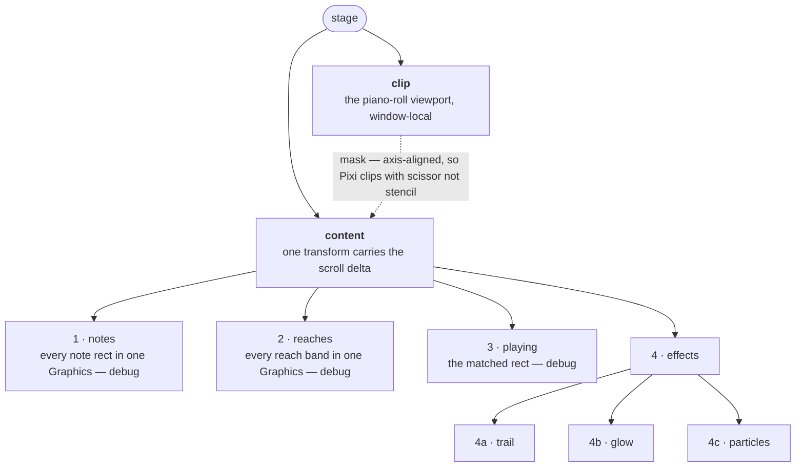

# Note effects

What actually gets drawn once [geometry](geometry.md) has answered *which rectangle*. Three
effects, one scene, one shared coordinate space.

Code: `apps/voxpane/src/renderer/src/render/` (the effects and the Pixi scene) and
`playback/pitch.ts` (where the voice is inside a note).

## The three effects

**Glow** (`glow.ts`) — a bloom sprite sitting on the playhead where it crosses a note. One
sprite, driven by two envelopes and shaken by three random walks. Four built-in shapes
(`bloom`, `cross`, `x`, `star`), or a picture the user imported.

**Particles** (`particles.ts`) — sparks thrown off the same point. A fixed pool of 600
sprites; directional (fanned along an angle, with gravity) or radial (an ellipse burst, no
gravity).

**Trail** (`trail.ts`) — the line the voice leaves behind. A polyline of up to 512 points
that fades from the tail, plus up to 240 twinkling sparkles scattered along it.

They differ in what they draw and agree on everything else: all three take a point per
frame, all three live in the note set's coordinate space, and all three keep running after
playback stops so that what is in flight finishes rather than vanishing.

## Where an effect is drawn

`playback/frame.ts` computes the emission point from the matched rectangle $\text{hit}$,
where $p$ is how far the playhead is into the note and $s$ is the pitch offset in semitones:

```math
\begin{aligned}
x &= \text{hit}_x + \text{hit}_w \cdot p \\
y &= \text{hit}_y + \tfrac{1}{2}\,\text{hit}_h - s \cdot \text{hit}_h \\
\text{spread} &= \text{hit}_h
\end{aligned}
```

Three things about this are easy to get wrong:

- **$p$ is not clamped to $[0, 1]$.** A pitch contour runs into a note before it starts
  and out of it after it ends, and the effect is meant to run with it. Off the ends the
  fraction leaves the range and the point leaves the rectangle sideways — which is exactly
  where the curve went.
- **A semitone is a rectangle height.** `hit.h` is one semitone by construction, so a pitch
  offset in semitones needs no mapping of its own and inherits the existing scroll/zoom
  alignment for free. This is the invariant the whole file rests on.
- **The trail gets its own point.** `emit` follows the pitch only when the user asked for
  it; `trailEmit` follows it always, because drawing the sung curve is what the trail *is*.

## Pitch following

`playback/pitch.ts` answers "how far is the voice from the note's own pitch, right now, and
how fast is that changing" — in semitones, so it drops straight into the formula above.

**Two sources, one interface.** When the bridge carries a computed curve (`note.bend`), it is
sampled and interpolated. When it does not — the engine has not computed that group's pitch,
which real projects sit in — a contour is **synthesized** from the notes alone: a glide in
from the previous note (`TRANSITION_SEC` 0.09 s, only across gaps under `TRANSITION_GAP_SEC`
0.12 s) plus a vibrato that waits `VIBRATO_ONSET_SEC` 0.28 s and fades in over 0.18 s at
5.5 Hz, ±0.18 semitones. **The caller cannot tell which it got, and should not have to.**

The waiting vibrato is doing real work: notes shorter than the wait never reach it, which is
what keeps it off fast passages without a rule about fast passages.

**Three modes** (`pitch.mode`): `position` moves the emission point, `intensity` scales
particle rate and glow level by how fast the voice is moving, `both` does each. Speed is a
one-frame difference of the offset, and the boost it earns is capped so an effect cannot run
away:

```math
\text{speed} = \frac{\lvert\, \text{offset}(t) - \text{offset}(t - \delta) \,\rvert}{\delta},
\quad \delta = \tfrac{1}{60}
\qquad
\text{boost} = 1 + \min(\text{speed} \cdot \text{sensitivity},\; \text{MAX\_BOOST})
```

**`range` bounds the offset rather than trusting it.** The contour is written by a separate
process that can restart at any version, and the engine reports unvoiced frames as pitch
zero rather than as a gap — an offset of most of an octave, enough to throw the effect off
the canvas. The script filters that today; the bound here is what stops an older or broken
writer doing it anyway. **Speed is taken before the bound**, because intensity should follow
the voice, not the place the drawing was allowed to reach.

See [synthv.md](synthv.md#the-computed-pitch-curve) for why the curve behaves the way it
does, and [bridge.md](bridge.md#the-record-layout) for how it travels.

## Techniques

Each entry is: what it is · why it is here · what breaks when it goes wrong.

### Two summed envelopes

Glow brightness is not one value but the **sum of two**. `burst` jumps to 1 at a note onset
and decays exponentially; `sustain` chases its target — `level` while a note sounds, zero
otherwise — with time constant $\tau$ = `SUSTAIN_TAU` 0.16 s, and releases with the same
constant.

```math
\begin{aligned}
\text{burst} &\leftarrow \text{burst} \cdot e^{-\Delta t / \text{flash}} \\
\text{sustain} &\leftarrow \text{sustain} + (\text{target} - \text{sustain})\left(1 - e^{-\Delta t / \tau}\right) \\
\text{brightness} &= (\text{sustain} + \text{burst}) \cdot \text{flicker}
\end{aligned}
```

**Why:** one envelope alone makes an onset read as *a light being switched on*. The spike
carries the strike, the sustain carries the holding. Below `CUTOFF` 0.01 the sprite is not
drawn at all.

**Breaks as:** flat, unimpactful onsets (burst not firing — check `noteStarted`) · light that
never goes out (the sustain target is not going to zero) · a note change that does not
re-strike (`struck` is tracked from the schedule, not from the rectangle, precisely so a note
still starts on a frame where it could not be matched).

**Used with:** [smoothed random walk](#smoothed-random-walk),
[frame-rate independence](#frame-rate-independence).

### Smoothed random walk

`Tremble` draws a fresh target in −1..1 `rate` times a second and eases into it with
smoothstep. Three independent walks drive brightness flicker, x shake and y shake.

**Why:** white noise at these amplitudes reads as blur, not as a shiver. Separate walks stop
the shake from simply tracking the brightness. The walks are **stepped even when jitter is
zero**, so turning jitter up mid-note starts from wherever the shiver would have been rather
than snapping.

**Jitter multiplies the envelope, it does not add to it** — the third line above. So the
release takes the shiver down with it; added, the trembling would outlive the note.

**Breaks as:** trembling that continues after a note ends (jitter added rather than
multiplied) · a visible jump when the jitter slider moves (walks not stepped while unused).

### Sprite pooling with a hard cap

`MAX_PARTICLES` 600 and `MAX_SPARKLES` 240 sprites are allocated at construction, added to
the layer once, and moved between a pool and a live list. Emission is bursty and per-frame,
so churning display objects — not the arithmetic — is the expensive part.

**Saturation drops the new spark rather than stealing a live one.** A recycled live particle
would teleport across the screen, which is far more visible than a slightly thinner spray.

**Breaks as:** particles disappearing mid-flight (a live sprite was recycled) · a spray that
thins under load (normal, and preferable).

### Reach-parameterised motion

Particle settings are **reaches in pixels over one lifetime**, not speeds. Velocity and
gravity are derived from them:

```math
v = \frac{\text{reach}}{\text{life}}
\qquad\qquad
g = \text{ARC} \cdot \frac{\text{spread}_y}{\text{life}^2}
```

**Why:** a reach is what stays meaningful to someone dragging a slider. Store speed instead
and lengthening the lifetime also makes everything fly further, so the shape changes when the
user only asked for duration. Tying gravity to the settings rather than fixing it in px/s²
keeps the arc the same shape as the sliders move — otherwise a long lifetime turns a spray
into a fountain.

**Radial gets gravity 0.** A burst reads as a burst because it is symmetric; gravity
collapses it into a fountain.

**Breaks as:** the lifetime slider changing reach too · a radial burst sagging downward.

### Quantized fade

Alpha falls off along the trail, and Pixi strokes one path at one alpha — so the honest
drawing is a stroke per segment, hundreds rebuilt every frame. Instead the fade is quantized
to `FADE_LEVELS` 16.

For a point of age $a$ in a line of lifetime $L$:

```math
\text{level} = \left\lceil \left(1 - \frac{a}{L}\right)^{2} \cdot \text{FADE\_LEVELS} \right\rceil
\qquad
\alpha = \frac{\text{level}}{\text{FADE\_LEVELS}}
```

**Why it is sound:** $\alpha$ only ever *decreases* towards the tail, so a level is always a
contiguous run of points, and the whole line comes out in at most 16 strokes. The fade is
squared rather than linear, so the line stays readable behind the playhead and then gives way
quickly instead of ending on a hard edge.

**Breaks as:** visible banding (too few levels) · frame drops on long trails (quantization
lost, one stroke per segment) · gaps at run boundaries — a run must end **on** the point
where the next begins, not before it.

### Join rules

Two guards decide whether consecutive trail points are connected:

- `MIN_STEP_PX` 3 — a parked playhead extends nothing.
- `MAX_JOIN_LANES` 6, **sideways only**. The voice can dive an octave between two frames and
  drawing that is the entire point of the line; but the playhead cannot leap *along* the
  roll. A jump like that is the sounding note having been matched to another note's
  rectangle, and joining it would leave a streak standing until it faded.

A break sets `joined: false` on the next point, and `redraw` starts a new run there.

**Breaks as:** long horizontal streaks after a scroll (the sideways guard is not firing, or
matching is wrong upstream — see [geometry](geometry.md#matching-a-note-to-a-rectangle)) ·
a line that will not draw across a real vibrato (the guard is being applied vertically).

### Coordinate-space rebasing

All three effects hold positions in the coordinate frame of **whichever note read is
current**. When the pump replaces the set mid-flight, `NoteRenderer.rebaseEffects` shifts
everything live by the same delta the notes moved:

```math
\begin{aligned}
x' &= \text{contentX}_{to} + (x - \text{contentX}_{from}) \cdot \frac{\text{contentW}_{to}}{\text{contentW}_{from}} \\[2pt]
y' &= y + (\text{refY}_{to} - \text{refY}_{from})
\end{aligned}
```

This is the same arithmetic as `followRect` and `rebaseAnchor` —
[geometry.md](geometry.md#staying-aligned) is its home. Particles and trail early-out when
the frames are identical, which is most frames.

**Breaks as:** particles and trail jumping every time a read lands during a scroll · a glow
release drifting away from where it was struck.

### Frame-rate independence

Everything time-based is a **rate**, integrated against $\Delta t$. Emission accumulates a
debt and spends whole sparks, carrying the remainder into the next frame, so 60 Hz and 120 Hz
emit the same number per second:

```math
\text{debt} \leftarrow \text{debt} + \Delta t \cdot \text{rate}
\qquad
n = \lfloor \text{debt} \rfloor
\qquad
\text{debt} \leftarrow \text{debt} - n
```

Envelopes use $e^{-\Delta t/\tau}$ rather than a per-frame multiplier, for the same reason.

$\Delta t$ is clamped to `MAX_STEP_SEC` 0.1 s. A longer gap means the window was hidden or the
loop stalled; catching up would fire a burst, so it is treated as a fresh start.

**Breaks as:** twice the sparks on a 120 Hz display · a burst of particles when the window
is un-hidden · effects that speed up on a fast machine.

### Procedural textures, built once

Glow shapes are drawn into a 256 px canvas with radial/linear gradients and `lighter`
compositing, then cached in a `Map` per shape. The particle spark is three concentric circles
baked to a texture through `generateTexture`.

**Why:** switching shape mid-drag would otherwise rasterise a 256 px canvas on the frame the
setting changes. Every shape is the same round bloom with rays laid **over** it — a shape
changes what the light throws off, never whether there is light there — and the bed is dimmed
under a shape (`HALO_LEVEL` 0.45) or it would swallow the rays and all four shapes would look
identical.

**Breaks as:** a hitch when a shape setting changes · shapes that all look like `bloom`.

### Blend and tint duality

A built-in shape is drawn additively and tinted with the user's colour. An imported image is
drawn **in its own colours** (tint `0xffffff`) with the user's blend mode, because the picture
*is* what the light is made of rather than a mask to paint through. Additive is what reads as
light; an opaque photo washes out under it, which is why `normal` exists.

Particles choose the texture **per burst**, not per frame: sparks already in flight keep what
they were born with, so switching source cannot make a live spray change identity halfway
across the screen.

**Breaks as:** an imported image coming out tinted · a live spray changing texture mid-air ·
an image that stays invisible — the effect falls back to its built-in look until the texture
loads, and a load that failed is never retried.

## The scene graph

Numbered back to front — 1 is furthest away.



Four things worth knowing:

- **A plain scroll frame is one transform update.** Note geometry is rebuilt only when the
  pump delivers a new set or the style changes; scroll and zoom move `content`.
- **The mask is an axis-aligned rectangle** so Pixi clips with scissor rather than stencil.
  Nothing may draw over the phoneme lane, the piano keys or the toolbars.
- **Layer order is back to front:** the trail is what the light has already passed over, so
  the glow and then the sparks read as being in front of it.
- **Pixi's ticker is stopped** (`autoStart: false`, `sharedTicker: false`). Rendering is
  driven from the app's own rAF, which samples the viewport at paint time — Pixi rendering
  behind our back would draw with a stale transform.

`NoteRenderer` owns its `<canvas>` rather than taking one from React: tearing down a WebGL
renderer loses its context for good, so a canvas that survived an HMR reload would come back
dead and silently draw nothing.

## Presets, images, and the preview

**Presets** are named copies of the four effect groups, with a stable `id` separate from the
user-editable name. `activePreset` answers "where did these values come from", which is *not*
the same question as "which preset do they equal" — editing after loading leaves the values
matching nothing, and saving still needs to know what to overwrite.

**Images** are imported through main, copied into `userData/effect-assets` under a hashed
name, and served back over a privileged `asset://` scheme. Preferences only ever carry the
file name, so nothing binary reaches `preferences.json`, and the name is re-validated against
`^[0-9a-f]{16}\.(png|jpg|…)$` on the way out — it becomes both a path and a URL.

The scheme's `corsEnabled` is the flag that decides whether this works at all: renderers are
served from http (dev) or file (packaged), so every `asset://` read is cross-origin, and Pixi
loads textures by `fetch` in a worker. Without it the refusal surfaces only as an effect that
quietly keeps drawing its built-in shape — while the settings thumbnail, an ``, works
fine and hides the problem.

**The preview** in the settings window plays a rising three-note staircase through the *real*
`samplePitch`, so what it shows is the line the overlay would draw rather than a shape of its
own. It shares `palette.ts` with the overlay for the same reason.

## Invariants

| Invariant | If broken |
| --- | --- |
| A matched rectangle is exactly one semitone tall | pitch offsets scale wrongly; the trail flattens or exaggerates |
| Effects keep stepping after playback stops | the last sparks and the glow release are cut off mid-air |
| Live effect positions are rebased when the note read is replaced | everything jumps when a read lands during a scroll |
| `dt` is clamped and every rate is integrated | a hidden window comes back with a burst; 120 Hz doubles the output |
| Saturation drops new sparks, never recycles live ones | particles teleport |
| Trail runs break sideways, never vertically | streaks across the roll, or a vibrato that will not draw |
| Preferences carry an asset *name*, never a path or bytes | a preset shared between machines writes outside the asset directory |
