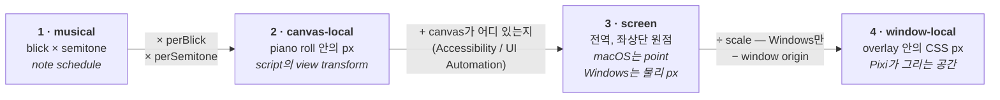

# Geometry (한국어)

> 원문: **[geometry.md](geometry.md)**. 영어판이 원본이다.

note가 화면 어디에 있는가. 미묘한 버그가 사는 곳이다. 답이 두 출처에서 조립되는데, 각자
절반씩만 권위가 있고 어느 쪽도 신선하지 않기 때문이다.

- **bridge**는 note의 음악적 위치를 정확히 안다 — 다만 canvas-local 단위이고, 읽힐 무렵이면
  레코드는 이미 수십 밀리초 낡았다.
- **native helper**는 rect이 화면 어디에 실제로 있는지 지금 이 순간 안다 — 다만 어느 rect이
  어느 note인지는 모른다.

그래서: bridge가 *예측*을 주고, 예측은 rect을 **고른다**. rect에서 값을 뽑는 게 아니다.
geometry에 대한 진실은 rect 쪽이다.

## Coordinate spaces

넷이고, 각 단계 사이가 버그 한 종류씩이 사는 곳이다.



주목할 것은 2번이다: script는 그것을 정확히 알면서, canvas가 화면 어디 있는지는 **아무것도**
말하지 않는다. native helper가 존재하는 이유가 그 공백이다.

## Two platforms, two strategies

플랫폼이 정말로 갈리는 유일한 지점이고, 그 차이는 `shared/native.ts`의 추상화 뒤로
**의도적으로 감추지 않는다.** 한쪽을 바꾸는 것이 보통 양쪽을 바꾸는 것이 아니다.

**macOS — 트리를 읽는다.** SynthV가 Accessibility 트리를 노출하므로 note rect이 이미 거기
있다. `packages/macos-helper/src/pianoroll.rs`가 그것을 훑고(~50 ms), note 영역의 scrollbar
쌍에서 canvas를, canvas 좌상단에 정렬된 가장 넓은 group에서 content group을 찾아, 보이는 note
rect들을 전역 screen point로 반환한다. bridge는 그중 *어느 것이* 울리는지만 말한다.

**Windows — 계산한다.** JUCE가 editor 전체를 HWND 하나에 그리므로 읽을 note element 트리가
없다. 그래서 rect은 **script 자신의 view transform에서 유도되고**
(`shared/windowsGeometry.ts`, 순수 함수라 Windows가 아닌 곳에서도 테스트된다), UI Automation
에는 script가 알 수 없는 단 하나 — canvas가 화면 어디 있는지 — 만 묻는다.

canvas는 레이아웃을 추측해서가 아니라 **bridge와의 합의로** 식별한다: 보이는 time·value range에
각각의 px-per-unit을 곱하면 canvas의 정확한 픽셀 크기가 나오고, `uia.rs`가 JUCE의 평평한
~140-element 트리에서 그 치수를 가진 element를 찾는다. 자기검증적이고, SynthV가 패널을
재배치해도 살아남는다.

붙들어 둘 만한 결과들:

| | macOS | Windows |
| --- | --- | --- |
| note rect 출처 | AX 트리 | view transform에 대한 산술 |
| helper가 주는 것 | canvas, scroll, zoom, note rect | canvas rect, 그리고 window origin |
| 세로 기준 | 추적 중인 note chip의 `y` | transform이 직접 말해줌 |
| read가 어긋날 수 있는가 | 그렇다 — 움직이는 중에 트리를 읽음 | 아니다 — flag는 항상 true |
| 사용자 승인 필요 | 그렇다, Accessibility | 아니다 |
| scroll 지연 | 없음 (AX는 실시간) | script tick 하나 (16 ms) |

마지막 줄이, 재생이 멈춰 있어도 script의 idle tick이 16 ms로 유지되는 이유다: 멈춰 있을 때가
바로 사용자가 스크롤하는 때이고, Windows에서는 publish된 transform이 roll이 어디로 스크롤되어
있는지에 대한 앱의 유일한 출처다.

## Physical pixels, points and DIPs

Windows는 **물리 픽셀**을 보고한다 — Win32와 UI Automation 둘 다 그렇다 — 반면 Electron은
창을 배치하고 renderer를 레이아웃할 때 **DIP**를 쓴다. 변환은 원점이 아니라 대상이 올라가 있는
디스플레이를 기준으로 한다:

```math
x_{\text{dip}} = \text{originDip}_x + \frac{x_{\text{px}} - \text{originPx}_x}{\text{scale}}
\qquad
w_{\text{dip}} = \frac{w_{\text{px}}}{\text{scale}}
```

`scale`과 두 origin을 Electron에 물을 수 있는 것은 main process뿐이라, `main/dip.ts`가 대상
창이 올라가 있는 디스플레이에서 그것들을 유도해 모든 renderer에 push한다. renderer는 프레임
geometry를 로컬에서 변환한다(`shared/native.ts`의 `toDipRect`, `toDipViewport`,
`toDipPianoRoll`) — 읽을 때마다 IPC를 왕복하는 대신. macOS에서는 transform이 항등이라, 적용하는
것이 특수 케이스가 아니라 no-op이 된다.

잘못됐을 때의 증상: 100 % 배율에서는 맞는데 HiDPI 디스플레이에서 배율에 비례해 어긋난다,
또는 주 모니터에서는 맞는데 배율이 다른 두 번째 모니터에서 틀린다.

## Matching a note to a rectangle

`playback/locate.ts`에 셋이 있고, 각자가 앞의 것의 사각지대를 덮으므로 층을 이룬다.

**1. `locateNote` — 예측하고, 스냅한다.** view mapping과 그것이 짝지어진 scroll 위치로 note가
*있어야 할* 곳을 계산하고, 폭이 (25 % 이내로) 맞으면서 거리가 slip 한계 안인 가장 가까운
rect을 취한다. 충분히 가까운 것이 없으면 `null`을 반환한다: 엉뚱한 note에 effect를 보여주는
것이 아무것도 안 보여주는 것보다 나쁘다.

스냅이 바로 약간 틀린 것을 견디게 해주는 장치이고, 오차가 note 사이 간격보다 한참 작게
유지되는 한 동작한다.

**2. `followRect` — 갖고 있는 것을 유지한다.** 프레임마다 다시 예측하면 움직이는 roll에서
effect가 옆 note로 스냅해 버린다. 대신, note가 한 번 rect을 가지면 read에서 read로 *추적*한다:
두 read 모두 자기 좌표가 찍힌 scroll과 zoom을 싣고 있으므로, 옛 rect이 새 frame으로 정확히
매핑되고 그 note의 rect은 그냥 거기 있는 것이다(6 px 이내). read에서 사라졌다는 것은 —
편집으로 지워졌거나, 스크롤로 나갔거나, track이 바뀌었거나 — 처음부터 다시 매칭하라는 뜻이다.

**3. `ReadAnchor` — 한 번의 매칭이 모든 note를 배치한다.** 2026-08-04 측정: bridge의 view
mapping은 **재생 중 18 ms, 꼬리에서 35 ms** 낡았고, 실제 스크롤 속도에서 그것은 note 한두
개만큼의 오차다. 그래서 mapping으로 만든 예측은 *어느* note를 보고 있는지에 대한 추측 이상이
될 수 없다.

read는 자기 자신에 대해서는 그 질문에 답할 수 있다. piano roll의 모든 note는 blick에서 픽셀로
가는 하나의 직선 위에 있다 — 그래서 **매칭된 rect 하나가 그 read 전체에 대해 그 직선을
고정하고**, 나머지 모든 note는 bridge 지연이 전혀 없는 산술로 따라 나온다. 매칭된 rect 하나가
직선의 절편을 준다:

```math
x_0 = \text{rect}_x - \text{onB} \cdot \text{perBlick}
```

그리고 그 read의 다른 모든 note가 거기서 따라 나온다:

```math
\begin{aligned}
x &= x_0 + \text{onB} \cdot \text{perBlick} \\
y &= y_{\text{anchor}} + (\text{pitch}_{\text{anchor}} - \text{pitch}) \cdot \text{laneH} \\
w &= (\text{offB} - \text{onB}) \cdot \text{perBlick} \\
h &= \text{laneH}
\end{aligned}
```

mapping은 자기가 잘하는 것만 남긴다: 스케일. 그것도 읽힌 view에서 이 frame으로 다시 스케일된
값이다.

anchor는 read 범위다. 다음 read로 들고 가려면 rebase해야 하고(`rebaseAnchor`), 그건 rect을
추적하는 것과 정확히 같다.

이것이 `App.tsx`의 게이트이기도 하다: fling(한 프레임에 24 px 초과 이동)은 새 매칭을
**시작할** 수 없다. 예측이 이미 두 note 사이 간격보다 더 벗어나 있기 때문이다. 그럴 필요도
없다 — 이미 잡힌 매칭은 추적되고, anchor가 나머지 전부를 배치한다. 둘 다 mapping에게 무엇이
어디 있는지 묻지 않으므로, 어떤 스크롤에서도 살아남는다.

## Staying aligned

note rect은 **read 시점 기준의** 절대 screen 좌표다. viewport는 **paint 시점에** 샘플링된다.
`playback/frame.ts`에 있는 것은 전부 그 두 순간의 차이다:

| 값 | 나르는 것 |
| --- | --- |
| `contentX` | 가로 scroll — blick 0의 screen x |
| `contentW` | 가로 zoom, 오직 자기 자신과만 비교됨 |
| `refY` | 세로 scroll — 기준점의 screen y |

```math
\begin{aligned}
\text{scaleX} &= \frac{\text{contentW}_{\text{live}}}{\text{contentW}_{\text{read}}} \\[2pt]
\text{offsetX} &= \text{contentX}_{\text{live}} - \text{contentX}_{\text{read}} \cdot \text{scaleX} \\[2pt]
\text{dy} &= \text{refY}_{\text{live}} - \text{refY}_{\text{read}}
\end{aligned}
```

정렬의 전부가 그것이다: 스케일 하나와 offset 둘을, read의 rect들에 Pixi `content` container의
transform 한 번으로 적용한다.

Windows에서 `contentW`는 실제 content 폭이 아니다. script가 그런 것을 보고하지 않는다. 고정된
blick 구간에 `perBlick`을 곱한 값이고, zoom에 비례하며, 그거면 충분하다.

macOS의 `refY`는 추적 중인 note chip의 `y`다. SynthV의 AX 트리에서 세로 scroll을 따라가는
스칼라는 없다 — scrollbar 값은 죽어 있고, thumb child도 없고, 움직이는 group도 없다 — 그러나
chip frame은 움직이므로, 프레임마다 캐시된 chip 하나를 읽으면 델타가 바로 나온다. 살아 있는
세로 기준이 없으면 y 위치는 정말로 알 수 없고, overlay는 lane 하나 어긋난 note를 그리는 대신
**아무것도** 그리지 않는다.

**Stability flag.** roll이 움직이는 동안 찍힌 macOS read는 좌표들이 서로 어긋나 있다: chip들이
서로 다른 순간에 샘플링됐고 보정할 chip별 기준이 없다. `xStable` / `yStable`이 그것을 말하고,
그런 read는 통째로 버린다. 그동안 이전 set이 여전히 맞는 이유는 어차피 살아 있는 viewport
데이터로 매핑되기 때문이다. Windows에서는 rect이 transform 하나에서 나오므로 두 flag가 항상
true다.

**Window origin.** overlay는 전역 좌표를 window-local로 매핑할 때 `vp.origin` — canvas와 같은
호흡에 샘플링된 window origin — 을 쓰고, helper가 주지 않을 때만 `window.screenX`로 떨어진다.
Chromium은 `screenX`를 자기 일정대로 갱신하므로 드래그 중에는 둘이 어긋나고 그림이 미끄러진다.

**Effect도 자기 frame을 싣는다.** 살아 있는 particle과 trail point는 현재 read의 좌표 공간에
놓여 있으므로, pump가 날아다니는 중에 set을 교체하면 `rebaseEffects`가 note가 움직인 만큼 그것들을
옮긴다. 없으면 스크롤 중에 read가 들어올 때마다 튄다. 위의 `followRect`·`rebaseAnchor`와 같은
산술을 다른 대상에 적용한 것이다 — [effects.ko.md](effects.ko.md#coordinate-space-rebasing)
참조.

## Invariants

아래 중 하나가 깨지면 옆에 적힌 증상이 나온다.

| 불변식 | 깨지면 |
| --- | --- |
| view mapping은 같은 프레임에 읽은 scroll 위치와 짝지어서만 쓸 수 있다 | 스크롤 중 effect가 note보다 앞서거나 뒤처짐 |
| 예측은 rect을 고르는 것이지, rect이 *되는* 것이 아니다 | effect가 note에서 일정하게 조금씩 벗어남 |
| note는 울리는 동안 매칭된 rect을 유지한다 | note 중간에 effect가 옆 note로 건너뜀 |
| roll이 빠르게 움직이는 동안에는 새 매칭을 하지 않는다 | fling이 effect를 한두 note 떨어진 곳에 떨굼 |
| stability flag가 false인 read는 부분이 아니라 통째로 버린다 | 스크롤 후 note들이 서로 어긋남 |
| 세로 기준이 없으면 아무것도 그리지 않는다 | effect가 lane 하나 어긋나서, 놓칠 만큼 그럴듯하게 나옴 |
| window-local 매핑은 canvas와 함께 샘플링된 origin을 쓴다 | 창을 드래그하는 동안 그림이 미끄러짐 |
| rect은 정확히 1 semitone 높이다 | pitch offset이 잘못 스케일됨. trail이 납작해지거나 과장됨 |

마지막 것은 자명하지 않은 방식으로 하중을 받는다: 매칭된 rect이 정확히 1 semitone 높이라는
사실이, semitone 단위 pitch offset을 rect 높이로 스케일하고 기존 scroll/zoom 정렬을 공짜로
물려받게 해준다. `playback/pitch.ts`가 그것에 의존한다 —
[effects.ko.md](effects.ko.md#where-an-effect-is-drawn) 참조.

찾아낸 rect에 무슨 일이 일어나는지는 [effects.ko.md](effects.ko.md), 그것이 그려지는 창이
어디서 오는지는 [overlay.ko.md](overlay.ko.md).
