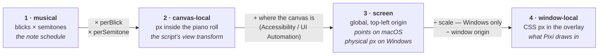

# Geometry

> 한국어판: **[geometry.ko.md](geometry.ko.md)**. 영어판이 원본이므로, 동작이 바뀌면 여기를 먼저 고치고
> 같은 커밋에서 번역을 맞춘다.

Where a note is on screen. This is where the subtle bugs live, because the answer is
assembled from two sources that are each authoritative about half of it and neither of
which is fresh.

- The **bridge** knows each note's musical position and the piano-roll view transform —
  but only in canvas-local units, and its record is tens of milliseconds old by the time it
  is read.
- The **native helper** knows where SynthV's window and piano-roll canvas are on screen —
  but not which notes are visible or sounding.

So: native anchors the canvas in screen space, and the bridge-derived transform computes
the note rectangles inside it. The renderer then rebases those stale rectangles onto the
live viewport rebuilt from the current bridge state and the latest native anchor.

## Coordinate spaces

Four, in order — and the step between each pair is where a whole class of bug lives.



Space 2 is the one to watch: the script knows it exactly and it says **nothing** about where
the canvas is on screen. That gap is what the native helpers exist to close.

## Two platforms, two strategies

This is the one place the platforms genuinely differ, and the difference is deliberately
**not** hidden behind the abstraction in `shared/native.ts`. A change to one side is
usually not a change to both. Note rectangles, however, are no longer platform-specific:
both platforms compute them in `shared/pianoRollGeometry.ts` from the bridge schedule and
view transform.

**macOS — seed from the tree.** SynthV exposes an Accessibility tree, so
`packages/macos-helper/src/pianoroll.rs` can find the note-area canvas and cache a cheap
viewport read. The full AX walk remains a fallback for seeding that cache, but note
recognition does not depend on walking visible note chips.

**Windows — identify the canvas by size.** JUCE draws the whole editor into a single HWND;
there is no tree of note elements to read. UI Automation is asked for the one thing the
script cannot know: where the canvas sits on screen.

On Windows the canvas is identified by **agreement with the bridge**, not by guessing at
the layout: the visible time and value ranges times their px-per-unit give the canvas's
exact pixel size, and `uia.rs` looks for the element with those dimensions in JUCE's flat
~140-element tree. That check is self-verifying and survives SynthV rearranging its panels.

Consequences worth holding onto:

| | macOS | Windows |
| --- | --- | --- |
| note rects from | arithmetic on the bridge view transform | arithmetic on the bridge view transform |
| the helper supplies | cached canvas/viewport seed | the canvas rectangle, and the window origin |
| vertical reference | stated by the transform | stated by the transform |
| a read can be skewed | no — the rects come from one transform | no — the rects come from one transform |
| needs a user grant | yes, Accessibility | no |
| scroll latency | one script tick (4 ms) | one script tick (4 ms) |

That last row is why the script's idle tick stays at 4 ms even when playback is stopped:
stopped is exactly when the user scrolls, and the published transform is the app's source
for where the roll is.

## Physical pixels, points and DIPs

Windows reports **physical pixels** — Win32 and UI Automation both do — while Electron
places windows and lays out renderers in **DIPs**. The conversion is anchored on the display
the target is on, not on the origin:

```math
x_{\text{dip}} = \text{originDip}_x + \frac{x_{\text{px}} - \text{originPx}_x}{\text{scale}}
\qquad
w_{\text{dip}} = \frac{w_{\text{px}}}{\text{scale}}
```

Only the main process can ask Electron for `scale` and the two origins, so `main/dip.ts`
derives them from whichever display the target window is on and pushes them to every
renderer. The renderers then convert per-frame geometry locally (`toDipRect`,
`toDipViewport`, `toDipPianoRoll` in `shared/native.ts`) rather than paying an IPC hop per
read. On macOS the transform is the identity, so applying it is a no-op rather than a
special case.

Symptom of getting this wrong: everything is correct at 100 % scaling and offset
proportionally to the scale factor on a HiDPI display, or correct on the primary monitor
and wrong on a second one with a different scale.

## Matching a note to a rectangle

Three mechanisms, in `playback/locate.ts`, layered because each covers the previous one's
blind spot.

**1. `locateNote` — predict, then snap.** Compute where the note *should* be from the view
mapping and the scroll it was paired with, then take the nearest computed rectangle whose
width agrees (within 25 %) and whose distance is under the slip limit. Nothing close enough
returns `null`: showing an effect on the wrong note is worse than showing none.

Snapping is what tolerates being slightly wrong, and it works as long as the error stays
well under the spacing between notes.

**2. `followRect` — keep the one you have.** Re-predicting every frame lets a moving roll
snap the effect onto the note next door. Instead, once a note has a rectangle it is
*followed* from read to read: both reads carry the scroll and zoom their coordinates were
taken at, so the old rectangle maps into the new frame exactly and the note's rectangle is
simply the one sitting there (within 6 px). Gone from a read — edited away, scrolled off,
track switched — means match again from scratch.

**3. `ReadAnchor` — one match places every note.** The bridge's view mapping is fresh
enough for drawing, but during a fast scroll it can still be old enough for a
mapping-built prediction to identify the wrong note. So that prediction can only ever be a
guess about *which* note it is looking at. Re-measure that age with the latency probe in
[debugging](debugging.md#4-turn-on-debug-mode) before tuning the thresholds.

A read can answer that question about itself instead. Every note on a piano roll sits on one
straight line from blicks to pixels — so a **single matched rectangle fixes that line for the
whole read**, and every other note follows by arithmetic, with no bridge latency in it at
all. One matched rectangle gives the line's intercept:

```math
x_0 = \text{rect}_x - \text{onB} \cdot \text{perBlick}
```

and every other note in that read then follows from it:

```math
\begin{aligned}
x &= x_0 + \text{onB} \cdot \text{perBlick} \\
y &= y_{\text{anchor}} + (\text{pitch}_{\text{anchor}} - \text{pitch}) \cdot \text{laneH} \\
w &= (\text{offB} - \text{onB}) \cdot \text{perBlick} \\
h &= \text{laneH}
\end{aligned}
```

The mapping keeps only what it is good at: the scale, rescaled from the view it was read in
to this frame.

Anchors are read-scoped. Carrying one into the next read means rebasing it (`rebaseAnchor`),
exactly as a rectangle is followed.

This is also the gate in `App.tsx`: a fling (>24 px of movement in one frame) may not
**start** a new match, because the prediction is already further out than the gap between
two notes. It does not have to — a match already taken is followed, and the anchor places
everything else. Neither asks the mapping where anything is, so both survive any scrolling.

## Staying aligned

Note rectangles are computed as absolute screen coordinates **as of read time**. The
viewport is the latest completed snapshot from the async viewport manager. Everything in
`playback/frame.ts` is the difference between those two moments:

| Quantity | Carries |
| --- | --- |
| `contentX` | horizontal scroll — screen x of blick 0 |
| `contentW` | the horizontal zoom, only ever compared against itself |
| `refY` | vertical scroll — screen y of the reference |

```math
\begin{aligned}
\text{scaleX} &= \frac{\text{contentW}_{\text{live}}}{\text{contentW}_{\text{read}}} \\[2pt]
\text{offsetX} &= \text{contentX}_{\text{live}} - \text{contentX}_{\text{read}} \cdot \text{scaleX} \\[2pt]
\text{dy} &= \text{refY}_{\text{live}} - \text{refY}_{\text{read}}
\end{aligned}
```

That is the whole of alignment: one scale and two offsets, applied to the read's rectangles
as a single transform on the Pixi `content` container.

`contentW` is not a real content width on Windows; the script never reports one. It is a
fixed span of blicks times `perBlick`, which is proportional to the zoom, which is all
anything needs.

`refY` is the screen y of value 0, derived from the same bridge view transform as the note
rectangles. Without a live vertical reference the y position is genuinely unknowable, and
the overlay draws **nothing** rather than notes one lane off.

**Stability flags.** Computed note reads come from one bridge view transform, so
`xStable` / `yStable` are true. If a future native read can report mutually skewed
coordinates, a false flag must still discard the read whole. The previous set stays
correct meanwhile because it is mapped through live viewport data anyway.

**Window origin.** The overlay maps global coordinates to window-local ones against
`vp.origin` — the window origin sampled in the same breath as the canvas — falling back to
`window.screenX` only when the helper does not supply one. Chromium updates `screenX` on
its own schedule, so during a drag the two disagree and the drawing slides.

**Effects carry their frame.** Live particles and trail points are positioned in the
coordinate space of whichever read is current, so when the pump replaces the set mid-flight
`rebaseEffects` shifts them by the same delta the notes moved. Without it they jump every
time a read lands during a scroll. That is the same arithmetic as `followRect` and
`rebaseAnchor` above, applied to a different set of things — see
[effects.md](effects.md#coordinate-space-rebasing).

## Invariants

Break one of these and the symptom is listed beside it.

| Invariant | If broken |
| --- | --- |
| A view mapping is only usable paired with the scroll position read in the same frame | effects drift ahead of / behind the notes while scrolling |
| A prediction picks a rectangle from the current note read | effects sit slightly off the note, consistently |
| A note keeps its matched rectangle for as long as it sounds | the effect hops to a neighbouring note mid-note |
| No new match while the roll is moving fast | a fling lands the effect one or two notes away |
| A read with a stability flag false is discarded whole, not partly | notes skew apart from each other after a scroll |
| No vertical reference means draw nothing | effects appear one lane off, plausibly enough to be missed |
| Window-local mapping uses the origin sampled with the canvas | the drawing slides while the window is dragged |
| Rectangles are one semitone tall | pitch offsets scale wrongly; the trail flattens or exaggerates |

That last one is load-bearing in an unobvious way: the matched rectangle being exactly one
semitone tall is what lets a pitch offset in semitones scale by the rectangle's height and
inherit the existing scroll/zoom alignment for free. `playback/pitch.ts` depends on it —
see [effects.md](effects.md#where-an-effect-is-drawn).

What happens to the rectangle once it is found is [effects.md](effects.md); where the window
it is drawn in comes from is [overlay.md](overlay.md).
