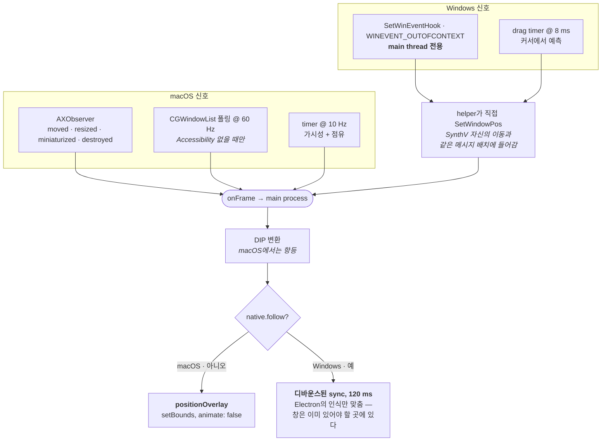

# The overlay surface (한국어)

> 원문: **[overlay.md](overlay.md)**. 영어판이 원본이다.

effect가 그려지는 창. 하는 일이 셋이고, 서로 잡아당긴다:

1. **SynthV의 창 위에 정확히 있을 것** — 이동·리사이즈·zoom·모니터 전환·드래그를 거쳐도
   같은 사각형.
2. **절대 방해가 되지 않을 것** — 클릭도, 포커스도, 작업 표시줄 항목도, 그림자도 없고,
   SynthV를 보여줄 수 없을 땐 보이지 않을 것.
3. **절대 밀리지 않을 것.** frame을 늦게 따라가는 창은, 살짝 틀린 창과는 다른 방식으로
   고장 나 보인다.

코드: `main/overlay.ts`(창), `main/index.ts`(follow loop), `main/toolbar.ts`(도킹된 스트립),
그리고 두 helper crate의 `stick.rs`.

창 *안쪽*에서 note가 어디 있는지는 [geometry](geometry.ko.md). 이 문서는 창 자체를 다룬다.

## The window

```
transparent, frame: false, hasShadow: false, roundedCorners: false,
resizable: false, movable: false, focusable: false, skipTaskbar: true,
backgroundColor: "#00000000", show: false
```

여기에 `setIgnoreMouseEvents(true, { forward: true })` — 클릭은 SynthV로 통과하고, `forward`가
mouse-move 이벤트를 계속 오게 해서 hover 상태 같은 것이 여전히 동작할 수 있게 한다.

`webPreferences` 두 항목이 하중을 받는다:

- **`sandbox: false`.** preload가 native addon을 require하고 bridge channel 파일을 연다.
  이것이 renderer로 하여금 geometry와 재생 상태를 **프레임 경로에 IPC 없이** 읽게 해준다 —
  [hot path](#the-hot-path) 참조.
- **`backgroundThrottling: false`.** overlay는 절대 포커스를 받지 않고, Electron은 포커스
  없는 창의 rAF와 timer를 스로틀한다. 이게 없으면 스크롤할 때 overlay가 눈에 띄게 밀린다.

창은 숨긴 채로 만들고 helper가 frame을 보고한 뒤에야 보여준다 — 대상을 찾기 전에는 보여줄
것이 없다.

## Staying above SynthV

두 플랫폼이 정말로 다른 메커니즘을 쓰고, 어느 쪽도 일반화되지 않는다.

**macOS** — `setAlwaysOnTop(true, "floating")`. 단순하고, floating 레벨이면 메뉴 바와 싸우지
않으면서 SynthV 위에 앉기에 충분히 높다.

**Windows** — topmost가 아니라 **창 소유권**. `follow()`가 overlay의 HWND를 받아
`GWLP_HWNDPARENT`를 SynthV의 것으로 설정한다. 그러면 Windows가 overlay를 owner 바로 위에
유지하고, 최소화·복원을 함께 하고, 전역 topmost 창과 달리 SynthV 위에 쌓인 것이 overlay도
덮게 한다. topmost는 무관한 모든 애플리케이션 위에 overlay를 올려놓게 되므로 틀렸다.

> **진짜 `WS_CHILD`는 튜닝 문제가 아니라 막다른 길이다.** 두 번 시도됐다. `WS_CLIPCHILDREN`을
> 가진 부모는 — JUCE가 설정한다 — 자식이 덮는 영역을 자기 그리기에서 제외한다. 그래서 클라이언트
> 영역 전체를 덮는 overlay는 SynthV가 자기 자신을 다시 그리는 것을 아예 멈추게 만든다. 남의 창에서
> 그 스타일을 지우면 멈춤이 부모가 우리 위에 덮어그리는 것으로 바뀔 뿐이다. 소유권 더하기
> 쫓아가기가 Windows가 허용하는 최대치다.

프로세스 간 소유권은 Microsoft가 문서화한 것이 아니라 best-effort로 남고, 부착은 `follow()`
안에서만이 아니라 대상이 처음 나타나는 곳 어디서든 일어난다 — 대상은 보통 overlay handle이
넘겨진 *뒤에* 발견되기 때문이다.

## Following the frame

**macOS**는 SynthV의 창에 `AXObserver`를 설치한다. `AXMoved`, `AXResized`,
`AXWindowMiniaturized`, `AXWindowDeminiaturized`, `AXUIElementDestroyed`, 그리고 app element의
focused/main-window 변경. 그 이벤트들이 매끄러운 위치 갱신을 몰고, 옆에서 **10 Hz**
`CFRunLoopTimer`가 가시성과 점유를 다시 확인한다.

Accessibility 승인이 없으면 observer가 없으므로, helper는 모든 것을 모는 **60 Hz `CGWindowList`
폴링**으로 떨어진다. 상태가 어느 쪽이 돌고 있는지를 `mode: "ax" | "poll"`로 나른다.

frame은 좌상단 원점의 전역 **point**로 나오고, 그건 정확히 `win.setBounds()`가 원하는 것이다 —
그래서 macOS에서는 main process가 보고된 frame마다 `positionOverlay`를 `animate: false`로
직접 호출한다. 애니메이션된 이동은 정의상 대상보다 늦고, `native.disableAnimations`가 추가로
창에 `NSWindowAnimationBehavior::None`을 설정해서 AppKit이 자기 것을 얹지 못하게 한다.

**Windows**는 `WINEVENT_OUTOFCONTEXT`로 `SetWinEventHook`을 설치한다. 즉 Windows가 callback을
**설치한 스레드의 메시지 큐**로 전달한다는 뜻이고 — 그래서 메시지를 펌프하는 유일한 스레드인
Electron의 main thread여야 한다. worker에서 `start()`를 부르면 조용히 아무것도 받지 못한다.

거기서 frame은 물리 픽셀이므로, 창이 배치되기 전에
[DIP transform](geometry.ko.md#physical-pixels-points-and-dips)을 거친다.



## Techniques

### Native placement with debounced reconciliation

Windows에서는 helper가 직접 overlay를 배치한다. `SetWindowPos(SWP_NOACTIVATE | SWP_NOZORDER |
SWP_NOREDRAW)`를 **창이 사는 스레드에서** 호출하므로, 그 이동이 IPC와 `setBounds`를 거쳐 한
프레임 뒤에 오는 대신 SynthV 자신의 이동과 같은 메시지 배치에 들어간다.

그런데 Electron은 창이 보여질 때 자기가 아는 bounds를 다시 적용하므로, helper가 네이티브로
옮긴 뒤 overlay가 생성 크기로 되돌아가 버린다. 그래서 main은 **이동이 잦아든 뒤에** Electron의
인식을 맞춘다 — `BOUNDS_SYNC_MS` 120, frame 보고마다 타이머 재시작.

**왜 즉시가 아니라 디바운스인가:** 드래그 도중에 도착한 `setBounds`는 한 프레임 낡은 위치를
싣고 있어서 창을 뒤로 끌어당긴다. 화면에서 그건 *추격*이고, 잠깐 틀린 것보다 훨씬 눈에 띈다.

macOS에는 `native.follow`가 없으므로 다른 분기를 타고 직접 배치한다.

**깨지면:** 창이 보여질 때 800×400으로 튐(sync가 안 돎) · 드래그 중 overlay가 SynthV를 눈에
띄게 쫓아감(sync가 디바운스되지 않음).

### Cursor-based drag prediction

사용자가 SynthV의 타이틀 바를 드래그하는 동안, `EVENT_SYSTEM_MOVESIZESTART`가 8 ms 타이머를
시작해 창의 이동 이벤트를 기다리는 대신 **마우스**에서 위치를 예측한다:

```math
p = p_0 + (c - c_0)
```

$p_0$와 $c_0$는 드래그가 시작될 때의 창 frame과 커서 위치다.

진실과 예측이 `RESYNC_PX` 8 px보다 벌어지면 기준을 다시 잡고,

```math
\lVert p_{\text{reported}} - p \rVert > \text{RESYNC\_PX} \;\Rightarrow\; p_0, c_0 \leftarrow \text{now}
```

리사이즈에서는 **완전히 포기한다**: 리사이즈는 커서로 예측할 수 없고, 시스템이 화면 가장자리에
스냅시킨 창도 마찬가지다.

**깨지면:** 드래그 중 overlay가 창을 뒤따름(예측 꺼짐) · 앞서 나갔다가 되돌아옴(재기준화가 너무
느림) · 리사이즈 중 어긋남(예측을 포기하지 않음).

### Visibility gating

대상을 보여줄 수 없을 때는 overlay와 toolbar를 숨긴다. 아무것도 없는 위에 떠 있지 않도록.

**macOS**는 `CGWindowList`(화면상, desktop element 제외)를 훑어 대상이 앞의 창들에 얼마나 덮여
있는지 비율을 계산한다. `OCCLUSION_THRESHOLD` **0.15**를 넘으면 숨김으로 친다. 종료됐거나
숨겨진 애플리케이션, 그리고 화면에서 찾을 수 없는 창도 숨김으로 다룬다.

**Windows**는 `IsWindowVisible`과 `IsIconic`만 본다 — **거기엔 점유 판정이 없다.** 소유권이
이미 다른 창들이 overlay를 자연스럽게 덮게 해주기 때문이다.

Screen Recording은 의도적으로 요청하지 *않는다*: 이 판정은 bounds·pid·layer를 읽는데, 그 권한이
관장하는 것은 창 제목과 픽셀 캡처다.

**깨지면:** SynthV를 덮고 있는 무관한 앱 위에 overlay가 떠 있음(macOS 점유) · 최소화했는데
overlay가 살아남음.

### The hot path

프레임 단위 경로는 의도적으로 프로세스 경계를 넘지 않는다.

| 단계 | 어디서 | 비용 |
| --- | --- | --- |
| bridge `state` 레코드 읽기 | preload, 한 번만 할당한 버퍼로 `pread` | ~0.6 µs, 쓰레기 없음 |
| viewport snapshot 갱신 | preload, 비동기 native task | rAF call stack 밖 |
| 판단하고 그리기 | renderer | 단순 스크롤이면 transform 한 번 |

위의 전부가 **overlay renderer의 프로세스 안에서** `contextBridge`를 통해 일어난다. 대안 —
main이 읽고 renderer로 IPC — 은 프레임마다 왕복과 직렬화를 더하고, 그게 이 배치가 없애려고
존재하는 바로 그것이다. 여기서 `sandbox: false`가 값을 하는 이유다.

frame loop는 Accessibility API 자체가 아니라 가장 최근 완료된 native viewport anchor를 읽는다.
macOS에서 snapshotter는 여전히 캐시된 AX element를 다시 읽지만, 그 응답은 frame 사이에 도착한다.
느린 AX 왕복은 draw를 막는 대신 canvas anchor를 조금 낡게 만들 뿐이다. 실제 그리기에 쓰는
scroll과 zoom은 그 rAF에서 읽은 bridge state로 다시 계산한다.

note *set*은 이 경로에 없다: 백그라운드 pump가 `NOTE_READ_GAP_MS` 30마다 계산된 piano-roll
read를 요청하고, frame loop는 마지막으로 받아들인 것을 살아 있는 viewport 데이터로 매핑한다.

**깨지면:** 스크롤 지연(뭔가 IPC 경로로 옮겨갔다) · GC 톱니(state 버퍼를 다시 할당하고 있다).

### Sampling paired values together

짝으로 읽어야 하는 것은 같은 호흡에 읽어야 한다. 안 그러면 둘이 서로 다른 순간을 묘사하고
그림이 미끄러진다.

- **view mapping과 그것이 짝지어진 scroll 위치**는 `Transport.poll` 안의 같은 bridge state
  record에서 온다. 넘겨받은 viewport snapshot은 native canvas와 window origin만 공급한다. 그
  snapshot의 낡은 scroll field는 의도적으로 무시해서, 비동기 AX latency가 scroll latency가 되지
  않게 한다.
- **window origin**은 `window.screenX`가 아니라 helper가 canvas rect과 함께 주는
  것(`vp.origin`)에서 온다. Chromium은 `screenX`를 자기 일정대로 갱신하므로 드래그 중에는 둘이
  어긋난다.

**깨지면:** 창을 드래그하는 동안 그림이 미끄러짐 · 스크롤 중 effect가 어긋나거나 늦게 따라옴 ·
debug box가 한두 frame 동안 잘못된 note layout으로 튐.

### Docking with hysteresis

toolbar는 대상 옆 `GAP` 8 px에 도킹하고 **현재 있는 쪽에 머문다.** 그 쪽이 대상의 모니터에
더 이상 들어가지 않을 때만 넘어간다. 그래서 왼쪽 도킹은 오른쪽에 자리가 다시 나도 유지되고,
왼쪽 가장자리 자체가 부족해질 때만 되돌아간다.

창은 자기 renderer가 실제로 그리는 것에 맞춰 크기가 잡히고 — renderer가 자기 content를 재서
`panel.resize`를 호출한다 — 그 측정이 도착할 때까지 숨겨져 있으므로 placeholder 크기는 보이지
않는다. main이 마지막 보고된 frame(`dockedFrame`)을 들고 있는 이유가 정확히, 측정이 그 뒤 아무
때나 도착할 수 있기 때문이다.

**깨지면:** 화면 가장자리 근처에서 toolbar가 좌우로 진동함(히스테리시스 상실) · 시작할 때 잠깐
크기가 틀린 패널이 보임(재기 전에 보여줌).

## Lifecycle

순서대로 알아둘 것:

- **single-instance lock**을 `app.quit`이 아니라 `app.exit`으로 잡는다 — 진 쪽은 `ready`가
  발생해서 두 번째 observer가 같은 SynthV 창에 붙기 전에 사라져야 한다.
- **`userData`를 고정한다.** `setName`(기본값을 다시 계산한다) 뒤, 그리고 그것을 읽는 무엇보다
  먼저 — single-instance lock의 소켓이 거기 살기 때문에 그것도 포함이다.
- **permissions gate**가 macOS에서는 다른 무엇보다 먼저 돈다: Accessibility 없이는 canvas
  discovery가 실패하므로, overlay는 존재하되 절대 정렬되지 않는다. 창은 올라와 있는 동안 1 Hz로
  trust 상태를 양방향으로 폴링한다 — macOS는 물어봤을 때만 알려주고, 스위치는 다시 꺼질 수도 있다.
- **dock 아이콘은 숨겨져 있고** overlay와 toolbar는 SynthV가 붙어 있을 때만 존재하므로, SynthV가
  닫혀 있으면 tray가 앱의 유일한 가시 표면이다. tray가 있을 때 `window-all-closed`가 종료하지
  않는 이유다.

## Invariants

| 불변식 | 깨지면 |
| --- | --- |
| Windows의 event hook은 main thread에서 설치한다 | Windows에서 frame 갱신이 아예 없음 |
| Windows에서 overlay는 topmost가 아니라 owned다 | overlay가 무관한 애플리케이션 위에 뜸 |
| Electron의 bounds는 이동이 잦아든 뒤에만 맞춘다 | 드래그 중 눈에 띄는 추격, 또는 보여질 때 튐 |
| `backgroundThrottling`은 꺼진 채로 둔다 | 스크롤할 때 overlay가 밀림 |
| 프레임 단위로는 아무것도 main으로 넘어가지 않는다 | 스크롤 지연이 돌아옴 |
| 짝지어진 값은 같은 호흡에 샘플링한다 | 그림이 창에 대해 미끄러짐 |
| 대상을 보여줄 수 없으면 overlay를 숨긴다 | effect가 무관한 창 위에 뜸 |
