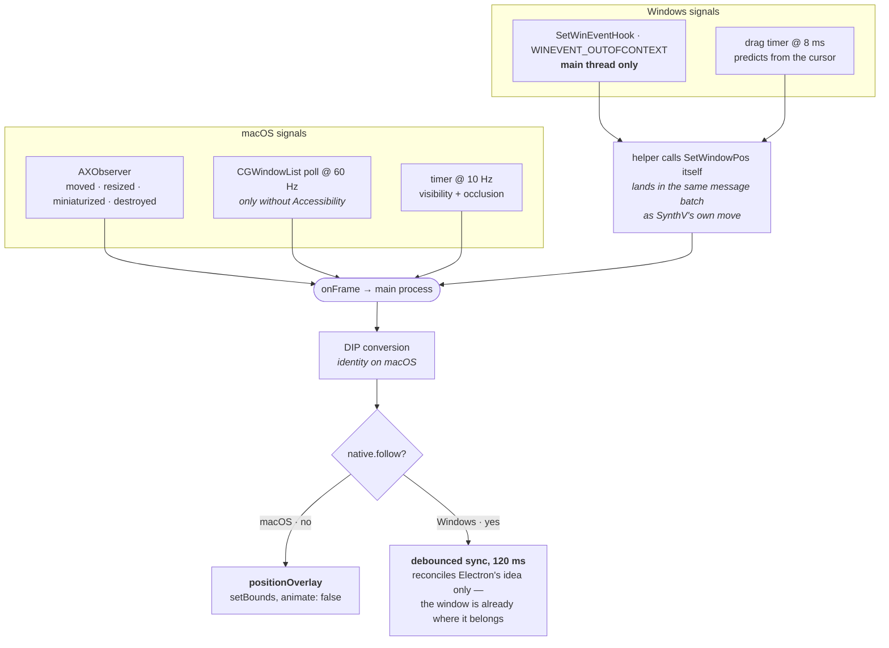

# The overlay surface

> 한국어판: **[overlay.ko.md](overlay.ko.md)**. 영어판이 원본이므로, 동작이 바뀌면 여기를 먼저 고치고
> 같은 커밋에서 번역을 맞춘다.

The window the effects are painted on. It has three jobs, and they pull against each other:

1. **Be exactly over SynthV's window** — same rectangle, through moves, resizes, zoom,
   monitor changes and drags.
2. **Never be in the way** — no clicks, no focus, no taskbar entry, no shadow, invisible
   when SynthV is not showable.
3. **Never lag.** A window that follows a frame late reads as broken in a way a window that
   is slightly wrong does not.

Code: `main/overlay.ts` (the window), `main/index.ts` (the follow loop), `main/toolbar.ts`
(the docked strip), and `stick.rs` in both helper crates.

For where a note is *inside* the window, see [geometry](geometry.md). This document is about
the window itself.

## The window

```
transparent, frame: false, hasShadow: false, roundedCorners: false,
resizable: false, movable: false, focusable: false, skipTaskbar: true,
backgroundColor: "#00000000", show: false
```

Plus `setIgnoreMouseEvents(true, { forward: true })` — clicks pass through to SynthV, and
`forward` keeps mouse-move events coming so hover states could still work.

Two `webPreferences` entries are load-bearing:

- **`sandbox: false`.** The preload requires the native addons and starts the bridge endpoint
  worker. This is what lets the renderer read bridge playback state with **no IPC hop in the
  per-frame path** — see [the hot path](#the-hot-path).
- **`backgroundThrottling: false`.** The overlay is never focused, and Electron throttles
  rAF and timers in unfocused windows. Without this the overlay visibly lags behind a scroll.

The window is created hidden and only shown once the helper reports a frame — there is
nothing to show before the target is found.

## Staying above SynthV

The two platforms use genuinely different mechanisms, and neither generalises.

**macOS** — `setAlwaysOnTop(true, "floating")`. Simple, and the floating level is high
enough to sit over SynthV without fighting the menu bar.

**Windows** — **window ownership**, not topmost. `follow()` takes the overlay's HWND and sets
`GWLP_HWNDPARENT` to SynthV's. Windows then keeps the overlay directly above its owner,
minimises and restores it alongside, and — unlike a global topmost window — lets anything
stacked above SynthV cover it too. Topmost would put the overlay above every unrelated
application, which is wrong.

> **A real `WS_CHILD` is a dead end, not a tuning problem.** It has been tried twice. A
> parent with `WS_CLIPCHILDREN` — which JUCE sets — excludes the area its children cover
> from its own painting, so an overlay covering the whole client area stops SynthV repainting
> itself entirely. Clearing that style on someone else's window only trades the freeze for
> the parent painting over us. Ownership plus a chase is the most Windows allows.

Cross-process ownership is not something Microsoft documents, so it stays best-effort, and
attachment happens wherever the target first appears rather than only in `follow()` — the
target is normally found *after* the overlay handle has been handed over.

## Following the frame

**macOS** installs an `AXObserver` on SynthV's window for `AXMoved`, `AXResized`,
`AXWindowMiniaturized`, `AXWindowDeminiaturized` and `AXUIElementDestroyed`, plus
focused/main-window changes on the app element. Those events drive smooth position updates;
a `CFRunLoopTimer` at **10 Hz** re-checks visibility and occlusion alongside.

Without the Accessibility grant there is no observer, so the helper falls back to a **60 Hz
`CGWindowList` poll** that drives everything. The status carries which one is running as
`mode: "ax" | "poll"`.

Frames come out as top-left-origin global **points**, which is exactly what
`win.setBounds()` wants — so on macOS the main process calls `positionOverlay` directly on
every reported frame, with `animate: false`. An animated move would lag the target by
definition, and `native.disableAnimations` additionally sets `NSWindowAnimationBehavior::None`
on the window so AppKit does not add its own.

**Windows** installs a `SetWinEventHook` with `WINEVENT_OUTOFCONTEXT`, which means Windows
delivers callbacks through the **installing thread's message queue** — so it must be
Electron's main thread, the only one pumping messages. Calling `start()` from a worker
silently receives nothing.

Frames are physical pixels there, so they go through the [DIP
transform](geometry.md#physical-pixels-points-and-dips) before any window is positioned.



## Techniques

### Native placement with debounced reconciliation

On Windows the helper positions the overlay itself, with `SetWindowPos(SWP_NOACTIVATE |
SWP_NOZORDER | SWP_NOREDRAW)`, **on the thread the window lives on** — so the move lands in
the same message batch as SynthV's own, rather than a frame later via IPC and `setBounds`.

But Electron reapplies its own idea of a window's bounds when the window is shown, so the
overlay would snap back to its creation size after the helper moved it natively. Main
therefore syncs Electron's idea **after the movement settles** — `BOUNDS_SYNC_MS` 120, timer
restarted on every frame report.

**Why debounced rather than immediate:** a `setBounds` arriving mid-drag carries a frame-old
position and drags the window backwards. On screen that is a *chase*, which is much more
visible than being briefly wrong.

macOS has no `native.follow`, so it takes the other branch and positions directly.

**Breaks as:** the overlay snapping to 800×400 when it is shown (sync never ran) · the
overlay visibly chasing SynthV during a drag (sync not debounced).

### Cursor-based drag prediction

While the user drags SynthV's title bar, `EVENT_SYSTEM_MOVESIZESTART` starts an 8 ms timer
that predicts the window's position from the **mouse** rather than waiting for the window's
own move events:

```math
p = p_0 + (c - c_0)
```

where $p_0$ and $c_0$ are the window frame and cursor position when the drag began.

It re-baselines whenever truth and prediction disagree by more than `RESYNC_PX` 8 px,

```math
\lVert p_{\text{reported}} - p \rVert > \text{RESYNC\_PX} \;\Rightarrow\; p_0, c_0 \leftarrow \text{now}
```

and **gives up entirely on a resize**: a resize is not predictable from the cursor, and
neither is a window the system snapped to a screen edge.

**Breaks as:** the overlay trailing the window during a drag (prediction off) · the overlay
leading it and snapping back (re-baselining too slow) · the overlay wrong during a resize
(prediction not abandoned).

### Visibility gating

The overlay and toolbar are hidden whenever the target is not showable, so they never float
over nothing.

**macOS** walks `CGWindowList` (on-screen, excluding desktop elements) and computes what
fraction of the target is covered by windows in front. Above `OCCLUSION_THRESHOLD` **0.15**
it counts as hidden. It also treats a terminated or hidden application, and a window it
cannot find on screen, as hidden.

**Windows** checks `IsWindowVisible` and `IsIconic` only — **there is no occlusion check
there**, because ownership already lets other windows cover the overlay naturally.

Visibility deliberately does *not* request Screen Recording: the check reads bounds, pid and
layer, none of which that permission gates — it covers window titles and pixel capture. The
optional LUFS meter is separate; it requests Screen Recording only when the toolbar switch is
turned on.

**Breaks as:** the overlay floating over an unrelated app that is covering SynthV (macOS
occlusion) · the overlay surviving a minimise.

### The hot path

The per-frame path deliberately does not cross a process boundary.

| Step | Where | Cost |
| --- | --- | --- |
| receive bridge pipe frames | preload worker | event-driven, independent of rAF |
| read the latest bridge `state` | preload memory cache | allocation-free, no file I/O |
| refresh the canvas snapshot | macOS: main IPC; Windows: preload native read | every ~250 ms, off the rAF call stack |
| decide and draw | renderer | one transform on a plain scroll |

The bridge state and draw decision stay **inside the overlay renderer's process**, via
`contextBridge`. The low-rate canvas refresh may cross main on macOS so Accessibility's TCC
subject matches the permissions gate; it is deliberately outside the per-frame path. The
alternative — main reads bridge state and IPCs it to the renderer every frame — adds a hop and
a serialisation to every frame, which is exactly what this arrangement exists to avoid.

The frame loop reads the latest completed native canvas anchor, not the Accessibility API
itself. On macOS main re-reads only the cached window and scroll-bar AX elements, and its
reply lands between frames; a slow AX round trip makes the canvas anchor older instead of
blocking the draw. The actual scroll and zoom used for drawing are recomputed from the bridge
state already sampled into the preload memory cache.

The base note set is rebuilt only when the cached schedule generation or canvas changes.
Plain scroll and zoom updates keep the same set and map it through the live bridge-derived
viewport. There is no separate note pump.

**Breaks as:** scroll lag (something moved onto the IPC path) · GC sawtooth (the state buffer
is being reallocated).

### Sampling paired values together

Anything read as a pair must be read in the same breath, or the two describe different
moments and the drawing slides.

- The **view mapping and the scroll position** it is paired with come from the same bridge
  state snapshot inside `Transport.poll`. The canvas snapshot passed in supplies only the
  native canvas and window origin, so async AX latency cannot become scroll latency.
- The **window origin** comes from the helper alongside the canvas rectangle (`vp.origin`),
  not from `window.screenX`. Chromium updates `screenX` on its own schedule, so during a drag
  the two disagree.

**Breaks as:** the drawing sliding while the window is dragged · effects drifting or
following late during a scroll · debug boxes that jump to a wrong note layout for one or two
frames.

### Docking with hysteresis

The toolbar docks `GAP` 8 px beside the target and **stays on the side it is on**, flipping
only when that side no longer fits on the target's monitor. So docking left persists after
room reopens on the right; it flips back only when the left edge itself runs out.

The window is sized to what its renderer actually draws — the renderer measures its own
content and calls `panel.resize` — and stays hidden until that measurement arrives, so the
placeholder size is never seen. Main holds the last reported frame (`dockedFrame`) precisely
because the measurement can arrive at any time after it.

**Breaks as:** the toolbar oscillating between sides near a screen edge (hysteresis lost) ·
a briefly wrong-sized panel on startup (shown before measuring).

## Lifecycle

Worth knowing, in order:

- **A single-instance lock**, taken with `app.exit` rather than `app.quit` — the loser must
  be gone before `ready` fires and a second observer attaches to the same SynthV window.
- **`userData` is pinned** after `setName` (which recomputes the default) and before anything
  reads it, including the single-instance lock, whose socket lives there.
- **The permissions gate** runs before anything else on macOS: without Accessibility canvas
  discovery fails, so an overlay would exist and never align. The window polls the trust
  state at 1 Hz in both directions — macOS reports it only when asked, and the switch can go
  back off.
- **The dock icon is hidden** and the overlay and toolbar only exist while SynthV is
  attached, so with SynthV closed the tray is the app's only visible surface. That is why
  `window-all-closed` does not quit when a tray exists.

## Invariants

| Invariant | If broken |
| --- | --- |
| The Windows event hook is installed from the main thread | no frame updates at all on Windows |
| The overlay is owned, not topmost, on Windows | the overlay floats above unrelated applications |
| Electron's bounds are reconciled only after movement settles | a visible chase during drags, or a snap-back on show |
| `backgroundThrottling` stays off | the overlay lags behind scrolling |
| Nothing per-frame crosses to the main process | scroll lag returns |
| Paired values are sampled in the same breath | the drawing slides against the window |
| The overlay is hidden whenever the target is not showable | effects float over unrelated windows |
