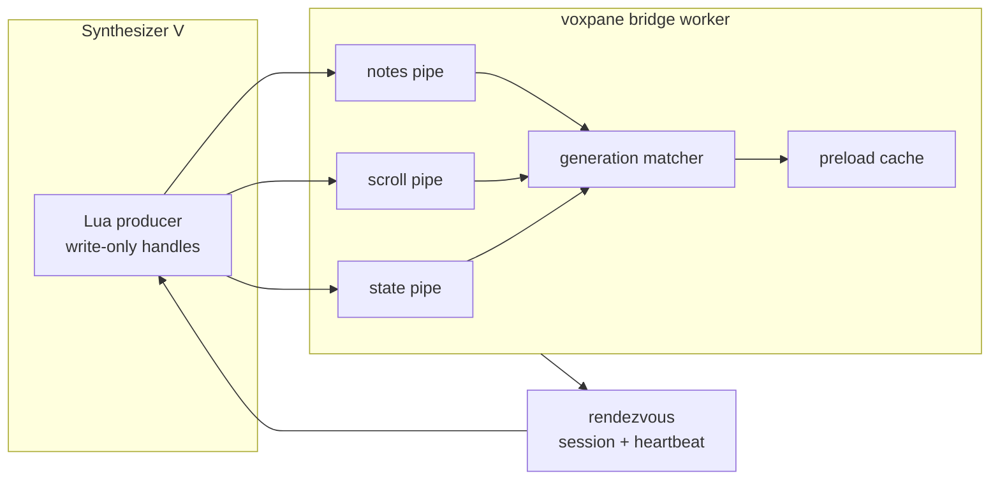

# SynthV Pipe Bridge Design

> English 원본: **[2026-08-08-synthv-pipe-bridge-design.md](2026-08-08-synthv-pipe-bridge-design.md)**.
> 이 문서는 승인된 file bridge 교체 설계를 설명한다. 현재 runtime은 task 단위로 migration 중이며,
> product document reconciliation은 이후 migration task에 남아 있다.

## Status

2026-08-08 구현 승인.

## Problem

현재 bridge는 세 regular file을 제자리에서 덮어쓰고 worker가 `state`를 4 ms마다 sampling한다.
속도는 충분하지만 매 sample마다 filesystem read를 수행하며, 두 지원 OS 모두 local named pipe를
제공하는데도 hot state를 polling하는 latest-value slot으로 모델링한다.

SynthV의 Lua host는 native library를 load하거나 socket을 열 수 없다. 하지만 `io.open`으로 macOS
FIFO와 Windows Named Pipe를 열 수 있다. SynthV 2.3.0tp1 실험에서 네 가지 제약을 확인했다.

- 사용 가능한 data가 없는 read는 SynthV UI thread를 block한다.
- macOS write-only FIFO open은 reader가 먼저 열려 있지 않으면 block한다.
- Windows Named Pipe write open은 server가 먼저 listen 중이면 빠르게 성공한다.
- 앱이 계속 drain하면 두 플랫폼 모두 continuous write-only traffic이 동작한다.

따라서 transport는 엄격하게 SynthV-to-app 단방향이어야 하고, endpoint 생성과 readiness는 앱이
소유해야 한다.

## Goals

- `state`, `scroll`, `notes` data file을 local pipe stream으로 완전히 교체한다.
- SynthV를 write-only로 유지하고 어떠한 bridge 동작도 pipe에서 read하지 않게 한다.
- 세 logical channel의 독립적인 change rate와 latest-value semantics를 보존한다.
- SynthV를 그대로 둔 채 voxpane을 재시작해도 완전한 현재 snapshot을 복구한다.
- hot receive path를 Electron main과 renderer frame loop 밖의 기존 Node-enabled bridge worker에
  유지한다.
- 앱이 없거나 crash한 상태에서 SynthV가 block하는 pipe open을 시도하지 않게 한다.
- 같은 protocol과 lifecycle contract로 macOS와 Windows를 지원한다.

## Non-goals

- App-to-SynthV command 또는 acknowledgement.
- 여러 SynthV writer의 동시 지원.
- Network transport 또는 remote host.
- Regular-file data channel로의 compatibility fallback.
- 앱 없이 기존 `dump` command로 live channel payload를 검사하는 기능의 유지.

## Decision

앱이 소유하고 SynthV가 write-only로 사용하는 stream 세 개를 둔다. 각각 `state`, `scroll`,
`notes`용이다. 이 stream들은 하나의 app session과 rendezvous record를 공유하지만 OS buffer와
parser는 독립적이다.

Global arrival order는 protocol의 일부가 아니다. 모든 indexed record가 자신의 generation을
식별하고, 앱은 state record가 참조하는 generation들이 모두 준비된 후에만 snapshot을 공개한다.
이로써 현재의 publish-before-state ordering 요구를 제거하고 큰 notes frame이 하나의 공유
stream에서 state byte 앞을 막지 않게 한다.

## Architecture



기존 main-process bridge setup은 private bridge directory를 일찍 생성한다. Node-enabled bridge
worker가 세 endpoint server, stream parser, heartbeat, cleanup을 소유한다. 완전한 framed record를
worker의 기존 `postMessage` boundary를 통해 preload memory로 전달한다. Per-frame main-process IPC는
추가하지 않는다.

macOS에서는 worker가 세 endpoint에 `/usr/bin/mkfifo`를 실행하고 각 FIFO를 `r+`로 연 뒤 readiness를
알린다. `r+`는 앱 자신의 open이 SynthV writer를 기다리지 않게 한다. 새로 생성한 session path에
기존 FIFO가 있으면 unlink 후 다시 만들고, non-FIFO가 있으면 startup을 중단한다. Windows에서는
`node:net` Named Pipe server 세 개를 시작하고 모두 listen할 때까지 기다린다. 모든 endpoint를
drain할 수 있게 된 이후에만 worker가 rendezvous readiness를 게시한다.

## Rendezvous

Data file은 사라지지만 작은 app-owned rendezvous record 하나는 남는다. 이것은 data channel이
아니다. Lua에는 non-blocking FIFO open이 없고, reader가 없는 macOS FIFO를 write open하면 SynthV가
멈추기 때문에 필요하다.

Record는 bridge directory 아래 `pipe-session`이며 정확히 128 byte다. 다음을 담는다.

- `VPR1` magic과 rendezvous format version;
- Unix heartbeat time;
- 32자 lowercase hexadecimal app session ID;
- meaningful field에 대한 FNV-1a checksum;
- fixed width까지의 space padding.

Padding 전 ASCII 표현은 다음과 같다.

```text
VPR1
<unix-seconds>
<32-lowercase-hex-session>
<8-lowercase-hex-checksum>
```

Checksum은 `VPR1`부터 session ID 다음 newline까지의 byte에 대한 FNV-1a다. 앱은 남은 byte를 space로
padding하고 offset 0에 한 번의 positioned 128-byte write로 record를 갱신한다. Regular-or-absent path만
받고, absent file은 exclusively create하며, available nonblocking/no-follow flag로 truncate 없이 연 뒤
opened `fstat`과 path `lstat` identity를 검증하고 write/truncate한다. SynthV는 endpoint를 열기 전에 완전한
shape, checksum, session ID, heartbeat freshness를 검증한다. Malformed, torn, future, stale record는 앱이
없는 상태로 취급한다. Session ID는 `node:crypto`의 random byte 16개를 lowercase hex로 encode한다.
Heartbeat는 500 ms마다 쓰고 2초 동안 fresh하다. SynthV는 disconnected 상태와 connected 상태 모두에서
240 ms logical-time cadence로 record를 다시 검증하며 매 4 ms state tick에서는 접근하지 않는다. 같은
connected app session의 fresh record는 기존 handle을 보존한다. Missing, malformed, stale, future,
different-session record는 다른 connection을 시도하기 전에 complete handle set을 닫는다.

Endpoint name은 rendezvous에 저장하지 않고 결정적으로 만든다.

| OS | Endpoint pattern |
| --- | --- |
| macOS | `<bridge>/pipe-<session>-state`, `<bridge>/pipe-<session>-scroll`, `<bridge>/pipe-<session>-notes` |
| Windows | `\\.\pipe\voxpane-<session>-state`, `\\.\pipe\voxpane-<session>-scroll`, `\\.\pipe\voxpane-<session>-notes` |

Unique name은 새 app process가 stale endpoint를 재사용하지 못하게 한다. 정상 종료 시 preload
worker에 receiver stop을 요청하고 acknowledgement를 기다린다. Receiver는 reader를 닫기 전에
rendezvous와 macOS FIFO pathname을 withdraw하고, 이미 open된 writer를 300 ms 동안 계속 drain한
다음 reader를 닫는다. 그러면 block된 `O_WRONLY` writer는 `EPIPE`로 실패한다. Worker나 window를
사용할 수 없거나 bounded quit timeout 안에 acknowledgement가 없으면 main은 먼저 overlay 재생성을
막고 owner window를 follow callback에서 분리한 뒤 BrowserWindow destruction을 시도한다. 짧은 내부
bound 안에 `closed` 또는 WebContents `destroyed`가 확인되지 않으면 captured WebContents에
`forcefullyCrashRenderer()`를 호출하고 window destruction을 재시도한 뒤 두 번째 bound 안에서
`render-process-gone`, `destroyed`, 또는 `closed`를 기다린다. Owner 또는 renderer destruction이
확인된 경우에만 main은 quit을 재개하기 직전 마지막 동작으로 checksum-valid regular rendezvous와
그 session에서 도출한 FIFO endpoint를 동기적으로 제거한다. Regular endpoint와 symbolic-link
endpoint path는 절대 제거하지 않는다. Bound 경과는 quiescence의 증명이 아니라 escalation 또는
rejection을 일으킨다. Forceful destruction을 확인할 수 없으면 live worker가 readerless advertisement를
다시 만드는 위험을 감수하는 대신 quit을 prevented 상태로 유지하고 error를 log한다. Force-kill은
handshake와 owner-quiescence fallback을 모두 건너뛸 수 있으므로 crash recovery는 계속 heartbeat
expiry와 unique session path에 의존한다.

FIFO pathname withdrawal 이후 endpoint open이 도착하면 `wb`가 regular file을 만들 수 있다. 이 드문
late-open artifact는 endpoint handle을 진짜 write-only로 유지하기 위해 감수하는 비용이다. `O_RDWR`는
writer 자신을 FIFO reader로 만들어 app reader가 사라진 뒤 `EPIPE`를 받는 대신 영원히 block될 수 있다.
Cold open 전 Lua는 같은 app session의 strictly newer heartbeat를 요구한다. open/write failure의
`(appSession, heartbeat)`는 session이 바뀌거나 heartbeat가 전진할 때까지 quarantine한다. 따라서
unchanged fresh-but-dead rendezvous로 readerless FIFO를 반복해서 열지는 않는다. Connected rendezvous
validation은 240 logical millisecond 안에 handle set을 닫고, 새 app session은 unique path를 사용하며,
stale pruning은 regular file과 symbolic link를 계속 거부한다. 300 ms receiver grace는 정상 종료 중 이미
open된 writer를 drain하기 위한 동작이며, liveness 관찰 뒤 force-kill이나 synchronous write에서 이미 멈춘
Lua thread까지 안전하다는 증명은 아니다. SynthV 내부에 native 또는 subprocess bridge를 다시 넣지 않는
한 Lua primitive만으로 이 마지막 race를 제거할 수 없다.

## Connection Lifecycle

Writer는 세 handle을 하나의 connection으로 취급한다.

1. Disconnected 상태에서 fresh rendezvous를 읽고 검증한다. 처음 본 app session은 candidate로 보관하고
   같은 session이 strictly newer heartbeat를 advertise할 때까지 기다린다.
2. 기존 endpoint를 `state`, `scroll`, `notes` 순서로 `io.open(path, "wb")`를 사용해 열고 각
   handle의 stdio buffering을 끈다. `setvbuf`가 nil을 반환하거나 throw하면 complete open을
   실패시킨다. Endpoint handle은 `write`, `setvbuf`, `close`만 사용하며 `read`, `seek`, `flush`는
   절대 호출하지 않는다.
3. 하나라도 open에 실패하면 모든 handle을 닫고 disconnected backoff 후 재시도한다.
4. 현재 view mapping과 note schedule을 수집한다.
5. 새 app session에 맞춰 `stateSeq`, `scrollSeq`, `notesSeq`를 초기화한다.
6. State stream에 session frame을 게시하고 각각의 stream에 완전한 `scroll`, `notes`, `state`
   snapshot을 하나씩 게시한다.
7. 이후 매 tick마다 state를, 변경 시에만 indexed channel을 게시한다.

4단계의 전체 note collection은 의도적이다. Cache된 notes는 revision-check interval만큼 오래됐을 수
있으므로 재사용하면 앱 재시작 후 자동 정확 복구 요구를 충족하지 못한다.

어느 stream에서든 write가 실패하면 세 handle을 모두 닫는다. 실패한 indexed-channel write는 state가
광고하는 generation을 증가시키지 않는다. Failed open/write/exact-snapshot advertisement는 app session이
바뀌거나 heartbeat가 strictly advance할 때까지 quarantine한다. 실패한 disconnected attempt는 240 logical
millisecond 동안 backoff한다. Connected 상태에서는 동일한 240 ms rendezvous cadence가 withdrawal 또는
session replacement를 감지한다. Notes encode 뒤 large write 직전에 cadence-gated validation을 한 번 더
하되, 현재 cadence의 rendezvous read를 공유하여 다시 open하거나 read하지 않는다. Liveness-proven
advertisement에서 set을 다시 연결하고 완전한 snapshot을 재전송한다. Partial channel recovery는 별도의
session-consistency protocol을 추가하므로 의도적으로 제외한다. 명시적 disable은 deadline을 reset해
re-enable이 liveness를 즉시 관찰할 수 있게 하지만 transport failure와 exact-snapshot failure에는
backoff와 quarantine을 유지한다.

앱은 transport diagnostics가 다른 non-null receiver app session을 알리는 즉시, Lua가 그 session frame을
보내기 전에 모든 bridge cache를 비운다. 같은 app session 안에서 새로운 state가 indexed record를 기다리는
동안에는 마지막 valid composed snapshot을 유지하지만, 이전 app session data를 새 data와 조합하거나
노출하지 않는다.

세 pipe는 cross-pipe arrival order를 제공하지 않는다. Physical handle set의 첫 session frame 전에는
receiver가 latest complete scroll frame과 latest complete notes frame을 각각 하나만 보관하고 state는
게시하지 않는다. State pipe가 ordered session frame을 보내면 receiver가 그 session을 먼저 게시하고,
gate를 연 다음 buffered scroll과 notes 순서로 flush한 후 같은 state chunk의 이후 state frame을
게시한다. Disconnect, fatal error, recovery, replacement session이 발생하면 gate를 닫고 두 bounded
slot을 비운다. Malformed pre-session framing은 계속 fatal이다.

## Wire Format

기존 12-byte little-endian record header를 유지한다.

| Field | Type | Value |
| --- | --- | --- |
| magic | 4 bytes | `VPB1` |
| layout | u16 | `5` |
| channel | u16 | 0 session, 1 state, 2 notes, 3 scroll |
| length | u32 | header 다음의 payload byte 수 |

Regular-file padding은 제거한다. Stream frame은 정확히 `12 + length` byte다. Lua publish는 계속 한
번의 `write` call이지만 receiver는 write boundary를 가정하지 않는다. 한 frame은 여러 chunk로
나뉠 수 있고 한 chunk에 여러 frame이 포함될 수 있다.

State stream은 session과 state frame을 받는다. Scroll과 notes stream은 각각 일치하는 channel ID만
받는다. Maximum payload length는 session 4 KiB, state 1 KiB, scroll 1 KiB, notes 64 MiB다. Invalid
magic, layout, channel, length는 render path에 throw하지 않고 connection set을 닫고 diagnostic을
기록한다.

Session payload는 flexible host metadata를 위해 JSON을 유지하며 protocol version `1`, rendezvous에서
echo한 app session, script session, script version, SynthV host 정보를 담는다.

State와 scroll은 현재 payload를 유지한다. Notes는 `rev` 앞에 `notesSeq`를 추가한다.

```text
notesSeq: u32
rev:      s2 UTF-8
count:    u32
notes:    repeated note records
```

Layout version은 Lua encoder, shared app decoder, human reference decoder에서 동시에 변경한다.

## Order-independent Matching

각 physical stream은 자신의 write order를 보존하지만 stream 사이의 ordering은 가정하지 않는다.
Receiver는 최신 state candidate, scroll generation, notes generation을 유지한다. 어느 record가
도착하든 composition을 다시 평가한다.

State candidate는 다음 조건을 모두 만족할 때만 visible해진다.

- `scrollSeq`가 보관한 scroll record의 `scrollSeq`와 같다.
- `notesSeq`가 0이거나 보관한 notes record의 `notesSeq`와 같다.
- Matching notes `rev`가 state `rev`와 같다.

State가 먼저 오면 기다리고 notes 또는 scroll이 먼저 와도 기다린다. Consumer는 모든 intermediate
generation이 아니라 latest value를 요구하므로 newer state가 unmatched state candidate를 교체할 수
있다. 완전한 newer tuple이 만들어질 때까지 preload는 마지막 valid tuple을 계속 노출한다.

## Backpressure

Lua pipe write는 synchronous이며 non-blocking 또는 readiness API가 없다. 따라서 살아 있지만 drain을
멈춘 receiver로부터 절대적으로 보호하는 것은 SynthV host에서 불가능하다.

Receiver는 기존 worker를 continuous drain에 전용하여 위험을 줄인다. Stream callback은 byte framing,
bounded channel state update, complete record transfer만 수행한다. Expensive decode와 renderer 작업은
read loop가 계속되기 전에 실행되지 않는다. 채널별 buffer는 큰 notes frame이 app 쪽에서 state 또는
scroll의 head-of-line blocking을 만들지 않게 한다.

Separate pipe가 single Lua thread를 concurrent하게 만들지는 않는다. 큰 notes `write`는 OS가 frame을
받을 때까지 producer를 잡고 있을 수 있다. 두 OS의 realistic large project로 이 pause를 manual test해야
한다. SynthV가 눈에 띄게 멈추는 regression이면 rollout을 막는다.

## Diagnostics and Migration

Bridge diagnostic은 file modification time과 read cost를 다음 항목으로 교체한다.

- app session과 connection state;
- 채널별 마지막 frame receipt time과 byte count;
- reconnect, malformed frame, generation mismatch, revision mismatch counter;
- 최신 composed state, scroll, notes generation.

SynthV side panel은 disconnected 또는 connected 상태, app session, 세 published generation, 마지막
write 또는 rendezvous error를 표시한다.

File fallback은 없다. 앱은 legacy `session.json`, `state`, `scroll`, `notes` file을 절대 읽지 않고,
pipe receiver가 ready가 된 뒤 그 정확한 path를 best-effort로 제거한다. Content hash로 새 script를
설치하며 SynthV가 그 script를 load해야 bridge가 live해진다. Standalone dump command는 rendezvous와
endpoint readiness를 보고할 수 있지만 second FIFO reader가 앱의 byte를 가져가므로 live stream
payload를 소비할 수 없다.

구현과 함께 architecture, bridge, SynthV, debugging, script-package documentation을 English와 Korean으로
갱신해야 한다.

## Verification

Pure test 범위는 다음과 같다.

- rendezvous validation, checksum rejection, heartbeat expiry;
- 모든 byte boundary에서 분할된 frame;
- 한 chunk에 합쳐진 여러 frame;
- invalid magic, layout, channel, channel별 length limit;
- state, scroll, notes의 모든 arrival permutation;
- generation mismatch 중 마지막 valid snapshot 유지;
- app session 간 cache reset;
- 한 channel 실패 후 모든 handle teardown;
- same-session handle preservation과 240 ms 안의 connected rendezvous withdrawal;
- 모든 cross-pipe arrival order에서 bounded pre-session scroll/notes buffering;
- nil/throw `setvbuf` failure, 명시적 disable/re-enable, 239/240 ms cadence edge;
- reconnect 시 full snapshot order와 generation reset.

Platform integration check 범위는 다음과 같다.

- 실제 macOS FIFO 생성, readiness, framing, shutdown, stale rendezvous 동작과 reader close 시
  `EPIPE`로 unblock되는 `O_WRONLY` large writer;
- Parallels Windows 환경의 실제 Windows Named Pipe 생성과 framing;
- SynthV를 먼저 시작하는 경우와 voxpane을 먼저 시작하는 경우;
- voxpane만 종료하고 재시작한 뒤 사용자 조작 없이 현재 notes, scroll, state 복구;
- voxpane을 강제 종료한 뒤 SynthV responsiveness 유지;
- 현실적인 큰 notes frame 전송 중 SynthV UI pause와 state receipt latency 측정;
- 일반 app build, typecheck, lint와 기존 bridge test suite.

## Rejected Alternatives

### One multiplexed pipe

Global order와 하나의 connection을 제공하지만 notes가 자신의 generation을 가지면 global order는
불필요하다. 또한 receiver byte stream에서 state가 큰 notes frame 뒤에 놓인다.

### Duplex pipe with app acknowledgements

Acknowledgement로 snapshot을 명시적으로 요청할 수 있지만 SynthV가 read해야 한다. Data가 없는 read는
host UI를 block하는 것이 직접 관찰됐고 product에는 app-to-SynthV command 요구가 없다.

### Regular-file fallback

Fallback은 lifecycle, diagnostic, pairing behavior를 이중화하고 polling path를 영구적인 복잡성으로
남긴다. 이 변경은 의도적인 full transport replacement다.
