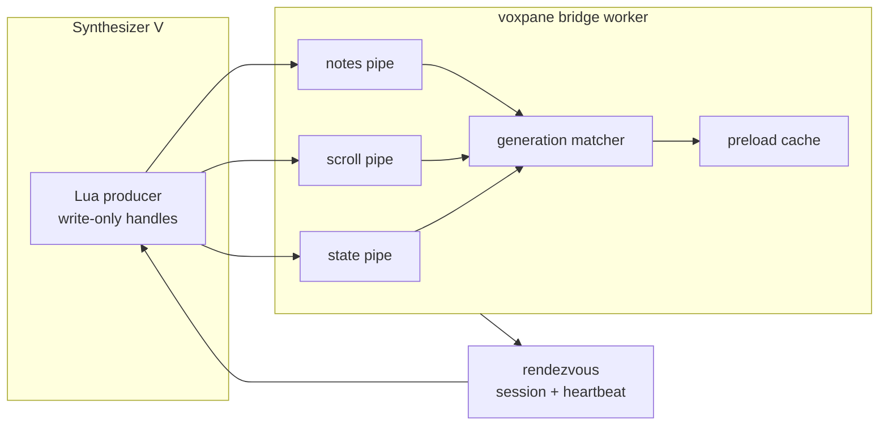

# SynthV Pipe Bridge Design

> Korean translation: **[2026-08-08-synthv-pipe-bridge-design.ko.md](2026-08-08-synthv-pipe-bridge-design.ko.md)**.
> This document describes the approved replacement for the file bridge. The current runtime
> is migrating task by task; product-document reconciliation remains a later migration task.

## Status

Approved for implementation on 2026-08-08.

## Problem

The current bridge rewrites three regular files in place and has a worker sample `state` every
4 ms. It is fast enough, but it still pays for a filesystem read on every sample and models hot
state as a polled latest-value slot even though both supported operating systems provide local
named pipes.

SynthV's Lua host cannot load native libraries or open sockets. It can, however, open a macOS
FIFO or a Windows Named Pipe through `io.open`. Experiments in SynthV 2.3.0tp1 established four
constraints:

- A read with no available data blocks SynthV's UI thread.
- A macOS write-only FIFO open blocks unless a reader is already open.
- A Windows Named Pipe write open succeeds promptly when its server is already listening.
- Continuous write-only traffic works on both platforms when the app continuously drains it.

The transport must therefore remain strictly SynthV-to-app, and the app must own endpoint
creation and readiness.

## Goals

- Replace the `state`, `scroll`, and `notes` data files completely with local pipe streams.
- Keep SynthV write-only; no bridge operation may read from a pipe.
- Preserve independent change rates and latest-value semantics for all three logical channels.
- Recover the complete current snapshot when voxpane restarts while SynthV remains open.
- Keep the hot receive path in the existing Node-enabled bridge worker, outside Electron main
  and the renderer frame loop.
- Prevent a missing or crashed app from causing SynthV to attempt a known-blocking pipe open.
- Support macOS and Windows through the same protocol and lifecycle contract.

## Non-goals

- App-to-SynthV commands or acknowledgements.
- Supporting multiple simultaneous SynthV writers.
- Network transport or remote hosts.
- A compatibility fallback to the regular-file data channels.
- Preserving the existing `dump` command's ability to inspect live channel payloads without the
  app.

## Decision

Use three app-owned, write-only-from-SynthV streams: one each for `state`, `scroll`, and `notes`.
The streams share one app session and one rendezvous record, but have independent OS buffers and
parsers.

Global arrival order is not part of the protocol. Every indexed record identifies its own
generation, and the app publishes a snapshot only after the generations referenced by a state
record are available. This removes the current publish-before-state ordering requirement and
prevents a large notes frame from sitting ahead of state bytes in one shared stream.

## Architecture



The existing main-process bridge setup still creates the private bridge directory early. The
Node-enabled bridge worker owns the three endpoint servers, stream parsers, heartbeat, and
cleanup. It transfers complete framed records to preload memory through the worker's existing
`postMessage` boundary. No per-frame main-process IPC is introduced.

On macOS, the worker invokes `/usr/bin/mkfifo` for three endpoints and opens each FIFO as `r+`
before advertising readiness; `r+` prevents the app's own open from waiting for a SynthV writer.
An existing FIFO under the freshly generated session path is unlinked and recreated, while an
existing non-FIFO aborts startup. On Windows, the worker starts three `node:net` Named Pipe servers
and waits until all three are listening. It publishes rendezvous readiness only after every
endpoint can be drained.

## Rendezvous

The data files disappear, but one small app-owned rendezvous record remains. This is not a data
channel. It is required because Lua exposes no non-blocking FIFO open, and opening a macOS FIFO
for writing without a reader freezes SynthV.

The record is `pipe-session` under the bridge directory. It is exactly 128 bytes and contains:

- the `VPR1` magic and rendezvous format version;
- Unix heartbeat time;
- a 32-character lowercase hexadecimal app session ID;
- an FNV-1a checksum over the meaningful fields;
- space padding to the fixed width.

Its ASCII representation before padding is:

```text
VPR1
<unix-seconds>
<32-lowercase-hex-session>
<8-lowercase-hex-checksum>
```

The checksum is FNV-1a over the bytes from `VPR1` through the newline after the session ID. The
app pads the remaining bytes with spaces and updates the record with one 128-byte write at offset
zero. SynthV validates the complete shape, checksum, session ID, and heartbeat freshness before
opening any endpoint. A malformed, torn, future, or stale record is treated as no app. The
session ID is 16 random bytes from `node:crypto`, encoded as lowercase hex. A heartbeat is written
every 500 ms and is fresh for two seconds. SynthV revalidates the record on a 240 ms logical-time
cadence while both disconnected and connected rather than touching it on every 4 ms state tick.
A fresh record for the same app session preserves the existing handles. A missing, malformed,
stale, future, or different-session record closes the complete handle set before another
connection is attempted.

Endpoint names are derived rather than stored in the rendezvous:

| OS | Endpoint pattern |
| --- | --- |
| macOS | `<bridge>/pipe-<session>-state`, `<bridge>/pipe-<session>-scroll`, `<bridge>/pipe-<session>-notes` |
| Windows | `\\.\pipe\voxpane-<session>-state`, `\\.\pipe\voxpane-<session>-scroll`, `\\.\pipe\voxpane-<session>-notes` |

Unique names prevent a new app process from reusing a stale endpoint. Normal shutdown asks the
preload worker to stop the receiver and waits for acknowledgement. The receiver withdraws the
rendezvous and macOS FIFO pathnames before closing readers, continues draining already-open
writers for 300 ms, and then closes the readers. A blocked `O_WRONLY` writer then fails with
`EPIPE`. If the worker or window is unavailable or does not acknowledge within the bounded quit
timeout, main synchronously removes only a checksum-valid regular rendezvous and FIFO endpoints
derived from its session; regular and symbolic-link endpoint paths are never removed.

`wb` can create a regular file if an endpoint open lands after its FIFO pathname was withdrawn.
That rare late-open artifact is the accepted cost of keeping endpoint handles genuinely
write-only: `O_RDWR` makes the writer its own FIFO reader, so it can block forever instead of
receiving `EPIPE` after the app reader disappears. Connected rendezvous validation closes the
handle set within 240 logical milliseconds, new app sessions use unique paths, and stale pruning
continues to refuse regular files and symbolic links. The 300 ms receiver grace lets orderly
shutdown drain writers that are already open; it is not proof against a force-kill or a Lua thread
already stalled in a synchronous write. Lua provides no primitive that removes those final races
without reintroducing a native or subprocess bridge inside SynthV.

## Connection Lifecycle

The writer treats all three handles as one connection:

1. Read and validate a fresh rendezvous while disconnected.
2. Open each existing endpoint in deterministic `state`, `scroll`, `notes` order with
   `io.open(path, "wb")`, then disable stdio buffering on every handle. A nil or thrown `setvbuf`
   result fails the complete open. Endpoint handles use only `write`, `setvbuf`, and `close`; they
   never call `read`, `seek`, or `flush`.
3. If any open fails, close every handle and retry after the disconnected backoff.
4. Collect a current view mapping and note schedule.
5. Reset `stateSeq`, `scrollSeq`, and `notesSeq` for the new app session.
6. Publish a session frame on the state stream and one complete `scroll`, `notes`, and `state`
   snapshot on their respective streams.
7. Continue publishing state every tick and the indexed channels only when they change.

The full note collection on step 4 is intentional. Cached notes may be up to one revision-check
interval old, so reusing them would not satisfy automatic exact recovery after an app restart.

A write failure on any stream closes all three handles. A failed indexed-channel write does not
advance the generation advertised by state. Failed disconnected attempts back off for 240
logical milliseconds. While connected, the same 240 ms rendezvous cadence detects withdrawal or
session replacement. Notes encoding is followed by another cadence-gated validation immediately
before its large write; it shares the current cadence's rendezvous read rather than opening or
reading again. The next fresh rendezvous reconnects the set and causes another complete snapshot.
Partial channel recovery is deliberately excluded because it would add a second
session-consistency protocol. Explicit disable resets the deadline so re-enable can attempt
immediately, while transport and exact-snapshot failures retain backoff.

The app clears all bridge caches when its receiver session starts. It keeps the last valid
composed snapshot while a newer state waits for matching indexed records, but data from a prior
app session is never composed with the new one.

The three pipes do not provide cross-pipe arrival order. Before the first session frame for a
physical handle set, the receiver retains only the latest complete scroll frame and latest
complete notes frame and publishes no state. When the state pipe supplies its ordered session
frame, the receiver publishes that session first, opens the gate, flushes buffered scroll then
notes, and only then publishes later state frames from the same state chunk. Any disconnect,
fatal error, recovery, or replacement session closes the gate and clears both bounded slots;
malformed pre-session framing remains fatal.

## Wire Format

The existing 12-byte little-endian record header remains:

| Field | Type | Value |
| --- | --- | --- |
| magic | 4 bytes | `VPB1` |
| layout | u16 | `5` |
| channel | u16 | 0 session, 1 state, 2 notes, 3 scroll |
| length | u32 | payload bytes following the header |

Regular-file padding is removed. A stream frame is exactly `12 + length` bytes. Each Lua publish
is still one `write` call, but the receiver never assumes write boundaries: a frame may arrive in
many chunks, and one chunk may contain many frames.

The state stream accepts session and state frames. The scroll and notes streams accept only their
matching channel IDs. Maximum payload lengths are 4 KiB for session, 1 KiB for state, 1 KiB for
scroll, and 64 MiB for notes. Invalid magic, layout, channel, or length closes the connection set
and records a diagnostic rather than throwing into the render path.

The session payload remains JSON for flexible host metadata and contains protocol version `1`,
the app session echoed from rendezvous, script session, script version, and SynthV host
information.

State and scroll retain their current payloads. Notes adds `notesSeq` before `rev`:

```text
notesSeq: u32
rev:      s2 UTF-8
count:    u32
notes:    repeated note records
```

The layout version changes in the Lua encoder, shared app decoder, and human reference decoder at
the same time.

## Order-independent Matching

Each physical stream preserves its own write order, but no ordering is assumed between streams.
The receiver retains the latest state candidate, scroll generation, and notes generation. It
re-evaluates composition whenever any record arrives.

A state candidate becomes visible only when:

- its `scrollSeq` equals the retained scroll record's `scrollSeq`;
- its `notesSeq` is zero, or equals the retained notes record's `notesSeq`;
- the matching notes `rev` equals the state `rev`.

If a state arrives first, it waits. If notes or scroll arrives first, it waits. A newer state may
replace an unmatched state candidate because consumers require the latest value, not every
intermediate generation. Until a complete newer tuple exists, preload keeps exposing the last
valid tuple.

## Backpressure

Lua pipe writes are synchronous and offer no non-blocking or readiness API. Absolute protection
from a live receiver that stops draining is therefore impossible in the SynthV host.

The receiver minimizes that risk by dedicating the existing worker to continuous draining. Its
stream callbacks only frame bytes, update bounded channel state, and transfer complete records;
expensive decoding and renderer work do not run before the read loop can continue. Separate
channel buffers prevent a large notes frame from creating app-side head-of-line blocking for
state or scroll.

Separate pipes do not make the single Lua thread concurrent. A large notes `write` can still hold
the producer until the OS accepts the frame. Manual tests must measure this pause with realistic
large projects on both operating systems. A regression that visibly freezes SynthV blocks the
rollout.

## Diagnostics and Migration

Bridge diagnostics replace file modification times and read costs with:

- app session and connection state;
- last frame receipt time and byte count per channel;
- reconnect, malformed frame, generation mismatch, and revision mismatch counters;
- latest composed state, scroll, and notes generations.

The SynthV side panel reports disconnected or connected state, the app session, the three
published generations, and the last write or rendezvous error.

There is no file fallback. The app never reads legacy `session.json`, `state`, `scroll`, or
`notes` files and removes those exact paths on a best-effort basis after the pipe receiver is
ready. It installs the new script by content hash and requires SynthV to load that script before
the bridge becomes live. The standalone dump command can report rendezvous and endpoint readiness
but cannot consume live stream payloads because a second FIFO reader would steal bytes from the
app.

The architecture, bridge, SynthV, debugging, and script-package documentation must be updated in
English and Korean with the implementation.

## Verification

Pure tests cover:

- rendezvous validation, checksum rejection, and heartbeat expiry;
- frames split at every byte boundary;
- multiple frames coalesced into one chunk;
- invalid magic, layout, channel, and channel-specific length limits;
- all arrival permutations of state, scroll, and notes;
- preservation of the last valid snapshot during a generation mismatch;
- cache reset between app sessions;
- all-handle teardown after one channel fails;
- same-session handle preservation and connected rendezvous withdrawal within 240 ms;
- bounded pre-session scroll/notes buffering across all cross-pipe arrival orders;
- nil and thrown `setvbuf` failures, explicit disable/re-enable, and 239/240 ms cadence edges;
- full snapshot order and generation reset on reconnect.

Platform integration checks cover:

- real macOS FIFO creation, readiness, framing, shutdown, stale rendezvous behavior, and an
  `O_WRONLY` large writer unblocking with `EPIPE` when the reader closes;
- real Windows Named Pipe creation and framing in the Parallels Windows environment;
- starting SynthV before voxpane and voxpane before SynthV;
- quitting and restarting only voxpane, with current notes, scroll, and state returning without
  user interaction;
- killing voxpane and confirming SynthV remains responsive;
- transmitting a realistically large notes frame while measuring SynthV UI pause and state
  receipt latency;
- normal app build, typecheck, lint, and existing bridge test suites.

## Rejected Alternatives

### One multiplexed pipe

This gives global order and one connection, but global order is unnecessary after notes carries
its own generation. It also places state behind a large notes frame in the receiver's byte stream.

### Duplex pipe with app acknowledgements

An acknowledgement could request a snapshot explicitly, but it requires SynthV to read. A read
with no data was directly observed to block the host UI, and the product has no app-to-SynthV
command requirement.

### Regular-file fallback

A fallback doubles lifecycle, diagnostics, and pairing behavior and would leave the polling path
as permanent complexity. This change is an intentional full transport replacement.
