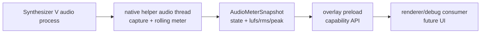

# SynthV Audio Meter Spike Design

> English 원본: **[2026-08-09-synthv-audio-meter-spike-design.md](2026-08-09-synthv-audio-meter-spike-design.md)**.

## Status

2026-08-09 설계 승인.

## Problem

voxpane은 Lua bridge를 통해 Synthesizer V가 무엇을 재생 중인지는 알지만, SynthV가 실제로 render하는
audio level은 알지 못한다. 유용한 LUFS meter에는 project에서 추론한 note timing이나 pitch data가 아니라
실제 output audio가 필요하다.

어려운 부분은 isolation이다. 일반 system loopback stream은 output endpoint의 모든 application을 측정한다.
다른 앱이 audio를 재생 중이면 meter가 SynthV를 실제보다 더 크게 표시하므로 잘못된 값이다. 따라서 첫 구현
task는 native helper가 SynthV process audio를 capture하고, raw PCM을 Electron이나 renderer frame loop로
옮기지 않은 채 compact meter state로 줄일 수 있음을 증명해야 한다.

## Goals

- 지원되는 Windows build에서 SynthV process audio용 native Windows capture path를 증명한다.
- Continuous PCM capture와 loudness calculation을 JavaScript boundary 아래에 유지한다.
- Preload/renderer code에는 compact meter snapshot만 노출한다.
- 공유되고 test된 meter-state contract와 pure loudness helper를 추가한다.
- 기존 overlay 규칙을 보존한다: per-frame renderer path는 main-process IPC나 native audio read에 의존하지
  않는다.
- macOS에서도 ScreenCaptureKit audio capture로 같은 native snapshot API를 증명한다.

## Non-goals

- 이 spike에서는 user-facing meter UI를 만들지 않는다.
- Integrated LUFS history, export, recording, waveform display는 만들지 않는다.
- Endpoint-wide Windows loopback fallback을 primary implementation으로 두지 않는다.
- Renderer code로 raw PCM을 전달하지 않는다.
- OS Screen Recording consent sheet 외의 application-level permission prompt UI는 만들지 않는다.

## Decision

기존 native helper 책임 옆에 audio meter capability를 추가하되, public contract는 의도적으로 작게 둔다.

- Target application의 native capture를 시작한다.
- Native capture를 중지한다.
- 최신 meter snapshot을 읽는다.

Native helper가 realtime capture와 rolling meter state를 소유한다. JavaScript는 자신의 cadence로 최신
snapshot을 관찰하고 sample buffer는 받지 않는다. 이는 기존 geometry split과 맞다. Native code는
OS-specific 질문에 답하고, shared TypeScript는 app contract를 정의하며, preload는 좁은 renderer API만
노출한다.

## Architecture



이 path는 SynthV Lua bridge와 독립적이다. Bridge는 계속 transport와 note state를 공급하고, audio meter는
측정된 audio level만 공급한다. Audio meter가 없거나 unsupported이거나 실패해도 overlay attachment,
bridge recovery, canvas read, effect rendering은 바뀌면 안 된다.

## Shared Contract

Meter data와 pure math를 위한 shared TypeScript module을 만든다.

```ts
export type AudioMeterState =
  | "unsupported"
  | "idle"
  | "starting"
  | "running"
  | "silent"
  | "error"

export interface AudioMeterSnapshot {
  state: AudioMeterState
  updatedAtMs: number
  momentaryLufs: number | null
  rmsDb: number | null
  peakDb: number | null
  sampleRate: number | null
  channels: number | null
  error?: string
}
```

Snapshot은 사용할 수 없는 numeric value에 `null`을 사용하므로 consumer는 silence와 missing data를 구분할
수 있다. Silence는 `state: "silent"`와 함께 `momentaryLufs`, `rmsDb`, `peakDb`를 `null`로 보고할 수 있다.
실제이지만 매우 작은 signal은 finite value를 보고할 수 있다.

Off-platform에서도 test할 수 있는 math는 pure helper function으로 둔다.

- PCM sample value clamp/normalize;
- peak dBFS 계산;
- RMS dBFS 계산;
- rolling sample window에서 first-pass momentary loudness value 계산.

Spike는 full ITU-R BS.1770 구현 전 practical first-pass loudness calculation을 사용할 수 있지만, API name은
measurement window와 limitation을 test와 docs에서 명시해야 한다. Production capture path는 renderer frame
timing에 의존하면 안 된다.

## Windows Spike

Windows가 핵심 증명 지점이다. Endpoint loopback은 whole system mix를 capture하므로 충분하지 않다. Windows
helper는 WASAPI process loopback을 시도해야 한다.

- Target SynthV process ID를 찾거나 입력받는다.
- `ActivateAudioInterfaceAsync`로 `VIRTUAL_AUDIO_DEVICE_PROCESS_LOOPBACK`을 activate한다.
- SynthV PID에 대해 include-tree mode의 `AUDIOCLIENT_PROCESS_LOOPBACK_PARAMS`를 전달한다.
- Native thread에서 captured frame을 읽는다.
- Lock으로 보호되는 최신 `AudioMeterSnapshot`을 갱신한다.
- OS build가 Windows 10 Build 20348 미만이거나 activation을 사용할 수 없으면 `unsupported`를 보고한다.

Spike는 SynthV의 audio rendering이 target process에서 일어나는지 child process에서 일어나는지 검증해야
한다. SynthV가 다른 process에 rendering을 위임한다면, 구현은 관찰한 process tree를 문서화하고 그것을
include하거나 명확히 실패해야 한다.

## macOS Spike

macOS는 Windows와 같은 `start` / `stop` / `read` snapshot contract로 ScreenCaptureKit을 사용한다.
Helper는 `SCShareableContent`에서 target SynthV application을 찾고, 해당 application을 include하는
content filter를 만든 뒤, `capturesAudio`를 켜고 current process audio는 제외하며 audio stream output만
붙인다.

Stream output은 `CMSampleBuffer` audio buffer를 받고 linear PCM sample을 normalized `f32`로 변환해 최신
`AudioMeterSnapshot`을 갱신한다. ScreenCaptureKit을 사용할 수 없거나 Screen Recording permission이
거절되면 helper는 `unsupported` 또는 `error` snapshot을 반환하고 overlay path는 건드리지 않는다.

## Preload Boundary

Preload에서 작은 API를 노출한다. Main이 아니다.

```ts
window.audioMeter.start(): Promise<AudioMeterSnapshot>
window.audioMeter.stop(): Promise<AudioMeterSnapshot>
window.audioMeter.read(): AudioMeterSnapshot
```

`read()`는 helper의 최신 completed snapshot을 반환하므로 synchronous일 수 있다. Native capture를 기다리며
block하면 안 된다. Native addon이 capture resource를 시작하거나 해제해야 한다면 start/stop은 asynchronous일
수 있다.

이 spike에서는 renderer code가 기존 drawing loop 안에서 audio를 poll하면 안 된다. Future UI는 자체 low-rate
interval을 선택할 수 있다.

## Error Handling

- Unsupported platform 또는 OS build는 짧은 reason과 함께 `state: "unsupported"`를 반환한다.
- Target process를 찾지 못하면 `state: "error"`를 반환하고 tight loop로 retry하지 않는다.
- Capture activation failure는 Windows에서 HRESULT-derived reason과 함께 `state: "error"`를 반환한다.
- Render stream이 없거나 all-zero buffer이면 exception이 아니라 `state: "silent"`를 만든다.
- Native worker shutdown은 addon teardown 전에 capture thread를 중지해야 한다.

## Testing

Shared TypeScript meter core에는 TDD를 사용한다.

- Silence는 `null` dB/loudness value를 만든다.
- 알려진 full-scale signal은 `0`에 가까운 `peakDb`를 만든다.
- 더 낮은 amplitude sample은 더 낮은 RMS/peak value를 만든다.
- Invalid sample value는 선택한 helper contract에 따라 clamp하거나 reject한다.

Native Windows capture는 macOS에서 증명할 수 없다. Implementation plan에는 다음을 포함해야 한다.

- Shared math와 snapshot normalization을 위한 local TypeScript test;
- 가능한 경우 target-independent helper logic용 Rust unit test;
- `cargo check --target x86_64-pc-windows-msvc` 또는 동등한 Windows target check;
- Windows VM/manual validation step: SynthV와 두 번째 audio app을 동시에 재생하고 meter가 SynthV만
  따른다는 것을 확인한다.

## Documentation

Spike가 code로 landing되면, committed behavior가 문서화된 invariant를 바꾸는 경우에만 architecture 또는
debugging docs를 갱신한다. User-facing behavior가 없는 pure spike API는 meter가 앱에 보이기 전까지 이
design과 GitHub issue에만 문서화해도 된다.
