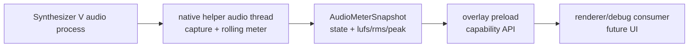

# SynthV Audio Meter Spike Design

> Korean translation: **[2026-08-09-synthv-audio-meter-spike-design.ko.md](2026-08-09-synthv-audio-meter-spike-design.ko.md)**.

## Status

Approved for design on 2026-08-09.

## Problem

voxpane knows what Synthesizer V is playing through the Lua bridge, but it does not know the
level of the audio SynthV actually renders. A useful LUFS meter needs real output audio, not
note timing or pitch data inferred from the project.

The difficult part is isolation. A normal system loopback stream measures every application on
the output endpoint. That is wrong when another app is playing audio, because the meter would
claim SynthV is louder than it is. The first implementation task therefore has to prove that the
native helper can capture SynthV's process audio and reduce it to compact meter state without
moving raw PCM through Electron or the renderer frame loop.

## Goals

- Prove a native Windows capture path for SynthV process audio on supported Windows builds.
- Keep continuous PCM capture and loudness calculation below the JavaScript boundary.
- Expose only compact meter snapshots to preload/renderer code.
- Add a shared, tested meter-state contract and pure loudness helpers.
- Preserve the existing overlay rule: no per-frame renderer path may depend on main-process IPC
  or native audio reads.
- Prove the same native snapshot API on macOS through ScreenCaptureKit audio capture.

## Non-goals

- No user-facing meter UI in this spike.
- No integrated LUFS history, export, recording, or waveform display.
- No endpoint-wide Windows loopback fallback as the primary implementation.
- No raw PCM delivery to renderer code.
- No application-level permission prompt UI beyond the OS Screen Recording consent sheet.

## Decision

Add an audio meter capability beside the existing native helper responsibilities, but keep the
public contract intentionally small:

- start native capture for a target application;
- stop native capture;
- read the latest meter snapshot.

The native helper owns realtime capture and rolling meter state. JavaScript observes the latest
snapshot at its own cadence and never receives sample buffers. This matches the existing geometry
split: native code answers the OS-specific question, shared TypeScript defines the app contract,
and preload exposes a narrow renderer API.

## Architecture



This path is independent from the SynthV Lua bridge. The bridge still supplies transport and note
state; the audio meter supplies only measured audio level. A missing, unsupported, or failed audio
meter must not change overlay attachment, bridge recovery, canvas reads, or effect rendering.

## Shared Contract

Create a shared TypeScript module for meter data and pure math:

```ts
export type AudioMeterState =
  | "unsupported"
  | "idle"
  | "starting"
  | "running"
  | "silent"
  | "error"

export interface AudioMeterSnapshot {
  state: AudioMeterState
  updatedAtMs: number
  momentaryLufs: number | null
  rmsDb: number | null
  peakDb: number | null
  sampleRate: number | null
  channels: number | null
  error?: string
}
```

The snapshot uses `null` for unavailable numeric values so consumers can distinguish silence from
missing data. Silence may report `state: "silent"` with `momentaryLufs`, `rmsDb`, and `peakDb`
set to `null`; a real but very quiet signal may report finite values.

Pure helper functions should cover the math that can be tested off-platform:

- clamp/normalize PCM sample values;
- calculate peak dBFS;
- calculate RMS dBFS;
- calculate a first-pass momentary loudness value from a rolling sample window.

The spike can use a practical first-pass loudness calculation before a full ITU-R BS.1770
implementation, but the API names must make the measurement window and limitations explicit in
tests and docs. The production capture path should not depend on renderer frame timing.

## Windows Spike

Windows is the critical proof point. Endpoint loopback is not sufficient because it captures the
whole system mix. The Windows helper should attempt WASAPI process loopback:

- find or accept the target SynthV process ID;
- activate `VIRTUAL_AUDIO_DEVICE_PROCESS_LOOPBACK` through `ActivateAudioInterfaceAsync`;
- pass `AUDIOCLIENT_PROCESS_LOOPBACK_PARAMS` with include-tree mode for the SynthV PID;
- read captured frames on a native thread;
- update a lock-protected latest `AudioMeterSnapshot`;
- report `unsupported` when the OS build is below Windows 10 Build 20348 or activation is not
  available.

The spike must verify whether SynthV's audio rendering happens in the target process or a child
process. If SynthV delegates rendering elsewhere, the implementation should document the observed
process tree and either include it or fail clearly.

## macOS Spike

macOS uses ScreenCaptureKit with the same `start` / `stop` / `read` snapshot contract as Windows.
The helper resolves the target SynthV application from `SCShareableContent`, creates a content
filter that includes that application, enables `capturesAudio`, excludes the current process'
audio, and attaches only an audio stream output.

The stream output receives `CMSampleBuffer` audio buffers, converts linear PCM samples to normalized
`f32`, and updates the latest `AudioMeterSnapshot`. If ScreenCaptureKit is unavailable or Screen
Recording permission is denied, the helper returns an `unsupported` or `error` snapshot and leaves
the overlay path untouched.

## Preload Boundary

Expose a small API from preload, not from main:

```ts
window.audioMeter.start(): Promise<AudioMeterSnapshot>
window.audioMeter.stop(): Promise<AudioMeterSnapshot>
window.audioMeter.read(): AudioMeterSnapshot
```

The API may be synchronous for `read()` because it returns the helper's latest completed snapshot.
It must not block waiting for native capture. Start/stop can be asynchronous if the native addon
needs to spin up or tear down capture resources.

No renderer code should poll audio from inside the existing drawing loop in this spike. A future UI
can choose its own low-rate interval.

## Error Handling

- Unsupported platform or OS build returns `state: "unsupported"` with a short reason.
- Target process not found returns `state: "error"` and does not retry in a tight loop.
- Capture activation failure returns `state: "error"` with an HRESULT-derived reason on Windows.
- No render streams or all-zero buffers produce `state: "silent"` rather than an exception.
- Native worker shutdown must stop capture threads before addon teardown.

## Testing

Use TDD for the shared TypeScript meter core:

- silence produces `null` dB/loudness values;
- a known full-scale signal produces `peakDb` near `0`;
- lower-amplitude samples produce lower RMS/peak values;
- invalid sample values are clamped or rejected according to the chosen helper contract.

Native Windows capture cannot be proven on macOS. The implementation plan must include:

- local TypeScript tests for shared math and snapshot normalization;
- Rust unit tests for target-independent helper logic where possible;
- `cargo check --target x86_64-pc-windows-msvc` or equivalent Windows target check;
- a Windows VM/manual validation step that plays SynthV and a second audio app at the same time
  and confirms the meter follows only SynthV.

## Documentation

If the spike lands code, update the architecture or debugging docs only when the committed behavior
changes a documented invariant. A pure spike API with no user-facing behavior can remain documented
in this design and the GitHub issue until the meter becomes visible in the app.
